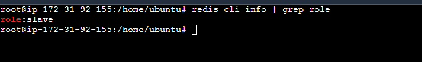

[Redis-cli](https://redis.io/docs/ui/cli/)

# 1.Redis 설치
#### AWS EC2 생성/접속한다.
#### EC2에 Redis 설치
```bash
sudo su
apt-get upate

# redis 설치
apt-get install -y redis-server

# redis 설치 확인 
service redis status
ps -ef | grep redis
```

#### Redis 설치 위치 
> 실행 위치: /usr/bin/redis-server<br/>
> 설정파일 위치: /etc/redis/redis.conf

```bash
# maxmemory 설정 (생성한 인스턴스의 메모리가 1기가 이므로 500mb로 설정)
vi /etc/redis/redis.conf
/maxmemroy
# 수정
maxmemory 500mb
config get maxmemory
```

#### Redis 접속
```bash
redis-cli
# info 명령어로 현재 설정된 정보를 확인할 수 있다.
```  

## 1.1 replica 설치

<br/>

#### 생성된 이미지 확인 
AMI 탭 > 상태 : 사용가능

### 1.1.1 replica 설정
생성한 Img의 인스턴스 시작
- 보안그룹을 master와 동일한 그룹으로 설정해주자.

```bash
# maxmemory 설정 (생성한 인스턴스의 메모리가 1기가 이므로 500mb로 설정)
vi /etc/redis/redis.conf
/maxmemroy
# 수정
maxmemory 500mb
config get maxmemory
```

```bash
redis-cli

#replicaof [master의 프라이빗 ip주소] [포트]
replicaof 172.31.90.75 6379

# maxmemory 설정 (생성한 인스턴스의 메모리가 1기가 이므로 500mb로 설정)
config set maxmemory 500mb
config get maxmemory

# 제대로 수정되었는지 확인 
info 
# role:slave
# master_host:172.31.90.75
# master_port:6379
# master_link_status:

# master_link_status:down 인 경우
tail -f /var/log/reids/redis-server.log
```
<br/>
위와 같은 사진인 경우, master 쪽에 port를 개방해주지 않아서 접속을 할 수 없어 master_link_status:down이 되어 있는 경우이다.<br/>

master의 보안정책에서 port를 열어주자


<br/>
접속 허용할 IP는 모두 열어도 되지만, 특정 IP만 지정하거나 replica의 보안그룹으로 설정하는 것이 보안에 좋다.

<br/>
<br/>
- 보안 그룹 추가 후에도 `Error condition on socket for SYNC: Connection refused`와 같은 에러가 발생한다면<br/>
  ➡️ master와 replica 각각에서 `redis.conf` 파일에서 `bind` 설정을 127.0.0.1 ::1 을 `해당 서버의 ip` 으로 변경해보자.
```bash
# master
vi /etc/redis/redis.conf

/bind

bind 172.31.92.155 127.0.0.1 ::1

# replica 
vi /etc/redis/redis.conf

/bind

bind 172.31.94.203 127.0.0.1 ::1
```

### 1.1.2 테스트
복제가 되도록 설정이 잘 되었으니 master의 데이터가 실제로 잘 복제가 되는지 확인해보자.
- master
```bash
redis-cli

set test redis_study_test
```
- replica
```bash
redis-cli 

get test 
```
<br/><br/>


- replicaof로 설정하면 Redis를 재시작하고 설정정보를 보면 처음과 같이 master로 돌아가 있는 것을 볼 수 있다. 이를 방지하기 위해서 아래와 같이 설정을 해주자.
```bash
# replica server
vi /etc/redis/redis.conf

/replicaof
#replicaof <masterip><masterport>
replicaof 172.31.92.155 6379
```


# 2. Redis Sentinel

## 2.1 설치하기
```bash
# master, replica
apt-get install -y redis-sentinel

ps -ef | grep sentinel
```

#### 설치 위치
> 실행 위치: /usr/bin/redis-sentinel<br/>
> 설정파일 위치: /etc/redis/centinel.conf

## 2.2 설정
### 2.2.1 port 오픈
sentinel은 기본 포트가 26379를 사용한다. 
앞에서 6379포트를 열어준 것과 같이 26379포트도 열어주자.

### 2.2.2 bind 설정
앞서 master와 replica에서 각각 bind 설정을 해주었는데 sentinel도 똑같이 해준다.
```bash
# master
vi /etc/redis/sentinel.conf

/bind

bind 172.31.92.155 127.0.0.1 ::1

# replica
vi /etc/redis/sentinel.conf

/bind

bind 172.31.94.203 127.0.0.1 ::1
```
설정한 후에는 변경된 사항의 적용을 위해 항상 재시작 해주자.
```bash
service redis-sentinel restart

# 혹은
service redis-sentinel stop
service redis-sentinel start

service redis-sentinel status
```

### 2.2.3 sentinel의 master 설정
```bash
# replica, service
vi /etc/redis/sentinel.conf

/monitor 

# sentinel monitor mymaster [master ip] [master port] [다수결 수]
sentinel monitor mymaster 172.31.92.155 6379 2
```

## 2.3 테스트
서비스 서버에도 sentinel을 똑같이 설치, 설정한 후, master를 내려 failover가 제대로 동작하는지 테스트해보자.<br/>
아래의 로그는 replica의 로그이다.

아래와 같이 redis의 role을 확인해보면 master로 변경된 것을 알 수 있다.
<br/>

#### 그렇다면 원래 master였던 Redis가 복구된다면?

master를 다시 띄워보자.<br/>
<br/>
기존에 마스터였던 Redis는 복구되면서 Slave로 변경되었다.

