# 1. VM 설치 및 설정

### 1.1 VirtualBox를 설치한다.
### 1.2 Ubuntu 22.04 버전을 다운로드 한다.
### 1.3 VirtualBox에 Ubuntu를 설치하는데 사양은 아래와 같이 설정한다.
#### 1) 2개의 Docker서버를 세팅하는데 1번은 메인 2번은 테스트(백업)서버
#### 2) 기본 메모리: 4096MB(최소: 4096MB, 권장: 8192MB)
#### 3) Proccessors: 4개
#### 4) Virtual Hard Disk: 100GB

### 1.4 설치를 완료 후 바로 부팅하는 것이 아니라 설정을 좀 만져준다.
#### 1) 설정이 비활성화 되어 수정할 수 없는 경우, 해당 vm이 `저장됨` 상태인지 확인해보고 vm을 종료하여 `전원꺼짐` 상태로 바꿔주자
#### 2) 시스템 - 마더보드: 광 디스크를 1번, 하드디스크를 2번으로 설정해주고 플로피는 해제해준다.
#### 3) 시스템 - 프로세서: PAE/NX 사용하기 체그
#### 4) 저장소 - 컨트롤러:IDE 에서 다운받은 iso 선택

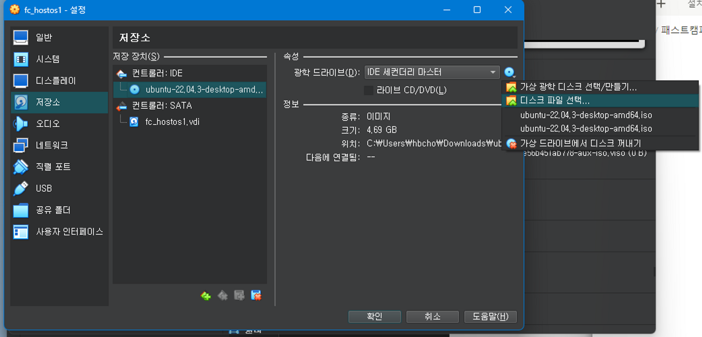 

- 저장소 - 컨트롤러: SATA - fc_hostos1.vdi : 리눅스(Ubuntu)를 위한 디스크

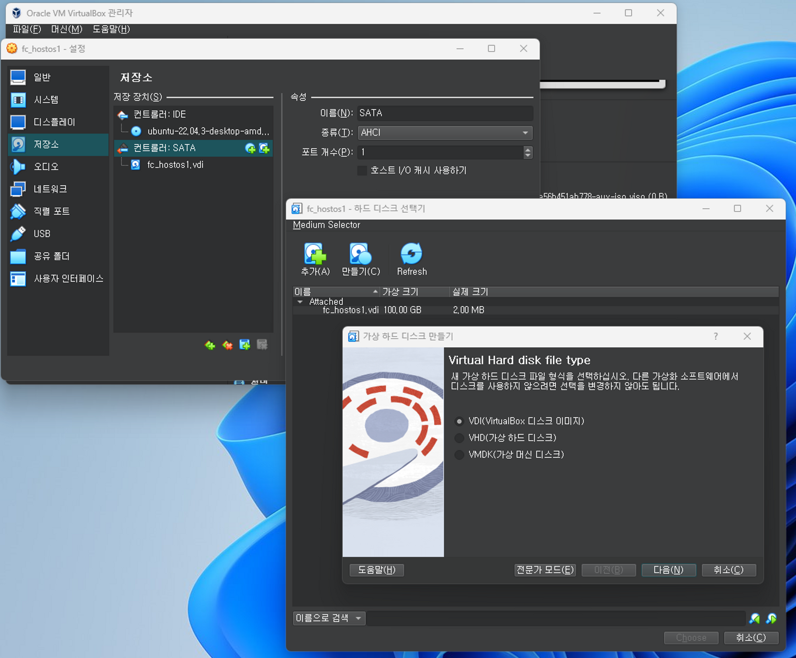 
- 컨트롤러: SATA 옆에 하드디스크 추가 버튼 클릭
- 만들기 클릭
- VDI 선택 후 드라이브 크기를 100GB로 늘려주고
- _1 → _docker로 vdi명을 변경해준다.

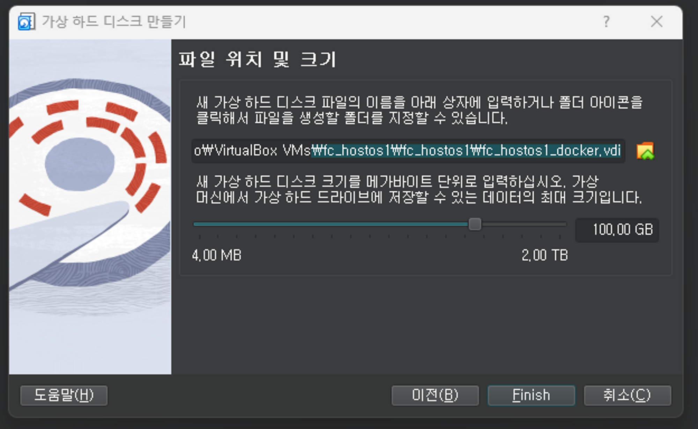 
- Finish를 한 후, 추가된 디스크를 선택하고 choose를 눌러 추가해준다.
#### 5) 네트워크
- 외부연결: NAT
- 내부연결: 호스트 전용 어댑터
  - 네트워크 설정에 가보면 VirtualBox Host-Only Ethernet Adapter라는 이더넷이 잡히는 것을 볼 수 있다.
- 따라서 어댑터1은 NAT, 어댑터2는 호스트 전용 어댑터로 변경해준다.

# 2. Ubuntu 설치
VM 기동 후 Ubuntu를 설치해보자. 
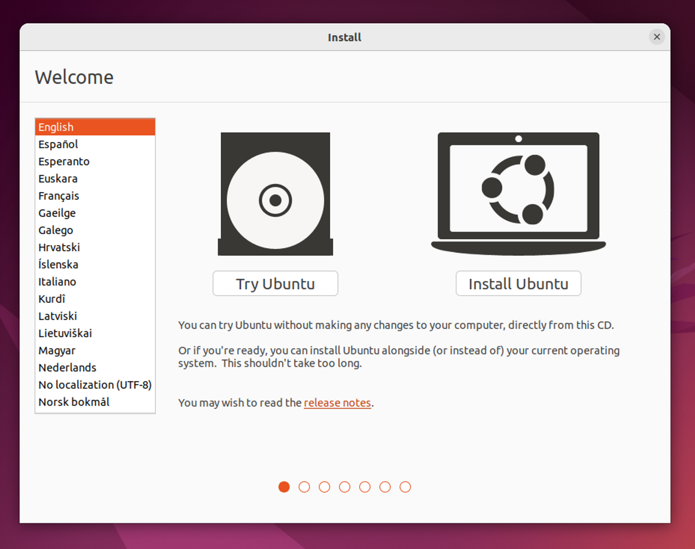 
Install Ubuntu를 눌러 설치를 진행한다. 
언어와 키보드는 기본값(영어)으로 두고 진행하자. 
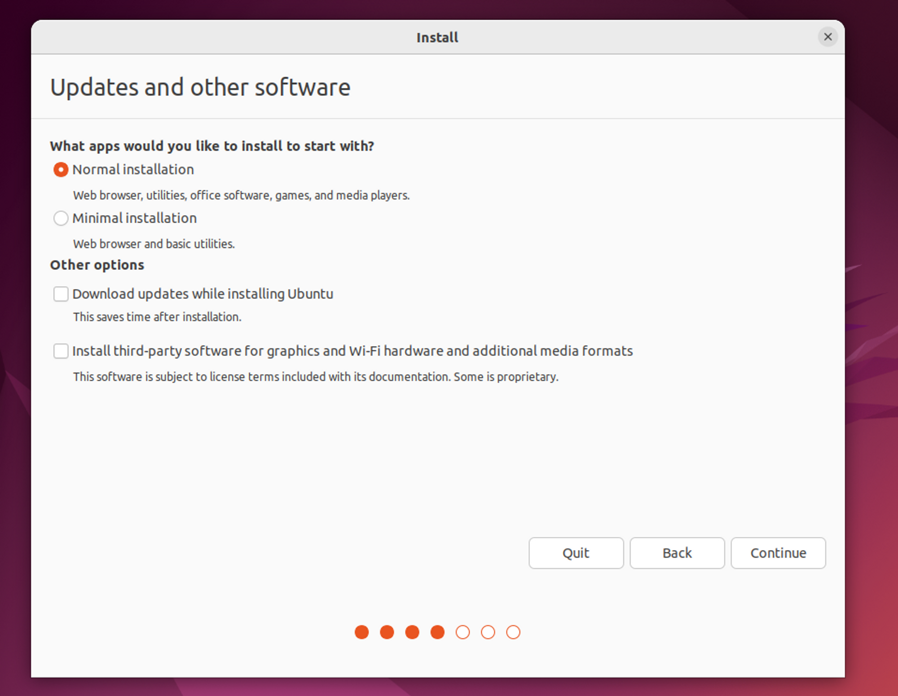 
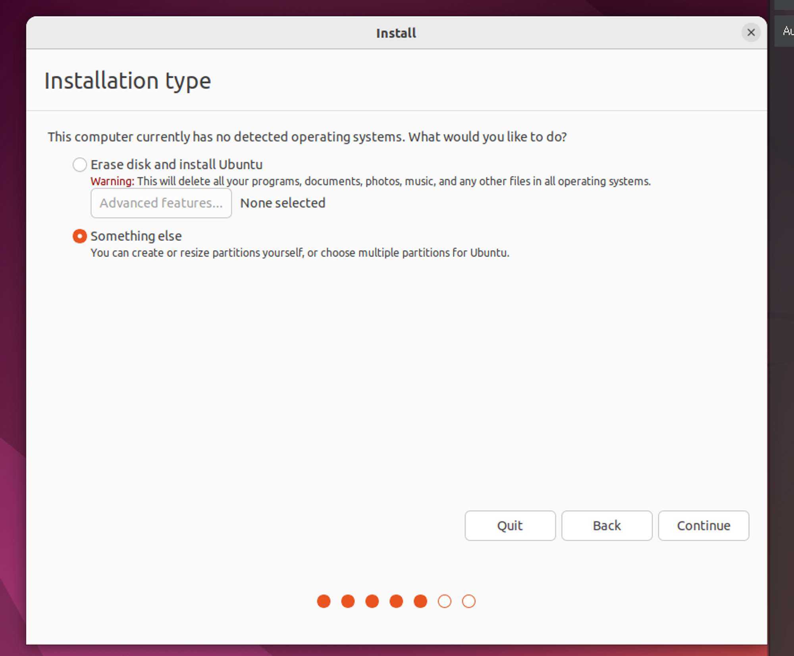 
내가 직접 파티션을 나누기 위해서 Something else를 선택하고 다음으로 넘어가면 아래와 같은 화면이 나온다. 
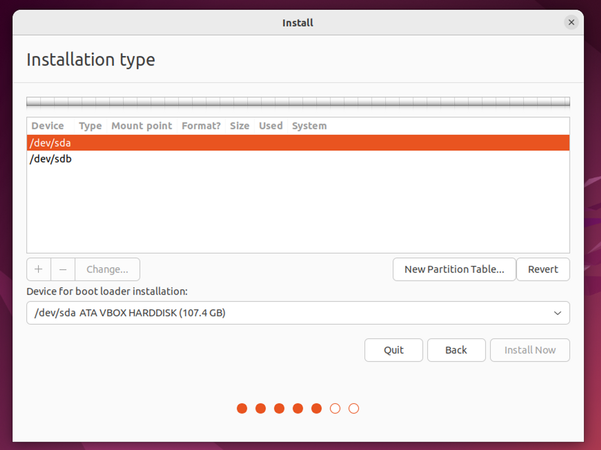 
sda는 리눅스, sdb는 Docker를 위해서 사용한다. 

sda를 선택하고 `New Partition Table` 을 누르면 sda 밑에 free space가 100GB가 잡힌 것을 볼 수 있다. 
아래에 있는 + 버튼을 눌러 아래의 파티션을 추가한다. 

| 파티션명      | 크기      |파일 타입| 마운트 위치  |
|-----------|---------|---|---------|
| /dev/sda1 | 70000MB |XFS| /       |
|           | 8192MB  |swap| -       |
| /dev/sda3 | 15000MB |Ext4| /DATA   |
| /dev/sda4 | 나머지     |Ext4| /BACKUP |
|/dev/sdb1|나머지| XFS|/var/lib/docker|
- swap은 보통 물리 메모리의 2배로 설정한다.

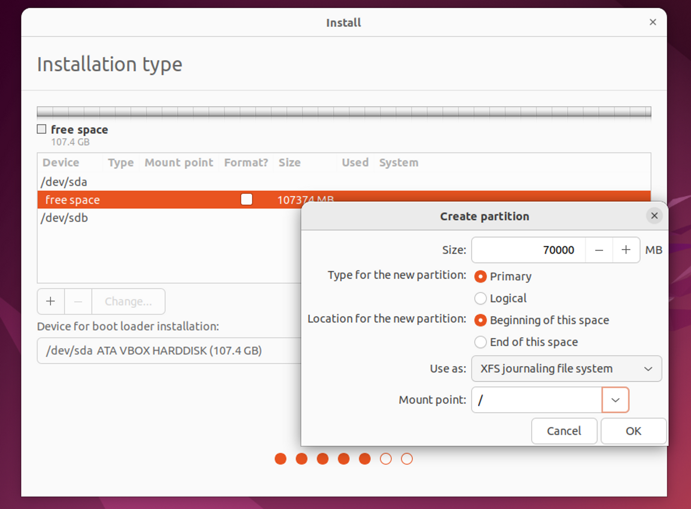 
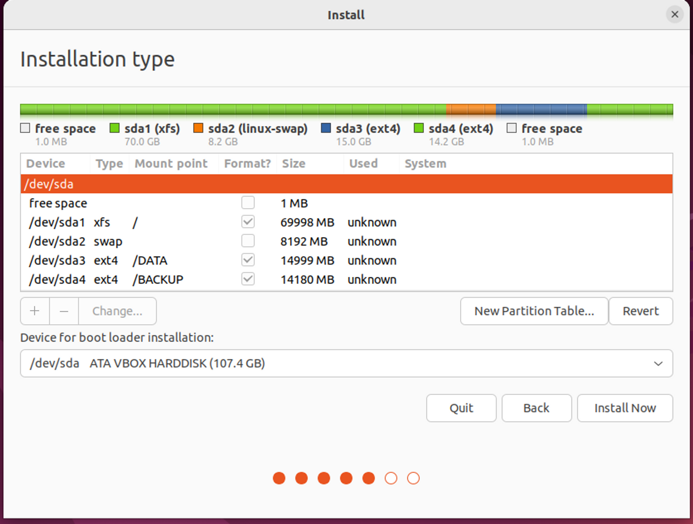 
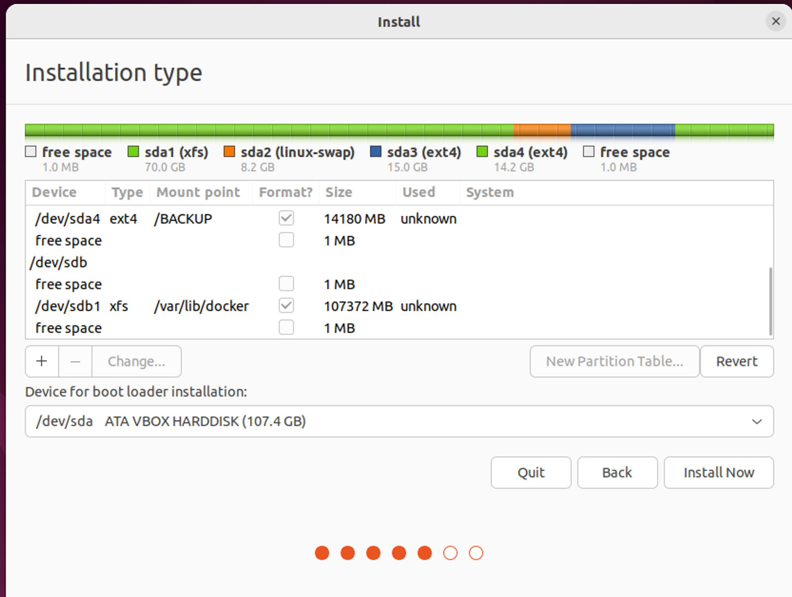 
 
위와 같이 파티션 설정이 끝났으면 Install Now를 누른 후 유저를 하나 생성하고 설치를 마무리하자. 
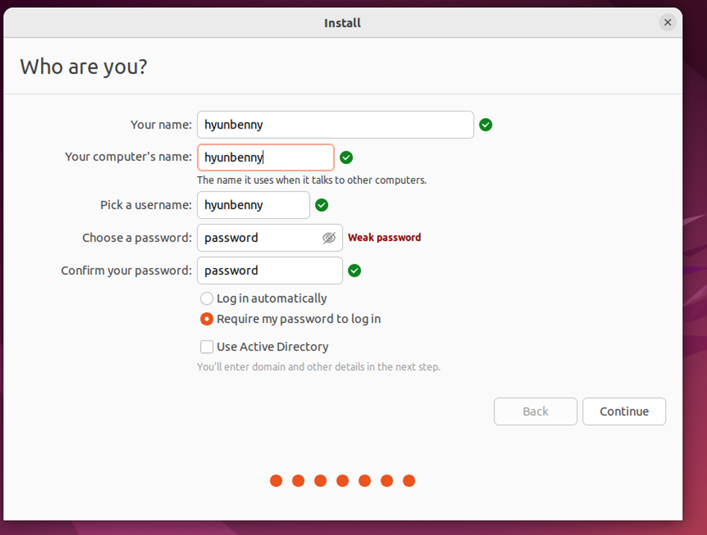 