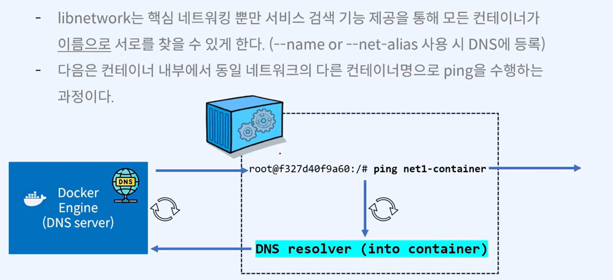
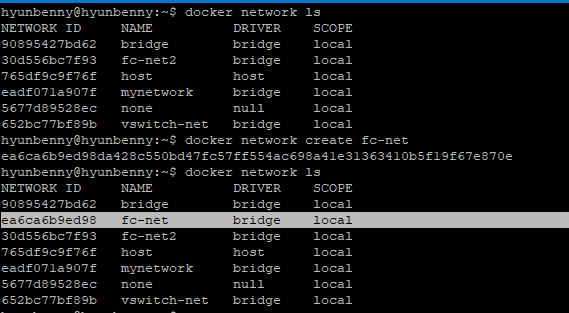
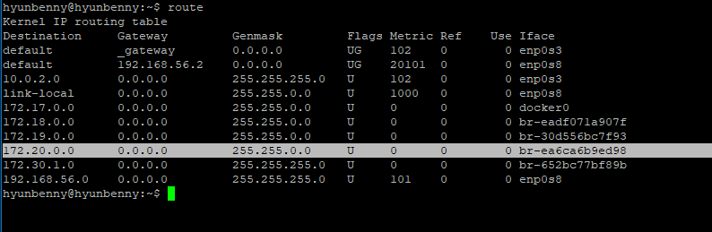
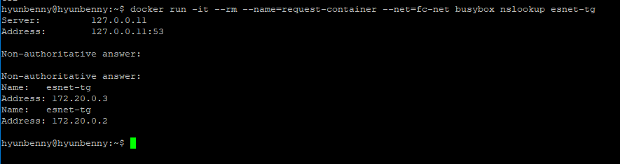
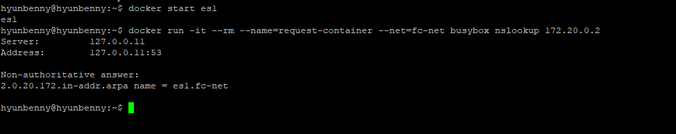
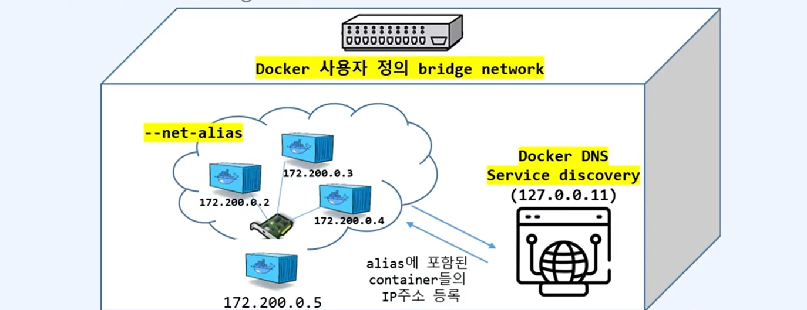
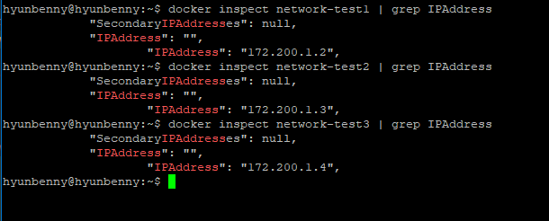
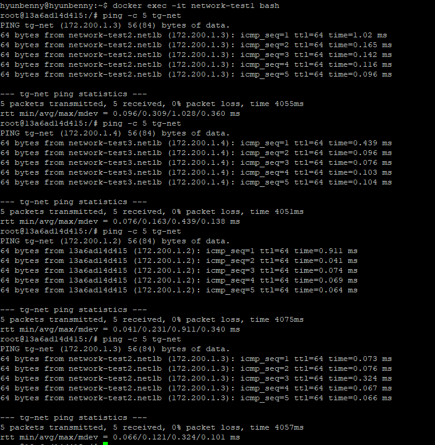
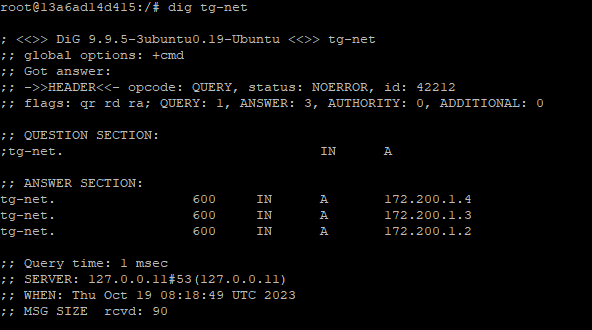

# Docker DNS
> Docker 컨테이너는 IP를 사용자 정의 네트워크의 컨테이너 이름으로 자동 확인하는 DNS 서버가 Docker 호스트에 자동 생성된다.(127.0.0.11)
- 기본 docker0 bridge driver에서는 DNS가 포함되어 있지 않다.
- 동일 네크워크 alias 할당을 통해 하나의 타겟 그룹을 만들어 RR(Round Robin)방식으로 응답한다.

## DNS 동작 구성
<br/>

## 사용자 정의 네트워크 Docker DNS 확인해보기
```bash
docker network ls
docker network create fc-net
docker network ls

route

# 사용자 정의 네트워크와 동일 target group을 지정하여 DNS 응답을 확인해보자.
# target group: --net-alias
docker run -d --name=es1 --net=fc-net --net-alias=esnet-tg -p 9201:9200 -p 9301:9300 -e "discovery.type=single-noe" elasticsearch:7.17.10
docker run -d --name=es2 --net=fc-net --net-alias=esnet-tg -p 9202:9200 -p 9302:9300 -e "discovery.type=single-noe" elasticsearch:7.17.10

docker ps | grep es
```
<br/>
<br/>

```bash

docker inspect es1 | grep -i ipa
docker inspect es2 | grep -i ipa

# 사용자 정의 네트워크에 자동으로 DNS기능이 활성화되는지 확인해보자.
docker run -it --rm --name=request-container --net=fc-net busybox nslookup esnet-tg
docker run -it --rm --name=request-container --net=fc-net busybox nslookup 172.20.0.2
docker run -it --rm --name=request-container --net=fc-net busybox nslookup 172.20.0.3
```
es1: 172.20.0.2<br/>
es2: 172.20.0.3<br/>
<br/>
<br/>

```bash
docker run -d --name=es3 --net=fc-net --net-alias=esnet-tg -p 9203:9200 -p 9303:9300 -e "discovery.type=single-noe" elasticsearch:7.17.10
docker run -it --rm --name=request-container --net=fc-net centos:8 bash
curl -s esnet-tg:9200
curl -s esnet-tg:9200
curl -s esnet-tg:9200
```
타겟그룹으로 요청하게 되면 응답 대상들이 로드밸런싱되는 것처럼 순서대로 RR(Round Robin)방식으로 응답한다.

## docker DNS를 활용하여 docker proxy(Load Balancing)
<br/>
1) 사용자 정의 Bridge Network 생성
2) --net-alias를 통한 target group 생성
3) 등록된 DNS 확인
   - 컨테이너 내부에 `dig`라는 툴을 설치해서 확인

```bash
docker network create --driver bridge --subnet 172.200.1.0/24 --ip-range 172.200.1.0/24 --gateway 172.200.1.1 netlb   

docker network ls
route

docker run -itd --name=network-test1 --net=netlb --net-alias tg-net ubuntu:14.04
docker run -itd --name=network-test2 --net=netlb --net-alias tg-net ubuntu:14.04
docker run -itd --name=network-test3 --net=netlb --net-alias tg-net ubuntu:14.04

docker inspect network-test1 | grep IPAddress 
docker inspect network-test2 | grep IPAddress 
docker inspect network-test3 | grep IPAddress 

docker exec -it network-test1 bash
ping -c 5 tg-net
```
<br/>
<br/>
ping이 172.200.1.2, 172.200.1.3, 172.200.1.4가 번갈아가며 호출되는 것을 알 수 있다.<br/>

#### dig 를 사용해보자.
```bash
docker exec -it network-test1 bash
apt-get update
apt-get install -y dnsutils

dig tg-net
```
<br/>