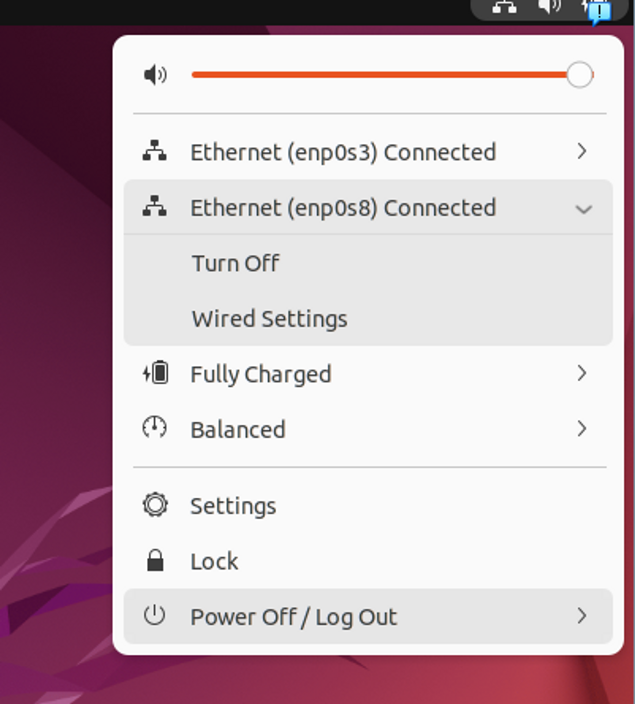

# 1. 네트워크 설정

<br/>

#### enp0s3은 NAT, enp0s8은 호스트 전용 어댑터로 설정한다.
1. `Wired Settings` 를 눌러 네트워크 설정으로 들어간다.
2. enp0s8의 톱니바퀴를 누른 후 ipv4를 직접 세팅해준다.

<br/>
세팅하고 나서 한번 껐다 켜주는 게 좋다.<br/>
터미널을 열어 세팅된 값을 확인해보자.
<br/>

# 2. 필요 패키지 설치
```bash
sudo apt update

# openssh, vim, net-tools 설치
sudo apt install net-tools vim openssh-server

# 확인
ifconfig

ping -c 2 192.168.56.1  # 윈도우까지 나가는지 확인
ping -c 2 8.8.8.8       # 구글로 나가는 지 확인
```
- 윈도우로 나가지지 않는다면 윈도우 방화벽 문제일 확률이 크다.  윈도우 방화벽을 끄고 다시 시도해보자.

<br/>
Windows 방화벽에 들어가서 아래와 같이 방화벽을 모두 끈 뒤 테스트 해보자.<br/>

<br/>

### 나가는 것이 테스트가 되었으니 이제 외부에서 들어오는 것을 테스트 해보자.
#### putty
<br/>