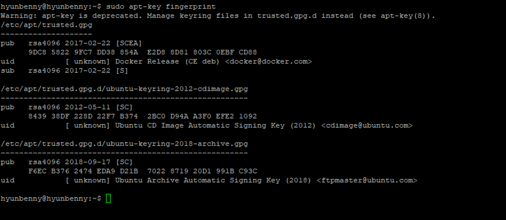

# 1. 필요 패키지 설치
- 커널 `3.10` 이상, `64bit`가 아니면 Docker를 설치할 수 없다.

```bash
# 내 정보 확인하기
uname -ar

# apt 업데이트
sudo apt update

# docker 사용에 필요한 패키지 설치
sudo apt-get install -y \
apt-transport-https \
ca-certificates \
curl \
gnupg-agent \
software-properties-common

# Docker의 공식 GPG(GNU Privacy Guard) key 추가
curl -fsSL https://download.docker.com/linux/ubuntu/gpg | sudo gpg --dearmor -o /usr/share/keyrings/docker-archive-keyring.gpg

sudo curl -fsSL https://download.docker.com/linux/ubuntu/gpg | sudo apt-key add -

# Docker가 가지고 있는 key값 확인
# Ubuntu 22.04 부터 시스템 보안 강화를 위해 apt key를 keyring 아래에 GPG key 저장을 권고한다.
sudo apt-key fingerprint
```

<br/>

# 2. Docker Repository 등록 및 설치
- keyring에 들어있는 key를 가지고 docker repository를 등록하고 docker ce버전을 다운로드 해보자.
  - community 버전은 Edge버전과 Stable버전으로 나뉜다.

```bash
# apt repository source에 docker repo 추가. (keyring 포함)
echo "deb [arch=$(dpkg --print-architecture) signed-by=/usr/share/keyrings/dockerarchive-keyring.gpg] https://download.docker.com/linux/ubuntu $(lsb_release -cs) stable" | sudo tee /etc/apt/sources.list.d/docker.list > /dev/null

# docker repository 추가하여 update 수행
sudo apt update

# docker에서 제공하는 docker-ce 버전 확인
sudo apt-cache policy docker-ce

# 최신 docker version 설치
sudo apt -y install docker-ce
```

#### 아래와 같은 문제가 발생하였다.
> W: GPG error: https://download.docker.com/linux/ubuntu jammy InRelease: The following signatures couldn't be verified because the public key is not available: NO_PUBKEY 7EA0A9C3F273FCD8


```bash
sudo apt-get update
sudo apt-get install \
   ca-certificates \
   curl \
   gnupg \
   lsb-release
   
curl -fsSL https://download.docker.com/linux/ubuntu/gpg | sudo apt-key add -
sudo add-apt-repository "deb [arch=amd64] https://download.docker.com/linux/ubuntu $(lsb_release -cs) stable"

apt-get update
sudo apt-get install docker-ce docker-ce-cli containerd.io
```
https://itslinuxfoss.com/fix-package-docker-ce-no-installation-candidate-error/ <br/>
https://velog.io/@osk3856/Docker-Ubuntu-22.04-Docker-Installation <br/>
<br/>
해결이 안된다<br/>

이 오류 메시지는 gpg키가 없는 채로 docker repository에 추가할 때 발생하는 오류로 `sources.list`에 직접 추가해보자.<br/>
```bash
vi /etc/apt/sources.list
deb [arch=amd64] https://download.docker.com/linux/ubuntu $(lsb_release -cs) stable
```


https://jhtechblog.tistory.com/entry/Docker-설치curl-libssl100-error와-the-GPG-error-NOPUBKEY가-둘-다-뜰-때-해결법 <br/>
https://www.dante2k.com/512 <br/>

추가했더니 아래와 같은 오류가 또 발생했다.
> Conflicting%20values%20set%20for%20option%20Signed-By%20regarding%20source%20https://download.docker.com/linux/ubuntu/%20jammy:%20/usr/share/keyrings/dockerarchive-keyring.gpg%20≠

/etc/apt/sources.list.d 에 있는 docker.list를 지우고 sources.list를 원복 했더니 갑자기 된다.. 

<br/>


# 3. 확인
```bash
# 기본적으로 docker engine은 /var/lib/docker에 깔린다.
df -h

# /var/lib은 root의 권한 영역이기 때문에 sudo를 붙여줘야 한다.
sudo docker version
```

- Docker 엔진은 dockerd(실행), containerd(관리), runc(생성)로 구성되어 있다.<br/>
<br/>

## ※ CentOS 7 사용시 도커 설치
```bash
cd /etc/yum.repos.d

yum-config-manager --add-repo https://download.docker.com/linux/centos/docker-ce.repo

ls
docker-ce.repo

yum repolist 
docker-ce-stable/7/x86_64 Docker CE Stable - x86_64

vi docker-ce.repo

yum -y install docker-ce && yum -y update

mkdir -p /etc/systemd/system/docker.service.d
systemctl daemon-reload
systemctl enable --now docker
systemctl start docker
systemctl status docker

# docker 설치 완료 확인
[root@server ~]# docker version
```

## ※ Docker에서 제공하는 쉘 스크립트로 설치

```bash
# docker 에서 제공하는 shell script을 이용한 자동 설치
curl -fsSL https://get.docker.com -o get-docker.sh

# shell script 내용 확인 후 변경 가능
sudo vi get-docker.sh

# 실행 권한 부여
chmod +x get-docker.sh

# 설치
sudo sh get-docker.sh
```

# 4. Docker 엔진 삭제

```bash
dpkg -l | grep -i docker
ii docker-ce 5:18.09.3~3-0~ubuntu-xenial
amd64 Docker: the open-source application container engine
ii docker-ce-cli 5:18.09.3~3-0~ubuntu-xenial
amd64 Docker CLI: the open-source application container engine
rc docker.io 18.06.1-0ubuntu1.2~16.04.1
amd64 Linux container runtime

sudo apt-get purge -y docker.io
sudo apt-get autoremove -y --purge docker.io
sudo apt-get autoclean
sudo apt purge docker-ce

# Host에 image, directory, 볼륨, 또는 사용자 생성 구성 파일을 제거
sudo rm /etc/apparmor.d/docker
sudo rm -rf /var/lib/docker
sudo groupdel docker
sudo apt-get purge docker-engine
sudo apt-get autoremove --purge docker-engine
```

# Dokcer 정보 확인
```bash
docker info
```
<br/>