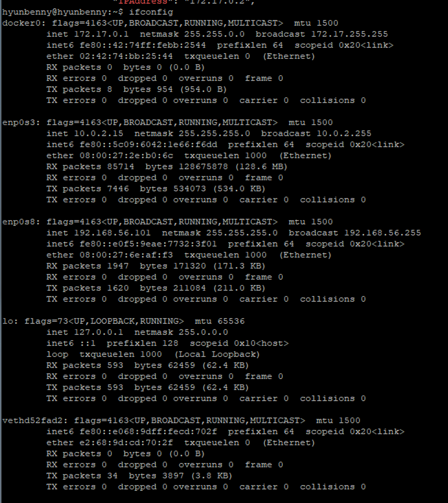
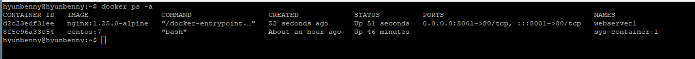
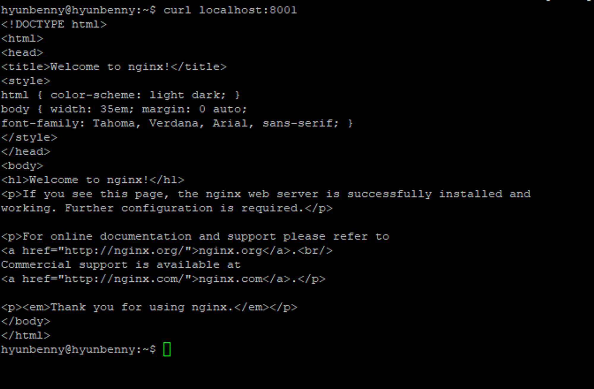
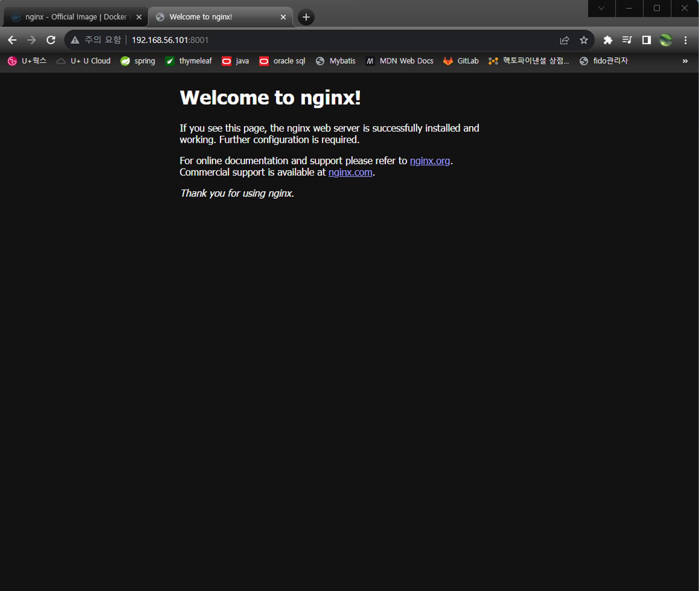

# Docker를 설치했으니 간단하게 사용해보자.

```bash
docker info | grep Username
```

## 1. DokcerHub에서 이미지 받아보기
```bash
# 신규 이미지를 받기 전에는 hub.docker.com에서 반드시 이미지를 확인해야 한다.

docker pull centos:7
docker images

docker pull ubuntu:16.04
docker images
```
이제 위에서 받은 이미지를 컨테이너로 생성해보자.<br/>
docker `run`이라는 명령어를 통해 실행해보자.<br/>

```bash
docker run -it --name=sys-container-1 centos:7 echo 'hello world'
```

### 컨테이너 정보

```bash
docker ps 
docker ps -a
```


## 2. centos를 bash로 실행해보기 - run

```bash
docker run -it --name=sys-container-1 centos:7 bash

cat /etc/os-release # 현재 os 정보를 확인

exit
```

## 3. 죽은 컨테이너 다시 실행하기 - exec

```bash
# 죽은 컨테이너(컨테이너가 stop상태) 다시 살리기
docker start sys-container-1

# 실행
docker exec -it sys-container-1 bash
```

## 4. exit하지 않고 실행한 컨테이너에서 빠져나오기

```bash
ctrl + p + q
```

## 5. 멈춘 컨테이너 삭제하기

```bash
docker rm sys-container-1
```

`exit` 를 치고 나오면 컨테이너가 죽는다.


```bash
docker inspect sys-container-1 | grep -i ipaddress
```
위 명령어를 통해 해당 컨테이너가 사용하고 있는 ip를 알 수 있다.<br/>

### virtual ethernet
컨테이너를 띄우고 ifconfig명령어를 입력해보면 아래와 같이 `veth`로 시작하는 게 추가되어 있을 것이다.<br/>
<br/>
이는 docker0과 컨테이너 사이에서 서로 연결해주는 터널로 컨테이너 개수만큼 생성된다.

# Nginx 컨테이너 실행해보기
centos와 같이 시스템 컨네이너 말고 우리가 앞으로 주로 사용하게 될 애플리케이션 컨테이너를 실행해보자.
```bash
docker pull nginx:1.25.0-alpine
docker images

docker image history nginx:1.25.0-alpine

```

```bash
docker run -d -p 8001:80 --name=webserver1 nginx:1.25.0-alpine

docker ps -a
```

<br/>

모든 IP에서 8001포트로 들어오면 컨테이너의 80포트로 포트포워딩 한다.<br/>

```bash
curl localhost:8001

# 8001포트가 열렸는지 확인해보자
sudo netstat -nlp | grep 8001

ps -ef | grep [docker-proxy]
ps -ef | grep 2906

docker inspect webserver1 | grep IPA
```

<br/>
VM이 아닌 로컬에서 VM의 웹서버로 접속해보자.<br/>
<br/>


### Docker 컨테이너로 host의 파일 복사하기
```bash
mkdir LABs && cd $_

vi index.html
<html>
        <head>
                <title>Docker Container Sample App</title>
        </head>
        <body>
                <div style=color:blue;text-align:center>
                        <h1>Sample Web Application</h1>
                        <p>Application is running on a Docker Container.</p>
                </div>
        </body>
</html>

# host에서 만든 index.html을 Docker 컨테이너 내부로 복사하기
docker cp index.html webserver1:/usr/share/nginx/html/index.html

# scp index.html hostos2:/home/hyunbenny
```

`scp`: server to server로 원격 copy

### docker file을 생성하여 컨테이너가 뜰 때 해당 파일들을 포함시켜서 띄워보자

index.html 수정

```bash
<html>
        <head>
                <title>Docker Container Sample App</title>
                <style>
                        body{
                                margin-top:40px;
                                background-color: #87CEB;
                                background-image: url("test.png");
                        }
                </style>
        </head>
        <body>
                <div style=color:blue;text-align:center>
                        <h1>Sample Web Application</h1>
                        <p>Application is running on a Docker Container.</p>
                </div>
        </body>
</html>
```

아무 이미지 파일을 가지고 test.png로 바꾼 후 index.html와 동일한 경로에 넣어준다.

dockerfile 생성

```bash
vi dockerfile

FROM nginx:1.25.0-alpine
COPY index.html /usr/share/nginx/html/index.html
COPY test.jpg /usr/share/nginx/html/test.jpg
EXPOSE 80
CMD ["nginx", "-g", "daemon off;"]
```

생성한 dockerfile로 빌드해보자

```bash
docker build -t mywebserver:v1.0 .

# 확인
docker images

# 컨테이너 띄우기
docker run -d --name=webserver2 -p 8002:80 mywebserver:v1.0

# 확인
docker ps
```
로컬에서 VM ip:8002로 접속하면 이미지가 포함된 페이지 화면을 볼 수 있다.<br/>

# MySQL 설치 및 실행해보기
이미지 다운로드 전 hub.docker.com에서 버전확인 하기<br/>
https://hub.docker.com/_/mysql <br/>
```bash

docker pull mysql:8.1.0

docker images

docker run --name mysql-container -e MYSQL_ROOT_PASSWORD=password -d -p 3306:3306 mysql:latest

docker exec -it mysql-container bash

cat /etc/os-release
mysql -uroot -p

mysql> show databses;
mysql> create database dockerdb;
mysql> show databses;
```

```bash
docker pull mysql:8.1.0

docker images

docker run -it --name=mysql-container -e MYSQL_ROOT_PASSWORD=password mysql:8.1.0 /bin/bash

cat /etc/os-release
/etc/init.d/mysql start

mysql -uroot -p

mysql> show databses;
mysql> create database dockerdb;
mysql> show databses;
```
`exit`로 빠져 나와서 컨테이너가 죽어있는데 `run`을 사용하면 또 다른 컨테이너가 생성된다.<br/>
`start`로 컨테이너를 실행 후 `exec`로 접속하자.<br/>