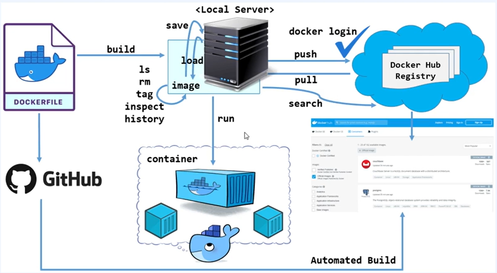
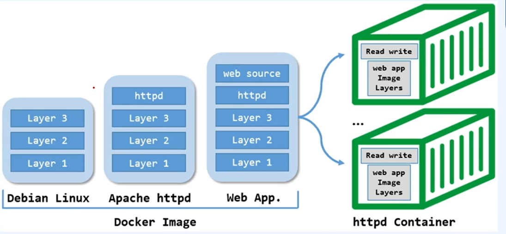
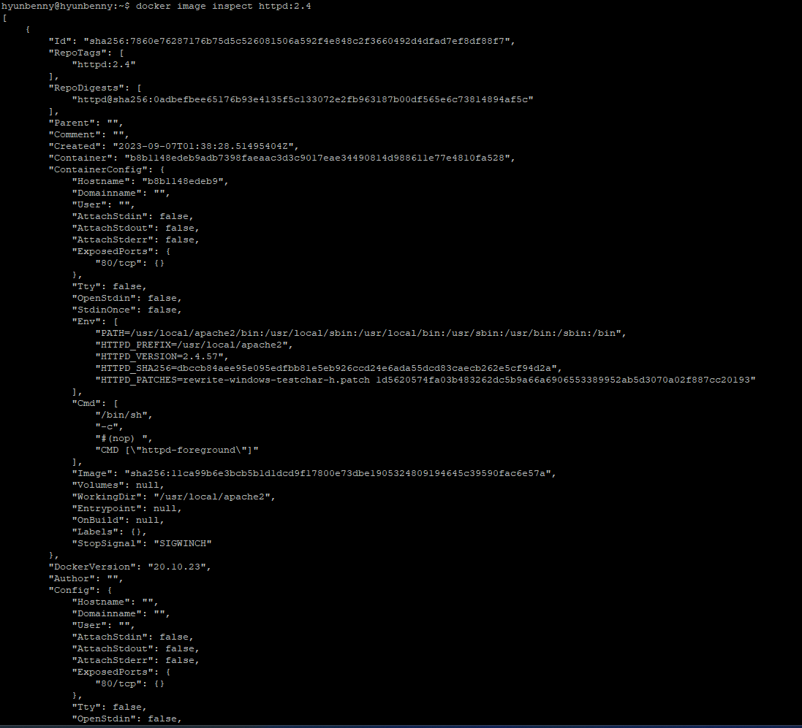
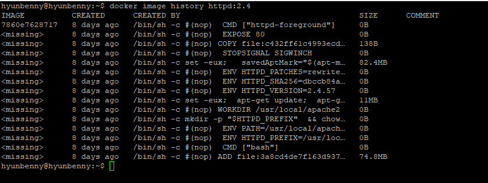
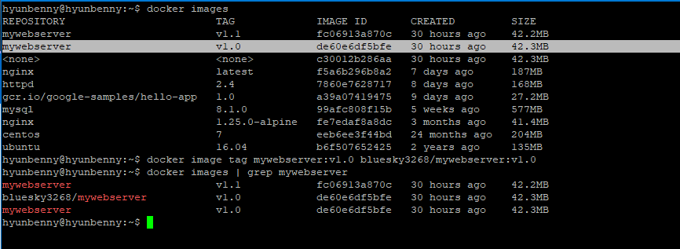
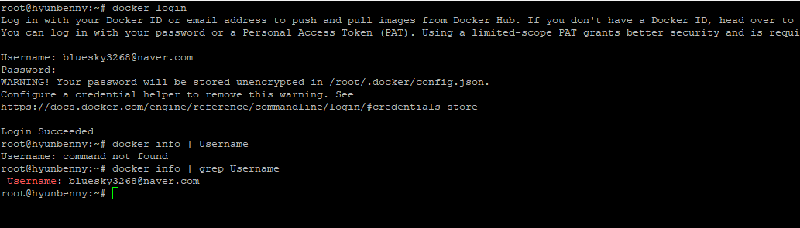
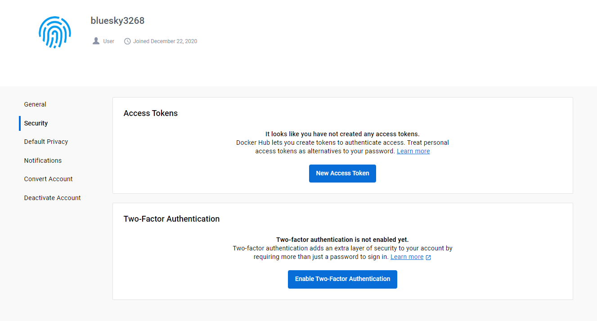
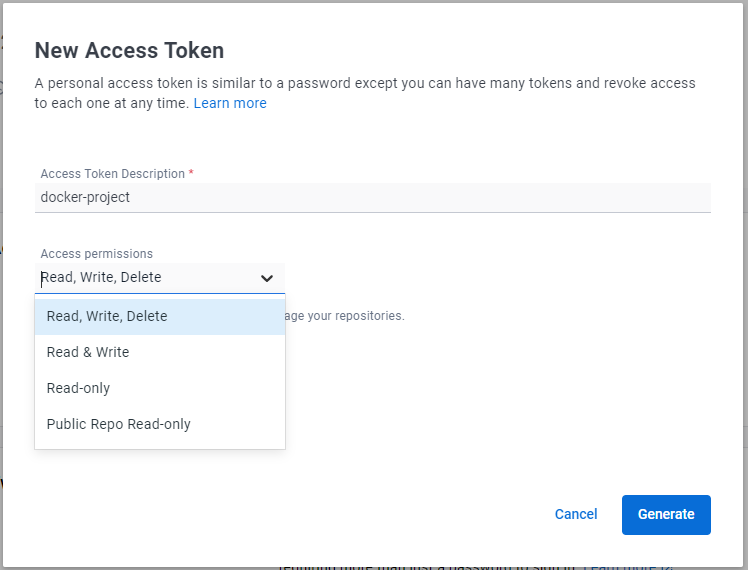
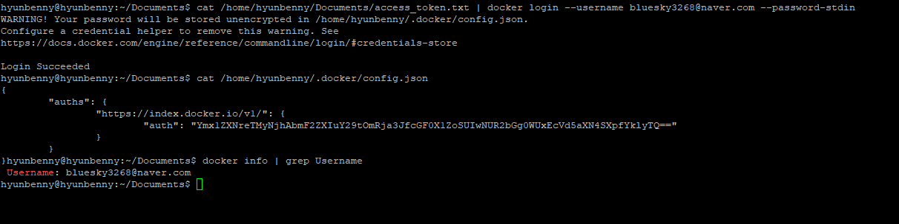

# Docker Image
> docker image는 컨테이너 runtime에 필요한 바이너리, 라이브러리, 설정 값 등을 포함하고 변경되는 상태 값을 보유하지 않고 변하지 않는다.(stateless, immutable)

# Docker Image 관련 명령어 workflow
<br/>

# 1. 이미지 내려받기(pull)
> docker [image] pull [options] [name]:[tag] <br/>
> pull은 이미 만들어져 있는 이미지를 가져다 쓰는 것이다.

```bash
# docker.io가 기본값으로 registry에 등록되어 있다.
docker pull debian # tag를 안붙일 경우 제일 최신 버전으로 받는다.
docker pull library/debian:10
docker pull docker.io/library/debian:10
docker pull index/docker.io/library/debian:10

# private registry, 개별 클라우드 저장소의 이미지 내려받기
docker pull 192.168.56.101:5000/debian:10
docker pull gcr.io/google-sample/hello-app:1.0
```
## 1.1 이미지의 구조
> 이미지는 레이어 구조로 되어 있다.<br/>

<br/>

## 1.2 Image의 레이어들
> 다운로드된 이미지의 레이어들은 `distributre ID`를 부여받아 docker 경로에 저장된다.

```bash
sudo su - 

cd /var/lib/docker/image/overlay2/distribution/diffid-by-digest/sha256/
ls -alrth
```

## 1.3 inspect
> docker image inspect [이미지명]:[태그]
- 생성된 이미지의 구조 정보를 JSON형태로 제공해준다.

```bash
docker image inspect httpd:2.4

# image를 빼면 컨테이너 inspect
docker inspect httpd:2.4
```
<br/>
- Id: 이미지 ID
- Created: 생성일
- DockerVersion: 이미지가 생성된 Docker의 버전
- Architecture: CPU 아키텍처
- RootFS: 이미지 다이제스트 정보
- GraphDriver: 이미지 레이어 저장 정보

#### - format 옵션
```bash
docker image inspect --format="{{.Os}}" httpd:2.4
docker image inspect --format="{{.ContainerConfig.ExposedPorts}}" httpd:2.4
docker image inspect --format="{{.ContainerConfig.ExposedPorts}} {{.Os}}" httpd:2.4
```

## 1.4 history
> dockerfile을 통해 build되는 정보를 보여준다.<br/>
> docker image history [이미지명]:[태그]

```bash
docker image history httpd:2.4

docker image history httpd:2.4 --no-trunc
docker image history httpd:2.4 --no-trunc > httpd.txt
```
<br/>

## 2. 이미지 올리기(push)
> docker [image] tag push <br/>
> registry에 이미지를 업로드 하는 것을 `push`라고 한다.
- registry: `dockerfile`이나 `docker commit`을 통해 생성된 이미지를 저장하는 저장소
  - public과 private(회사 내부에서만 접근되는 registry)로 구분할 수 있다.
- `push`를 위해서는 `docker login`과 `docker tag`를 먼저 수행해야 한다.
  - tag: 이미지의 새로운 참조명으로 버전 표시 등으로 활용된다.

```bash
docker login 
docker images

# mywebserver:v1.0 이미지를 bluesky3268/mywebserver:v1.0 태그를 건다.
docker image tag mywebserver:v1.0 bluesky3268/mywebserver:v1.0

docker images | grep mywebserver

# 업로드
docker push bluesky3268/mywebserver:v1.0
```
hub.docker.com에 가서 Repositories탭에서 제대로 업로드가 되었는지 확인해보자.<br/>

- 이미지 앞에 본인 계정명을 명시해야 한다.
<br/>

#### 복제한 VM2 환경 혹은 로컬환경에서 이미지를 받아 컨테이너를 실행해보자.
```bash
docker pull bluesky3268/mywebserver:v1.0

docker run -d -p 8001:80 --name=mywebserver bluesky3268/mywebserver:v1.0
```

### 2.1 Docker 접근 방법
#### 암호를 통한 접근 방법
```bash
docker login

# 계정확인
docker info | grep Username

# 내 계정정보가 base64로 인코딩되어 있는 것을 확인할 수 있다.
cat /root/.docker/config.json
```
<br/>
- base64로 인코딩된 값은 쉽게 디코딩해서 볼 수 있다.
```bash
echo /root/.docker/config.json | base64 -d
```

- 로그아웃
```bash
docker logout

docker info | grep Username 
```

#### 토큰을 통한 접근방법
<br/>
<br/>
- 토큰별 권한을 지정하여 줄 수 있다.

`Generate`를 눌러 토큰을 생성한 후, 생성된 토큰값을 이용해서 로그인을 해보자.
```bash
vi /home/hyunbenny/Documents/access_token.txt

# 토큰값을 저장한다.

cat /home/hyunbenny/Documents/access_token.txt | docker login --username bluesky3268@naver.com --password-stdin
docker info | grep Username
cat /home/hyunbenny/.docker/config.json
```
<br/>

## 3 이미지의 백업 및 이동
### save
> docker image save [이미지명]:[태그] > [이미지명].tar <br/>
> docker image save [이미지명]:[태그] | gzip > [이미지명].tar.gz <br/>
> docker image save [이미지명]:[태그] | bzip2 > [이미지명].tar.bz2 <br/>
- `save`를 통해 여러 레이어로 구성된 이미지를 하나의 tar파일로 묶어 저장한다.
- 전달받은 tar파일을 `docker load`를 통해 이미지로 등록한다.

```bash
docker image save mywebserver:v1.0 > mywebserver.tar.gz
# 이동
scp mywebserver.tar.gz hyunbenny@192.168.56.102:/home/hyunbenny/backup/mywebserver.tar.gz
```

### load
> docker image load < [압축한 이미지 파일]<br/>


```bash
docker image load < mywebserver.tar.gz
docker images
docker run -itd -p 8200:80 mywebserver:v1.0
curl localhost:8200
```


## 이미지 삭제
> docker image rm [옵션] {[이미지명]:[태그] | [이미지ID]}

```bash
# 이미지 전체 삭제
docker rmi $(docker images -p) 

# 특정 이미지명이 포함된 것만 삭제
docker rmi $(docker images | grep debian)

# 특정 이미지명이 포함된 것만 제외하고 모두 삭제
docker rmi $(docker images | grep -v centos)
```
#### Exited 상태인 컨테이너 모두 삭제하기
```bash
docker rm $(docker ps --filter 'status=exited' -a -q)
```
