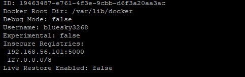

# Docker Registry
> Docker에서 제공하는 docker image를 회사 서버에서 개별적으로 구축, 관리하는 서비스

registry를 컨테이너로 띄우고 registry에 이미지를 올리고 내려받는 작업을 해보자.
- 개인 프로젝트가 아닌 회사에서 사용하는 이미지를 public registry에 올리는 경우는 당연히 없다.
  - 보안상 불특정 다수가 볼 수 없는 private registry를 구축하여 사용한다.
- 회사 인프라 내, private한 docker registry를 구축하기 위해서는 `Docker Hub`에서 제공하는 공식 `registry` 이미지를 사용한다.

# 1. Docker에서 제공하는 `Registry` 내려받기
```bash
docker pull registry

# 확인
docker images | grep registry
docker image history registry:latest
docker image inspect registry:latest
```

## 1.2 실행
```bash
docker run -d -v /home/hyunbenny/registry_data:/var/lib/registry \
-p 5000:5000 \
--restart=always \
--name=local-registry \
registry

# 확인
docker ps | grep registry
sudo netstat -nlp | grep 5000

curl -X GET http://192.168.56.101:5000/v2/_catalog
```
# 2. Registry에 이미지 업로드 하기 

## 2.1 업로드 전 registry 정보 변경
```bash
# 업로드 전 registry 정보 변경

sudo vi /etc/init.d/docker
# ----- vi 추가 내용 -----
DOCKER_OPTS=--insecure-registry 192.168.56.101:5000

sudo vi /etc/docker/daemon.json    # daemon.json은 새로 생성하는 파일
# ----- vi 추가 내용 -----
{"insecure-registries":["192.168.56.101:5000"]}

sudo systemctl restart docker.service

# 제대로 등록되었는지 확인
docker info
```
- `docker info` 를 통해 제일 밑에 보면 아래의 사진과 같이 `Insecure Registries`라는 항목에 우리가 추가한 주소가 등록되어 있는지 확인한다.
<br/>

## 2.2 이미지 업로드
```bash
# tag 생성
docker image tag bluesky3268/mywebserver:v1.0 192.168.56.101:5000/myweb:1.0

# tag 생성 확인
docker images

# 업로드
docker push 192.168.56.101:5000/myweb:1.0

# 확인
curl -X GET http://192.168.56.101:5000/v2/_catalog
curl -X GET http://192.168.56.101:5000/v2/myweb/tags/list
```

# 3. registry 활용해보기

아까 업로드한 것과 같이 이번에는 tag만 1.1로 바꾸어서 업로드 해보자
```bash
docker image tag bluesky3268/mywebserver:v1.0 192.168.56.101:5000/myweb:1.1

docker push 192.168.56.101:5000/myweb:1.1

curl -X GET http://192.168.56.101:5000/v2/myweb/tags/list
```

## 3.1 다른 서버에서 해당 registry에 접근하여 이미지를 받아보자.
로컬 환경 혹은 VM에서 다른 서버를 하나 만들어 접근해보자.
```bash
curl -X GET http://192.168.56.101:5000/v2/_catalog
curl -X GET http://192.168.56.101:5000/v2/myweb/tags/list

docker pull 192.168.56.101:5000/myweb:1.0
# pull할 때, 앞에서 발생한 에러와 동일한 에러가 발생할 것이다. -> 2.1을 똑같이 수행해주자. 

docker image tag 192.168.56.101:5000/myweb:1.0 dev_http:1.1


docker images
docker run -d -p 8100:80 --name=myweb-server dev_http:1.1
```

### 빌드 해서 실행 및 push해보기
```bash
git clone https://github.com/hylee-kevin/fastcampus.git

cd fastcampus/ch04

docker build -t phpserver:1.0 .

# 빌드된 이미지는 반드시 이미지를 조회하고, 컨테이너를 띄워서 테스트 해봐야 한다.
docker images | grep phpserver
docker run -it -d -p 8004:80 -h phpserver --name=phpserver phpserver:1.0
docker ps | grep phpserver
curl localhost:8004

# local registry에 push해보자.
docker image tag phpserver:1.0 192.168.56.101:5000/phpserver:1.0
docker push 192.168.56.101:5000/phpserver:1.0

# 확인
curl -X GET http://192.168.56.101:5000/v2/_catalog
curl -X GET http://192.168.56.101:5000/v2/phpserver/tags/list
```

### push한 이미지 pull해보기
```bash
docker pull 192.168.56.101:5000/phpserver:1.0
```