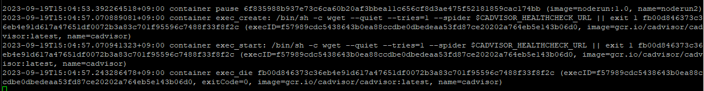
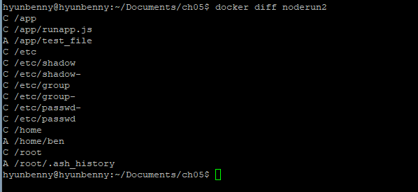

# ㅇ
### 테스트를 위한 샘플 이미지 생성
runapp.js
```bash
vi ~/Documents/ch05/runapp.js

# ----- 내용 -----
const http = require('http');

const server = http.createServer().listen(6060);

server.on('request', (req, res) => {
    console.log('Your request arrived.');
    res.write("HostName: " + process.env.HOSTNAME + "\n");
    res.end();
});

server.on('connection', (socket) => {
    console.log("Your Connected.");
});
```
Dockerfile
```bash
vi ~/Documents/ch05/Dockerfile

# ----- 내용 -----
FROM node:20-alpine3.17
RUN apk add --no-cache tini curl
WORKDIR /app
COPY runapp.js .
    EXPOSE 6060
ENTRYPOINT ["/sbin/tini", "--"]
CMD ["node", "runapp.js"]
```
빌드 및 실행
```bash
cd ~/Documents/ch05

# 빌드
docker build -t noderun:1.0 . 

# 확인
docker images | grep noderun
docker image history | grep noderun

# 실행
docker run -itd -p 6060:6060 --name=noderun -h noderun noderun:1.0

docker ps | grep noderun
curl localhost:6060
```
# Docker run 옵션 
|옵션| 설명                                                            |
|---|---------------------------------------------------------------|
|-i, -interactive| 대화식 모드 열기                                                     |
|-t| TTY 할당                                                        |
|-d, -detach=true| 백그라운드에서 컨테이너를 실행하고 컨테이너 ID등록                                  |
|--name| 실행되는 컨테이너에 이름 부여                                              |
|--rm| 컨테이너 종료시 자동으로 컨테이너 제거                                         |
|--restart| 컨테이너 종료시 적용할 재시작 정책 지정(no, on-failure, on-failure:횟수, always) |
|--env| 컨테이너 환경변수 지정                                                  |
|-v, --volume=host:container path| 호스트 경로와 컨테이너 경로의 공유 볼륨 지정(Bind Mount)                         |
|-h|컨테이너의 호스트명 지정|
|-p host port:container port, --publish|호스트 포트와 컨테이너 포트 연결|
|-P, --publish-all=true/false|컨테이너 내부에 노출된 포트를 호스트 임의의 포트에 게시|
|--workdir, -w|컨테이너 내부의 작업 경로|

`-p` 옵션을 사용하면 `docker proxy`가 사용되는데 아래와 같이 확인할 수 있다.
```bash
sudo netstat -nlp | grep 6060
ps -ef | grep 6060
```

# 상태값 조회
> docker top | port | stats
- top: 컨테이너에서 실행 중인 프로세스 조회
- port: 컨테이너에 매핑된 포트 조회
- stats: 컨테이너 리소스 사용 통계에 대한 실시간 스트림 출력
```bash
docker top noderun
docker port noderun
docker stats noderun
```

# cadvisor
> cadvisor 컨테이너 생성<br/>
- cadvisor: 구글에서 제공하는 오픈 소스 컨테이너 모니터링 도구
```bash
docker run --restart=always \
           --volume=/:/rootfs:ro \
           --volume=/var/run:/var/run:rw \
           --volume=/sys/fs/cgroup:/sys/fs/cgroup:ro \
           --volume=/var/lib/docker/:/var/lib/docker:ro \
           --volume=/dev/disk/:/dev/disk:ro \
           --publish=9559:8080 \
           --detach=true \
           --name=cadvisor \
           --privileged \
           --device=/dev/kmsg \
           gcr.io/cadvisor/cadvisor:latest
           
docker ps -a
```
192.168.56.101:9559로 접속해서 확인해보자.

# log
> 컨테이너에서 발생하는 로그를 출력한다.
> - 표준 출력(stdout)
> - 표준 에러(stderr)

```bash
# VM2
while true; do curl 192.168.56.101:6060; sleep 3; done

# VM1
docker logs -f noderun # runapp.js에서 찍은 로그, -f 옵션은 리눅스에서 tail -f 와 같다
```

#### 출력되는 로그 양이 큰 경우, disk full error의 원인이 될 수도 있다.
```bash
docker info | grep -i log
```
```bash
sudo ls -alrth /var/lib/docker/containers

sudo ls -alrth /var/lib/docker/containers/060a56e634aa3d5658438ce712dcce1da3414e2c40780afea379cad96ece5791
```
<br/>

#### 쌓이는 로그파일을 깨끗이 날려보자.(물론 실무에서는 백업을 해놓아야 한다.)
```bash
sudo truncate -s 0 /var/lib/docker/containers/060a56e634aa3d5658438ce712dcce1da3414e2c40780afea379cad96ece5791/060a56e634aa3d5658438ce712dcce1da3414e2c40780afea379cad96ece5791-json.log
```

#### 컨테이너에서 발생하는 로그 사이즈를 제한하자.
```bash
# 전체적으로 설정
sudo vi /etc/docker/daemon.json

{
  "insecure-registries":["192.168.56.101:5000"],
  "log-driver":"json-file",
  "log-opts":{
    "max-size":"30m",
    "max-file":"10"
  }
}

sudo systemctl restart docker.service
sudo systemctl status docker.service

# 컨테이너 단위로 설정
docker run -itd -p 6060:6060 --name=noderun2 -h noderun --log-driver json-file --log-opt max-size=30m --log-opt max-file=10 noderun:1.0
```

```bash
docker run -d -p 3306:3306 --name=mysqldb mysql:8.1.0
docker logs mysqldb

docker rm mysqldb

docker run -d -p 3306:3306 --name=mysqldb -e MYSQL_ROOT_PASSWORD=1234 mysql:8.1.0
docker ps
docker logs mysqldb
```

# insepect
> 컨테이너의 내부구조를 확인한다.<br/>
> docker container inspect [컨테이너명]

```bash
docker container inspect noderun
```

# cp, restart
> 컨테이너를 복사, 재시작한다.<br/>
> docker container cp [container명(ID)]:[container내 파일 경로] [host 디렉토리 경로]<br/>
> docker container cp [host 파일] [container명(ID)]:[container내 파일 경로]

#### test container의 /var/log/ 파일을 host의 /home/hyunbenny/cetos_log/로 복사
```bash
docker run -itd --name=my-container centos

docker cp my-container:/var/log/ /home/hyunbenny/cetos_log/
```

#### host의 디렉토리에 있는 test.txt를 container의 tmp/test.txt로 복사
```bash
touch test.txt

docker cp ./test.txt my-container:/tmp/test.txt
docker exec -it my-container ls /tmp
```

runapp.js를 수정해보자.
```bash

const http = require('http');

const server = http.createServer().listen(6060);

var requestIp = require('request-ip');
let ip = requestIp.getClientIp(req);

server.on('request', (req, res) => {
    console.log('Hello!!, Your request arrived.');
    res.write("HostName: " + process.env.HOSTNAME + "\n");
    res.end();
});

server.on('connection', (socket) => {
    console.log("Your Connected. ip: " + ip);
});
```
이제 `cp` 명령어를 통해 컨테이너 내부에 복사(덮어쓰기) 해보자.(리눅스의 `scp`와 같다고 보면된다.)
```bash
docker cp runapp.js noderun2:/app/runapp.js
```
변경된 파일의 적용을 위해 재시작하자(경우에 따라서 재시작이 필요없는 경우도 있다.)
```bash
docker restart noderun2
```

# docker 생성과 시작 그리고 일시정지
> docker [stop | start | pause | unpause]


#### events
> events 명령어를 통해 docker 엔진이 감지하는 정보를 확인할 수 있다. 
```bash
# VM2
while true; do curl 192.168.56.101:6060;                                                   sleep 3; done

# VM1
docker events
# docker events --until time(h|m|s) --since date1, date2, --filter "key=value" 
```
그럼 netty로 새로운 터미널로 접속해서 docker를 시작하고 일시정지 해보자.
```bash
docker stop noderun2
```
<br/>
```bash
docker start noderun2
```
<br/>
```bash
docker pause noderun2
```
<br/>
```bash
docker unpause noderun2
```
<br/>

## Docker Exit Code
| 코드            | 이름                  | 설명                                                      |
|---------------|---------------------|---------------------------------------------------------|
| exit code 0   | 의도적으로 중지            | 컨테이너가 자동으로 중지되었음을 나타내기 위해 개발자가 사용한다.                    |
| exit code 1   | 신청 오류               | 애플리케이션 오류 혹은 이미지의 사양이 잘못 참조되어 컨테이너가 중지된 경우 사용한다.        |
| exit code 125 | 컨테이너 실행 실패 오류       | docker run 명령이 성공적으로 실행되지 않음                            |
| exit code 126 | 명령 호출 오류            | 이미지 사양에 지정된 명령을 호출할 수 없음                                |
| exit code 127 | 파일 또는 디렉토리를 찾을 수 없음 | 이미지 사양에 지정된 파일 또는 디렉토리를 찾을 숭 ㅓㅄ음                        |
| exit code 128 | 종료 시 잘못된 인수가 사용됨    | 잘못된 종료 코드로 종료가 실행됨(0-255 정수만 유효)                        |
| exit code 134 | 비정상 종료(SIGABRT)     | 컨테이너가 abort()함수를 사용하여 자체 중단됨                            |
| exit code 137 | 즉시 종료(SIGKILL)      | 컨테이너가 SIGKILL 신호를 통해 운영체제에 의해 즉시 종료됨                    |
| exit code 139 | 분할 결함(SIGSEGV)      | 컨테이너가 할당되지 않은 메모리에 엑세스하려고 시도하여 종료됨                      |
| exit code 143 | 단계적 종료(SIGTERM)     | 컨테이너가 곧 종료될 것이라는 경로를 받은 후 종료된(graceful)                 |
| exit code 255 | 종료 상태가 범위를 벗어남      | 컨테이너가 종료되어 허용 가능한 범위를 벗어난 종료 코드를 반환함(== 오류의 원인을 알 수 없음) |

# attach, exec
> 실행 중인 컨테이너에 stdout, stdin, stderr 스트림 연결
> - attach: 실제 컨테이너 내부에서 돌아가는 로그, 혹은 실제 수행되는 작업의 정보 등을 출력할 때 사용한다.
> - exec: 컨테이너 내부에 접속해서 작업을 할 때 사용한다.

```bash
docker run -d --name=top-container ubuntu:22.04 /usr/bin/top -b

docker attach top-container

# 새
```
<br/>

```bash
docker run -itd --name=my-container2 alpine sh

docker exec -d my-container2 touch /tmp/exec_test

docker exec -it my-container2 ls /tmp

docker exec -it my-container2 sh
ls -alrth /tmp
```

# diff
> 컨테이너 내부의 변경사항 확인

```bash
docker exec -it noderun2

touch test-file1
adduser ben

ctrl + p + q

docker diff noderun2
```
<br/>
- A: 추가됨
- D: 삭제됨
- C: 변경됨

# commit
> 실행 중인 컨테이너의 변경사항을 포함한 새로운 이미지를 생성

```bash
docker commit noderun2 noderun:2.0
docker images | grep noderun

docker run -itd --name=noderunV2 -p 6063:6063 noderun:2.0

docker logs -f noderunV2

# VM2
while true; do curl 192.168.56.101:6063; sleep 1; done 
```

# export, import
> - export: 실행 중인 컨테이너의 파일 시스템을 그대로 tar archive로 내보낸다.<br/>
>   - (image save와는 달리 이미지의 레이어에 대한 내용은 포함하지 않고 하나의 레이어로 통합된다.)
> - import

export
```bash
docker ps
docker export noderun2 > noderun2.tar
ls -alrth

sudo scp noderun2.tar 192.168.56.102:/home/hyunbenny

# VM2
cd /home/hyunbenny
cat noderun2.tar | docker import - noderun2
docker images | grep node
```
VM2에서 옮긴 tar파일을 import한 후 실행하면 아래와 같은 에러가 발생한다.
<br/>
이는 export로 만들어진 이미지는 단순히 컨테이너의 파일 시스템을 아카이빙해서 만든 이미지이기 때문에 컨테이너를 run한 후 실행할 명령이 요구된다.<br/>

- import시 cmd를 추가하는 방법
```bash
# VM2
docker rmi noderun2
docker import --change 'CMD ["node", "app/runapp.js"]' noderun2.tar noderun:2.0
docker images | grep node

docker run -itd --name=noderunV2 -p 6064:6060 noderun:2.0
docker ps -a | grep node
```

- Dockerfile을 추가하여 다시 빌드하는 방법
