# Docker Network
> Docker Network는 OS커널이 가지고 있는 네트워크 스택 위에 존재하는 네트워크 드라이버를 가지고 Docker Network를 구현한다.<br/> 
- Docker Network 아키텍처는 CNM(Container Networking Model) 인터페이스 위에 구축하기 때문에 OS 및 인프라에 구애받지 않고 애플리케이션이 동일한 환경을 가질 수 있다.

```bash
ifconfig
```
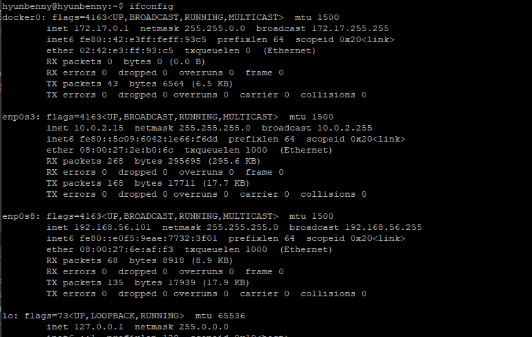<br/>
docker 엔진을 설치하면 `docker0`이 기본 인터페이스 브릿지로 할당되어 있다. 

#### 리눅스 네트워크 빌딩 블록
> 리눅스 브릿지, 네트워크 네임스페이스, veth pair 및 iptables가 포함된다.<br/>
> 복잡한 네트워크 정책을 위한 전달 규칙, 네트워크 분할 및 관리 도구를 제공한다.

# 1.리눅스 브릿지
> 커널 내부의 물리 스위치를 가상으로 구현한 OSI 2계층 장치로, 트래픽을 검사하여 동적으로 학습되는 MAC주소를 기반으로 트래픽을 전달한다.<br/>
- 브릿지 네트워크의 기본대역
  - 172.{17-31}.0.0/16: 65536개
  - 192.168.{0-240}.0/20: 4096개
- docker0은 리눅스 커널과 OS 도구를 통해 관리되고 브릿지 네트워크는 Docker 엔진과 Docker CLI를 통해 관리된다.

# 2.네트워크 네임스페이스
> 커널에 격리된 네트워크 스택으로 자체 인터페이스와 라우트, 방화벽 규칙 등을 보유한다.<br/>
- 네트워크 네임스페이스는 도커 네트워크를 통해 구성된 경우가 아니라면 동일한 호스트의 두 컨테이너가 서로 통신하거나 호스트 자체와 통신할 수 없음을 보장한다.
- CNM 네트워크 드라이버는 각 컨테이너에 대해 별도로 네임스페이스를 구현한다.


# 3.[CNM(Container Networking Model)](https://github.com/moby/libnetwork/blob/master/docs/design.md)
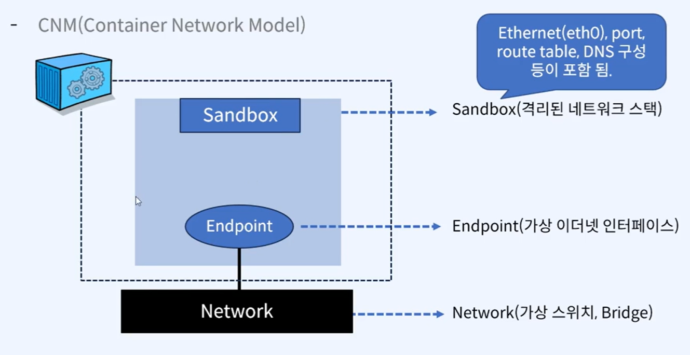<br/>
- CNM은 그냥 모델이고 LibNetwork를 통해 구현된다.
- 컨테이너가 생성이 되면 Sandbox가 내부에 구성이 된다.
  - SandBox: 격리된 네트워크 스택으로 Ethernet(eth0), port, route table, DNS 구성 등이 포함되어 있다.
  - EndPoint: 가상 이더넷 인터페이스라고 하는 접근 가능한 가상 주소를 가진다.(외부와의 연결점)
    - 이더넷을 통해 MAC주소와 IP를 제공하고, 그 주소를 통해 접근이 가능하도록 한다.
    - virtual ethernet, docker0, bridge network 
- 컨테이너는 Bridge Network과 연결된다.

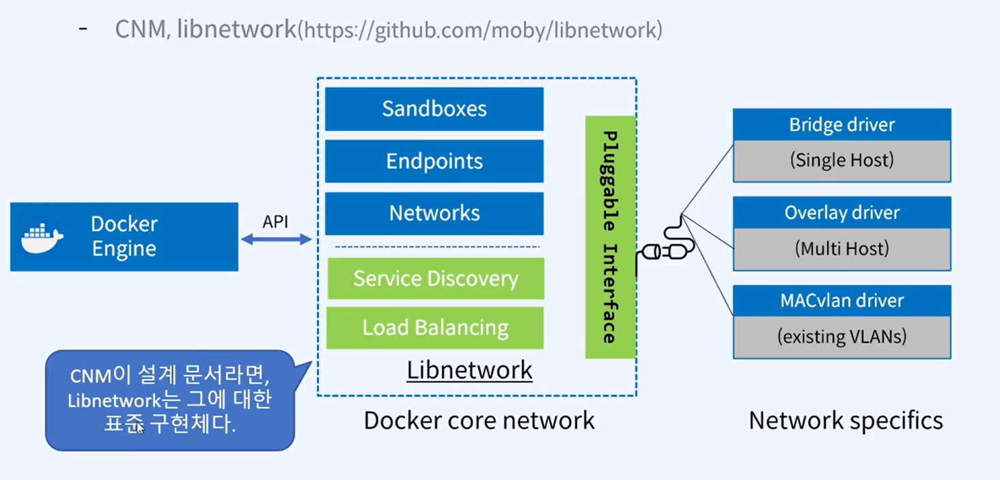<br/>
- Docker Network는 브릿지 네트워크이므로 Docker엔진에 의해 관리가 되고 Docker엔진을 통해 LibNetwork를 관리한다.
```bash
docker network ls 
```
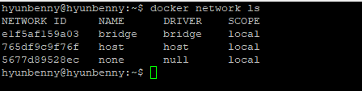<br/>
Docker에서 사용 가능한 드라이버 확인할 수 있다.

# 4.veth(Virtual Ethernet Device)
> OSI 2계층 서비스로, 컨테이너 내부에 제공되는 네트워크 인터페이스 `eth0`과 한 쌍으로 제공되어 `docker0`과 가상의 `터널링 네트워크`를 제공한다.
- 두 네트워크 네임스페이스 사이의 연결선으로 동작하는 리눅스 네트워킹 인터페이스
- 전이중 링크(full duplex link)
- 한 인터페이스의 트래픽을 다른 인터페이스로 전달한다.
- 도커 네트워크를 만들 때, 도커 네트워크 드라이버는 veth를 사용해 네임스페이스 간 명시적 연결을 제공한다.
- 컨테이너가 도커 네트워크에 연결되면 veth의 한쪽 끝은 컨테이너 내부에 배치(ethN)되고, 다른 쪽은 도커 네트워크에 연결된다.

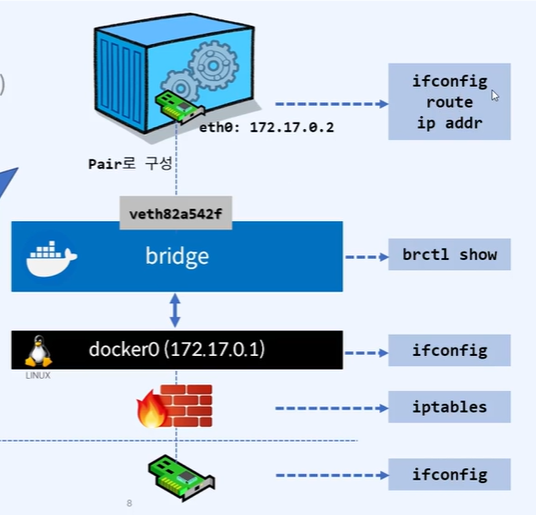<br/>
```bash
brctl show

# 명령어 실행이 안되는 경우
sudo apt install bridge-utils

# 브릿지 네트워크 정보를 확인해보자.
docker network inspect bridge
```
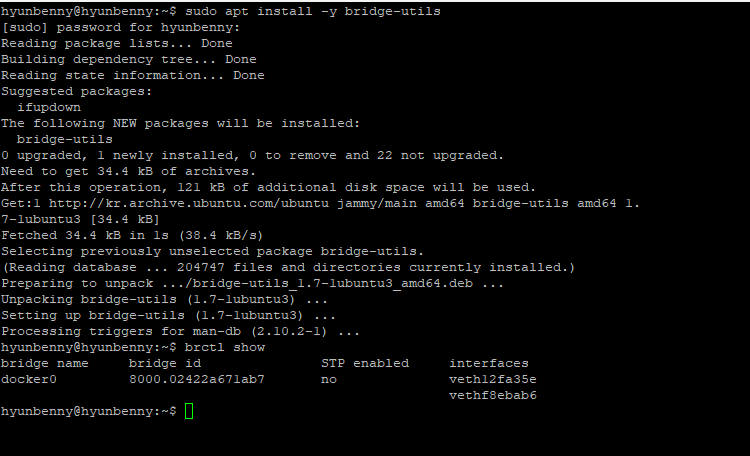<br/>
docker0과 연결된 컨테이너를 veth로 보여준다.<br/>
위의 화면에서는 2개가 연결되어 있다.
<br/><br/>

도커와 컨테이너간 연결된 링크값을 확인해보자
- 컨테이너의 네트워크(eth0)는 verth....의 숫자보다 하나 작은 값을 가진다.
```bash
brctl show
docker run -itd --name=ubuntu ubuntu:22.04
brctl show

docker network inspect bridge

docker exec ubuntu ip addr show eth0
sudo cat /sys/class/net/veth2d62d8f/ifindex
14

docker exec -it ubuntu bash
  cat /sys/class/net/eth0/iflink
14  

# 아래의 명령어로 13이 나오는 것을 확인할 수 있다. - 근데 나는 안된다... 
docker exec -it ubuntu route
docker exec -it ubuntu ip a
```
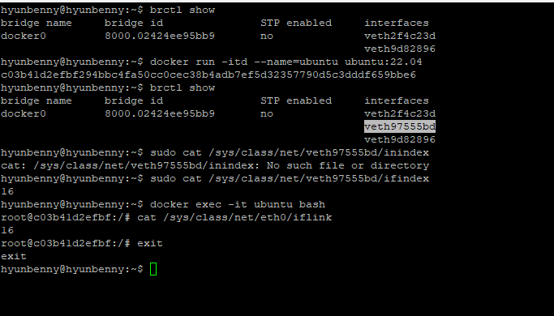<br/>
참고: 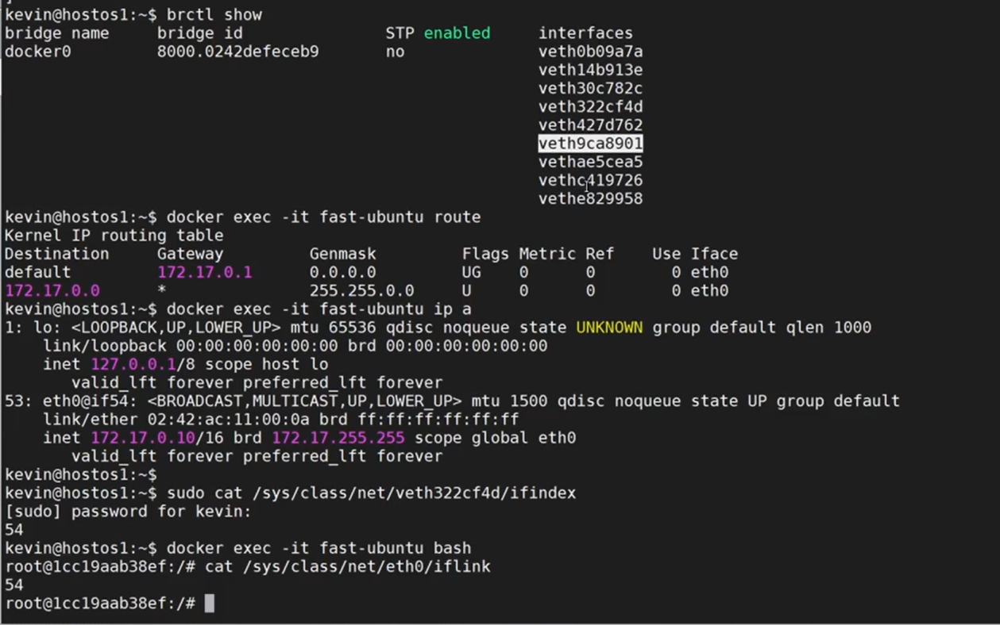<br/>

#### iptable
> 어디로 들어와서 어디로 포워딩하는지에 대한 정보를 `iptable`에 등록을 해 놓는다.

```bash
# nat에 연결된 주소들을 확인해보자.
sudo iptables -t nat -L -n
```
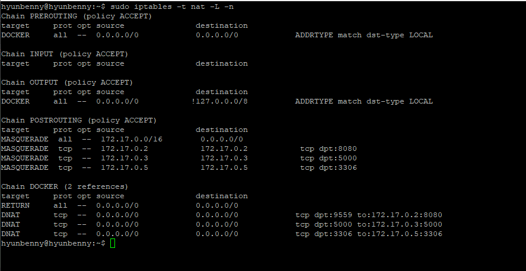<br/>

# 5.옵션
| 옵션                  |설명|
|---------------------|---|
| --add-host=[host명:ip] |컨테이너의 /etc/hosts의 host명과 ip주소를 설정|
| --dns=[ip]          |DNS서버의 ip주소를 설정(/etc/resolv.conf, 168.126.63.1~3/8.8.8.8)|
| --mac-address=[mac주소] |컨테이너의 MAC주소를 설정|
| --expose=[port]     |컨테이너의 내부에서 host로 노출할 포트 번호 지정|
| --net=[bridge&#124;none&#124;host]|컨테이너의 네트워크 설정(bridge=docker0)|
|-h, -hostname="host명"|컨테이너의 Host명 설정(기본값: 컨테이너ID)|
|-P, --publish-all=[true&#124;false]|컨테이너 내부에 노출된 포트를 호스트 임의의 포트(32768~)와 연걸(명시적)|
|-p [Host port]:[Container port] --publish published=5000, target=80|Host와 컨테이너의 포트를 매핑(암시적)|
|--link=[container:containerID]|동일 Host의 다른 컨테이너에서 엑세스 시, 이름 설정 -> IP가 아닌 컨테이너 이름을 통해 통신 가능|

```bash
sudo vi /etc/hosts

# VM2 접속
ssh hyunbenny@hostos2

# VM2에서 접속 확인해보기
w
```
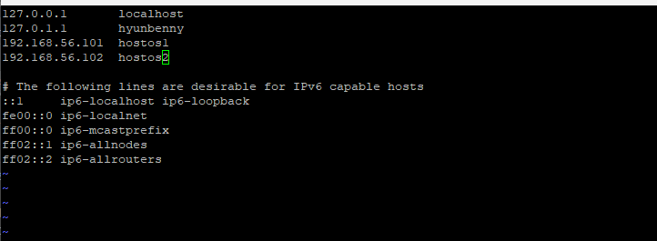<br/>

- --dns
```bash
# DNS 설정
docker run -it --dns=8.8.8.8 centos bash
 cat /etc/resolv.conf
```
<br/>

- --mac
```bash
# MAC 주소 설정 
docker run -d --mac-address="92:d0:c6:0a:29:33" centos:7
docker inspect --format="{{ .Config.MacAddress }}" c268f1
```

- --add
```bash
# Host명과 Ip주소 설정
docker container run -it --add-host=fastcampus.co.kr:192.168.0.100 centos:7 bash
cat /etc/hosts
```

- -P
```bash
# 커널이 아닌 사용자 환경에서 수행되기 때문에 커널과 관계없이 host가 받은 패킷을 그대로 컨테이너의 포트로 전달한다.<br/>
# 포트를 외부로 노출하도록 설정하면 docker host에는 docker-proxy라는 프로세스가 자동으로 생성된다.<br/>
docker run -d -P --name=myweb --expose=40001 nginx:1.25.0-alpine
docker port myweb

docker ps | grep myweb

sudo netstat -nlp | grep 32771

ps -ef | grep 3302
ps -ef | grep 3308
```
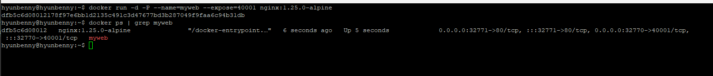<br/>
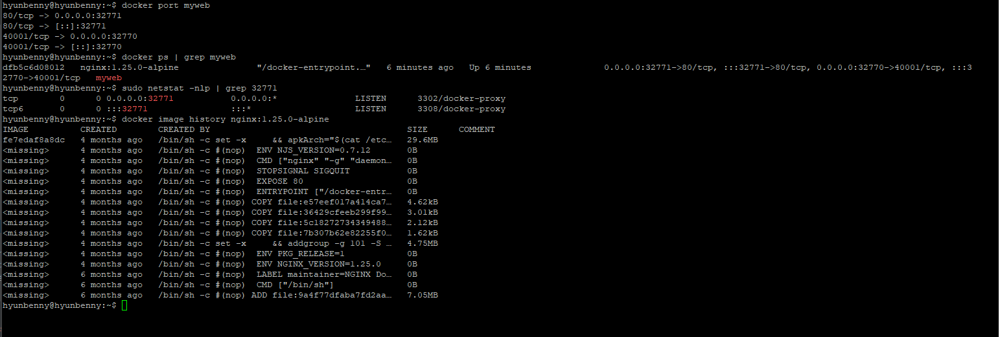<br/>
- `docker port`, `docker ps`로 확인했을 때, 내가 설정하지 않은 32771포트가 할당되어 있는데 이는 내장된 임시 포트다. 
- 컨테이너 내부의 80포트는 nginx:1.25.0에 설정되어 있고, 이 80포트를 랜덤포트와 연결시켜준다.

# 6. Overlay Network
> 서로 다른 Host(node)에서 서비스되는 컨테이너를 네트워크로 연결하는데 사용된다.<br/>
> 이러한 네트워크 생성을 위해 overlay network driver를 사용한다.<br/>
> - 네트워크로 연결된 여러 Docker Host안에 있는 Docker Daemon 간 통신을 관리하는 가상의 네트워크이다.<br/>
> - 컨테이너는 overlay network의 서브넷에 해당하는 IP대역을 할당받고, 할당받은 IP를 통해 상호 간 내부 통신을 수행한다.
> - overlay network에 포함되어 있는 컨테이너들은 서로 다른 Docker Host에 있는 컨테이너와 같은 서버에 있는 것처럼 통신이 가능해진다.
> - Docker swarm을 통해 구현한다.

```bash
docker network inspect [network ID]
```
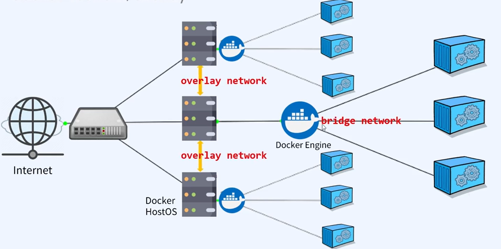<br/>
