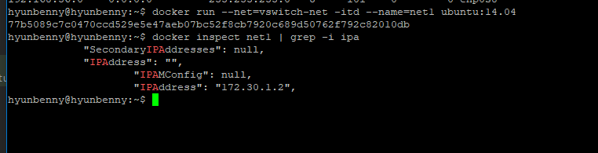

# 사용자 정의 네트워크
> Docker는 기본적으로 Host OS와 bridge를 통해서 연결을 한다.<br/>

- `--net`옵션을 통해 설정 가능
- `docker network create` 명령어를 통해 사용자 정의 bridge network 생성 가능 

## 옵션
|값| 설명                                            | 
|---|-----------------------------------------------|
|bridge| bridge 접속( default: docker0 - 172.17.0.0/16 ) |
|none| 네트워크에 접속하지 않음 (격리용)                           |
|container:[container_name]| 다른 컨테이너의 네트워크를 사용                             |
|host| 컨테이너가 Host OS의 네트워크를 사용                       |
|macvlan| 물리적 네트워크에 컨테이너 MAC주소를 통한 직접 연결 구현 시 사용        |
|NETWORK( 사용자 정의 network_name)| 사용자 정의 네트워크를 사용                               |


## 1.1 host
```bash
docker run -d --name=nginx_host --net=host nginx:1.25.0

# 확인
netstat -nlp | grep 80
curl localhost:80
ps -ef | grep nginx
```
- 내 PC에서 크롬창을 띄운 후, 주소창에 192.168.56.101을 입력하여 들어가면 내가 설치한 적 없는 Nginx 페이지가 뜨는 것을 볼 수 있다.
- 내가 연적 없는 80포트가 열려있는 것 또한 확인할 수 있다.

<br/>

그렇다면 컨테이너의 정보를 보자.
```bash
docker inspect nginx_host | grep -i ipa
```
<br/>
컨테이너에는 별도의 IP가 부여되지 않았기 때문에 IP정보가 나오지 않는 것을 볼 수 있다.
- `-p`옵션으로 포트를 연결한 경우 `docker-proxy`를 사용하였지만, `--net=host`를 사용한 경우, 호스트의 운영체제에 직접 PID를 할당받아 서비스하는 것을 알 수 있다.
- 따라서 docker0을 사용하지 않는다.


## 사용자 정의 네트워크를 직접 만들어보기
```bash
docker network craete mynetwork
docker network create -d bridge mynetwork
docker network create --driver bridge mynetwork

docker network ls

ifconfig
```
<br/>
<br/>
내가 만든 네트워크의 ID에 해당하는 브릿지가 만들어진 것을 볼 수 있다.<br/>
<br/>

<br/>
자세한 도커 네트워크 정보 확인

```bash
docker network inspect mynetwork
```
<br/>

## 우리가 생성한 네트워크를 사용하는 컨테이너를 띄워보자.
```bash
# 터미널1
docker run --net=mynetwork -it --name=net_check1 ubuntu:14.04 bash
ifconfig
route

# 터미널2
docker run --net=mynetwork -it --name=net_check2 ubuntu:14.04 bash
ifconfig
route

# 터미널3
brctl show
docker network inspect mynetwork
```
<br/>
<br/>
net_check1과 net_check2가 172.18.0.2와 172.18.0.3을 할당받은 것을 알 수 있다.<br/>  
`route`명령어를 입력해보면 172.18.0.0 대역에 연결되어 있는 것을 알 수 있다.<br/>
 - 172.18.0.0 대역은 mynetwork의 ip 대역임을 `docker network inspect mynetwork`를 통해 보았다.

<br/>
아까와 달리 2개의 컨테이너가 연결되어 있는 것을 확인할 수 있다.

#### 사용자 정의 네트워크를 사용하면 자체 DNS가 들어간다.
```bash
# 터미널1: net_check1
ping net_check2

# 터미널1: net_check2
ping net_check1
```
<br/>
- 컨테이너 명으로 ping을 던졌는데 ip가 발견되는 것을 볼 수 있다.
- net_check2.mynetwork (172.18.0.3) -> net_check2는 mynetwork에 172.18.0.3에 등록되어 있다.
- 사용자 정의 네트워크의 자체 DNS에 컨테이너명과 IP가 등록이 된다.

#### 사용자 정의 네트워크를 통해 특정 IP 대역 지정을 해보자.
```bash
docker network create \
--driver bridge \
--subnet 172.30.1.0/24 \      # CIDR 표기만 설정 가능(255.255.255.0 과 같음)
--ip-range 172.30.1.0/24 \     # subnet 이하, IP 범위 조정 가능(172.30.1.100/26)
--gateway 172.30.1.1 \
vswitch-net                   # 256개 IP 중 254개 사용 가능 


docker network create --driver bridge --subnet 172.30.1.0/24 --ip-range 172.30.1.0/24 --gateway 172.30.1.1 vswitch-net
## subnet, ip-range, gateway는 필수로 같이 사용해야 하는 옵션들이다.

docker network ls 

# 생성된 bridge network 정보 확인
docker network inspect vswitch-net
route
```
<br/>
<br/>

```bash
docker run --net=vswitch-net -itd --name=net1 ubuntu:14.04

# 특정 IP 지정
docker run --net=vswitch-net -itd --name=net2 --ip 172.30.1.100 ubuntu:14.04
```
생성된 컨테이너 net1의 IP는 자동적으로 172.30.1.2가 될 것이다.<br/>
확인해보자<br/>
```bash
docker inspect net1 | grep -i ipa
docker inspect net2 | grep -i ipa

docker network inspect vswitch-net
```
<br/>
<br/>
<br/>


### docker network topology
<br/>
- 전체 네트워크가 연결되어 있더라도, bridge간 통신은 기본적으로 막혀있다.
```bash
# 터미널1
docker exec -it net1 bash
ping -c 2 net2
ping -c 2 net_check1

# 터미널2
# 만약 net_check를 종료했다면
docker ps -a
docker start net_check1
docker exec -it net_check1 bash
ping -c 2 net1
```
<br/>

#### 그렇다면 이제부터 서로 다른 네트워크에 트래픽을 전달하는 방법을 알아보자.
### connect
> docker network [connect | disconnect]

```bash
# 터미널1
docker run -it --name=add-net ubuntu:14.04 bash
ifconfig

# 터미널2
docker ps
docker network create --driver=bridge fc-net2
docker network ls
route
ifconfig
```
#### 연결해보기
```bash
# net_check1
docker exec -it net_check1 bash

# 터미널2
docker network connect fc-net2 net_check1

# net_check1
ifconfig
```
<br/>
fc-net2를 연결하고 나서 ifconfig를 다시 해보면 eth1에 172.19.0.2와 연결된 것을 확인할 수 있다.

```bash
docker network disconnect fc-net2
```

<br/>
그림과 같이 구현해보자.
```bash
docker network create --driver=bridge backend-network
docker network create --driver=bridge frontend-network

docker run --name=my-webserver -itd --net=frontend-network ubuntu:14.04
docker run --name=my-was -itd --net=backend-network ubuntu:14.04
docker run --name=my-db -itd --net=backend-network ubuntu:14.04

docker network connect backend-network my-webserver

docker exec my-webserver route
docker exec my-was route
docker exec my-db route

docker network inspect frontend-network
docker network inspect backend-network

# 확인
docker exec -it my-webserver bash
ping -c 5 my-was
ping -c 5 my-db

docker exec -it my-was bash
ping -c 5 my-webserver
ping -c 5 my-db
```


