# 1. Docker에 Jenkins 설치
```bash
docker pull jenkins/jenkins:lts
docker run -itd --name=jenkins -p 18080:8080 -p 50000:50000 --privileged=true -u root --restart=always -v /var/run/docker.sock:/var/run/docker.sock -v /home/hbcho/fastcampus/jenkins:/var/jenkins_home jenkins/jenkins:lts
sudo chown -R hbcho.hbcho /home/hbcho/fastcampus/jenkins
sudo netstat -nltp | grep docker-proxy
```
localhost:18080 접속<br/>
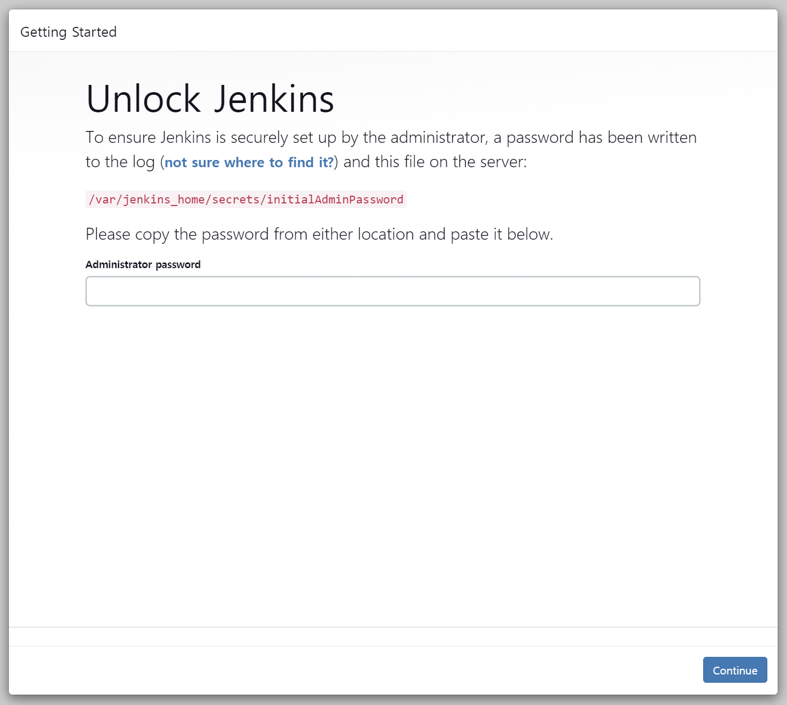<br/>
위와 같은 화면이 나오면 아래와 같이 진행하여 락을 푼 후 로그인을 한다.<br/>
```bash
docker exec jenkins cat /var/jenkins_home/secrets/initialAdminPassword
```
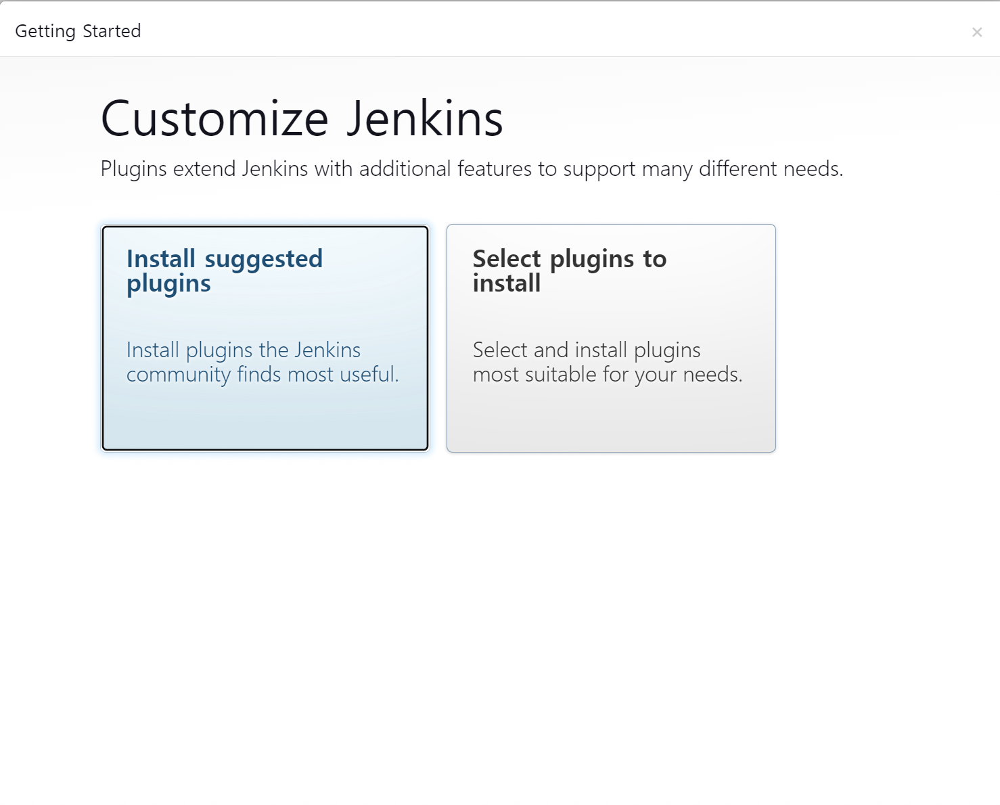<br/>
플러그인 설치를 진행한 후 로그를 확인해보자.<br/>
```bash
docker logs -f jenkins
```
설치가 완료되었다면 계정정보를 입력하여 등록한 후 로그인을 진행해보자.<br/>
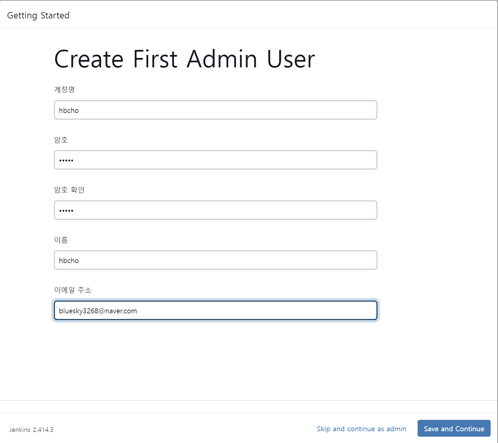<br/>
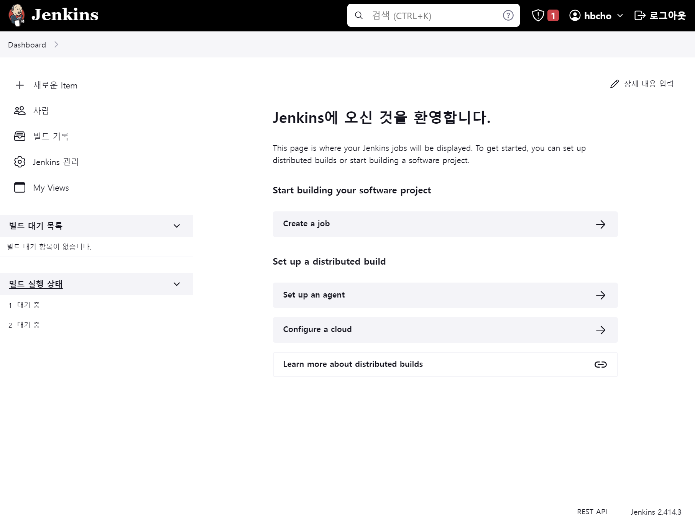<br/>

# 2. Jenkins내부에 Docker 설치
> Jenkins가 스스로 빌드를 해야 하기 때문에 내부에 Docker를 설치해줘야 한다.

```bash
docker exec -it -u root jenkins bash
```
### Key 생성하기 
```bash
cd /var/jenkins_home
mkdir .ssh && cd $_
ssh-keygen -t rsa -f /var/jenkins_home/.ssh/jenkins
ls 
```
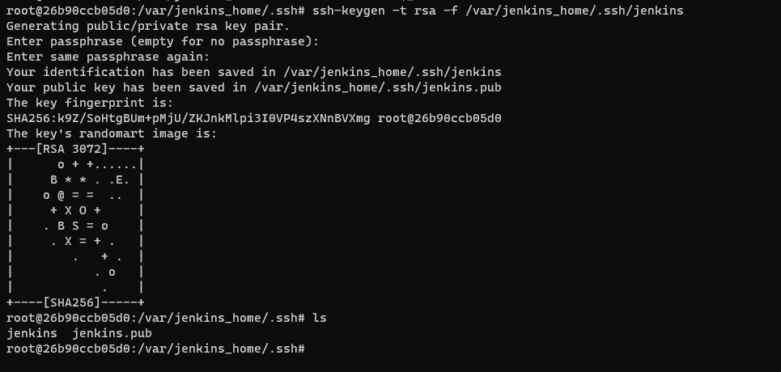<br/>
jenkins와 jenkins.pub이 생성된 것을 볼 수 있다.<br/>
private key를 이용하여 jenkins credential을 생성하고 public key를 이용하여 github credential을 생성한다.<br/>
- private key를 가지고 ssh 접근을 한다.

# 3. Jenkins와 Github 연결 
### Jenkins - private key
```bash
cd /var/jenkins_home/.ssh
cat jenkins
```
localhost:18080으로 접속 > Jenkins관리 > Credentials
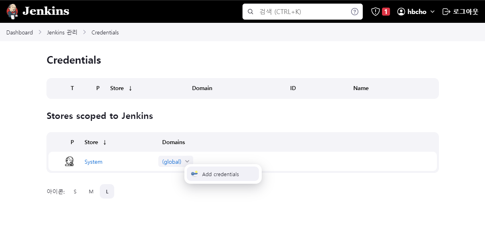<br/>
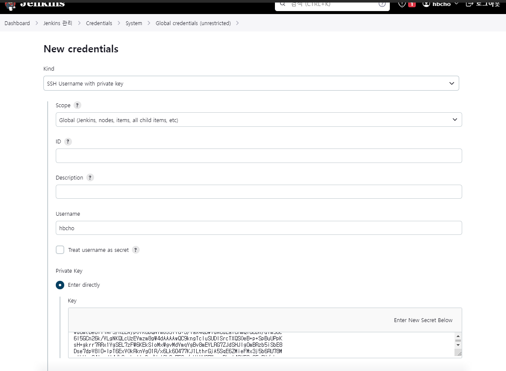<br/>
- Kind: SSH Username with private key
- Username: 아까 등록한 아이디
- Private Key -> Enter directly -> key란에 `cat jenkins`한 키 값을 복사하여 붙여넣는다.

### Github - public key
> Github repository > setting > Deploy keys add Deploy Key
Key란에 public 키를 복사해서 붙여넣는다.<br/>
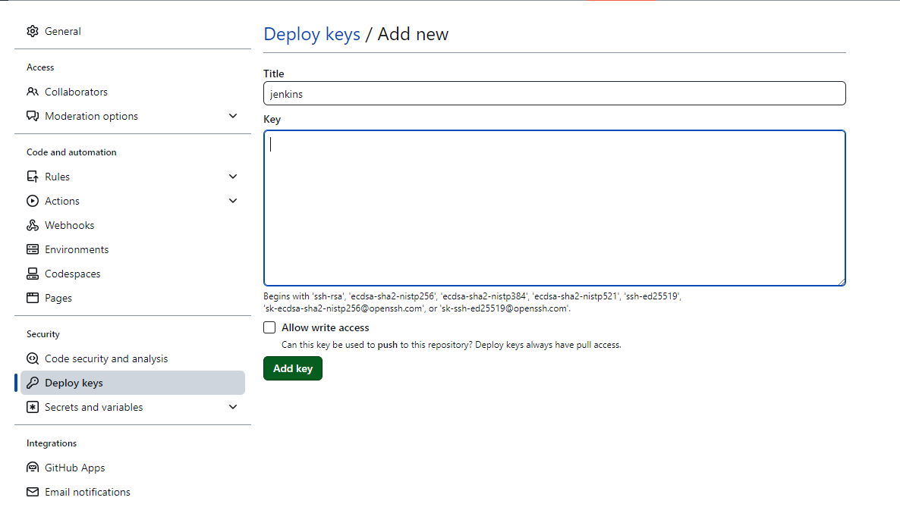<br/>
<br/>

### Github - Webhook
> Webhook이란, 특정 이벤트(push 등)가 발생하였을 때, 서비스나 응용프로그램으로 알림을 보내주는 기능
- EC2를 사용하는 경우, public IP가 있지만 VM 혹은 로컬 환경에 구성한 경우 public IP가 없기 때문에 `ngrok`이라는 애플리케이션을 사용하여 외부에서 접근할 수 있는 도메인을 사용한다.<br/>

#### ngrok
로컬에 ngrok 설치하기<br/>
```bash
cd /mnt/c/Users/hbcho/Desktop
mkdir ngrok && cd $_
wget -c https://bin.equinox.io/c/4VmDzA7iaHb/ngrok-stable-linux-amd64.zip
unzip ngrok-stable-linux-amd64.zip
sudo snap install ngrok
```
설치를 완료했으면 [https://ngrok.com]()에 접속하여 개인 토큰을 발급받자.<br/> 
```bash
ngrok config add-authtoken [ngrok-auth-token]
```
이제 18080으로 들어오는 public domain을 확인해보자.<br/>
```bash
cd /mnt/c/Users/hbcho/Desktop/ngrok 
ngrok http 18080
```
실제로 `https://0d64-211-180-204-23.ngrok-free.app`로 접속하면 Jenkins 로그인 화면이 뜨는 것을 볼 수 있다.<br/>

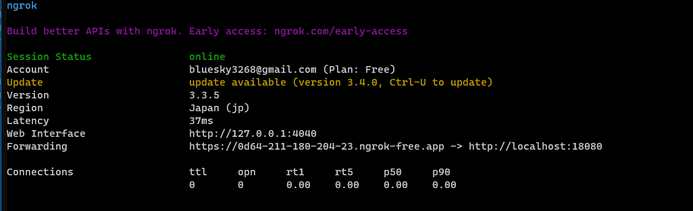<br/>
해당 주소를 github의 webhook - Payload URL에 추가해주자.<br/>
`https://0d64-211-180-204-23.ngrok-free.app/github-webhook` <br/>
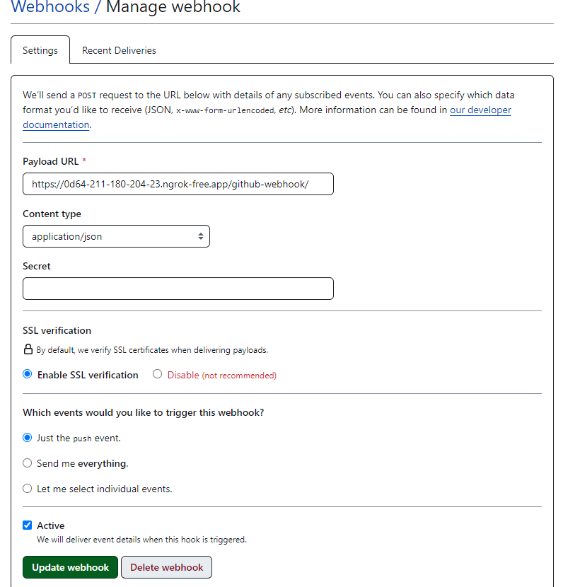<br/>

<br/>
그러면 이제 Jenkins에 ngrok의 주소를 연결해줘야 한다.<br/> 
Jenkins 관리 > System로 들어가서 `http://localhost:18080/` 되어 있는 Jenkins 주소를 ngrok 주소로 변경해준다.<br/>

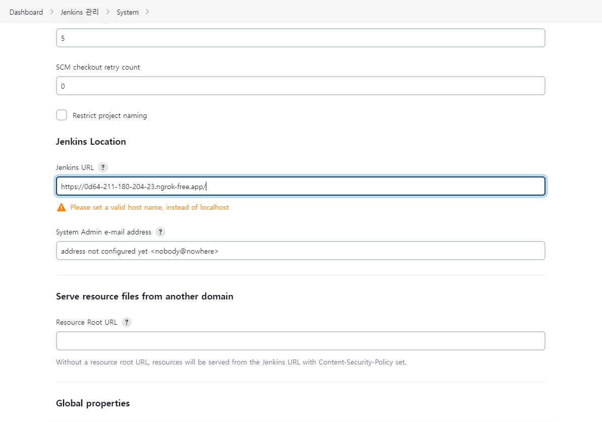<br/>


#### Jenkins Plugin 설치
> Public Over SSH, Docker Pipeline
- Jenkins관리 > Plugins > Available Plugins > 검색 후 설치 > 재시작
- 재시작하는 경우 ngrok의 주소가 변경되기 때문에 다시 변경해줘야 한다.

#### 추가 인증
<b>Docker Hub</b><br/>

> [https://hub.docker.com]() > Account Setting > Security > New Access Token 하여 토큰을 발급 받는다.<br/>

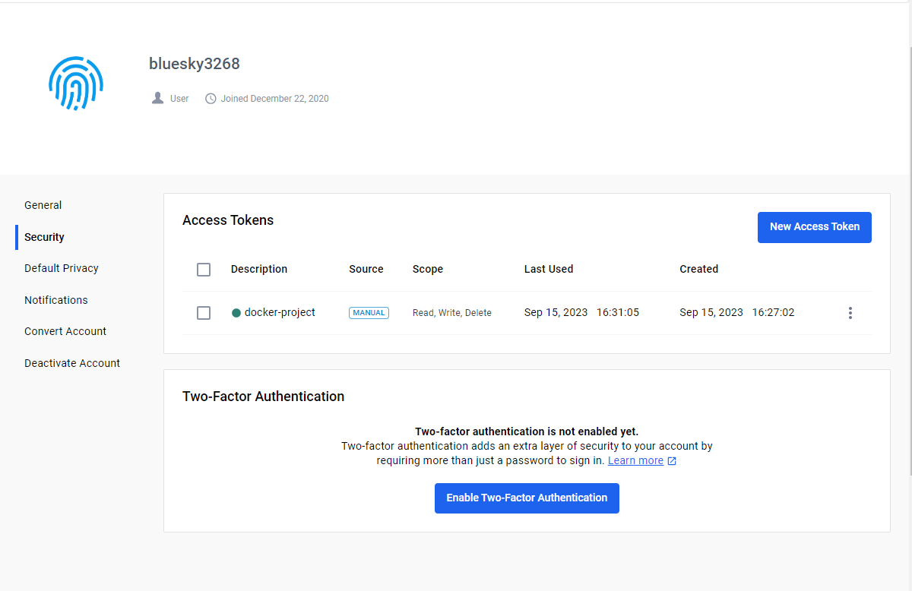<br/>
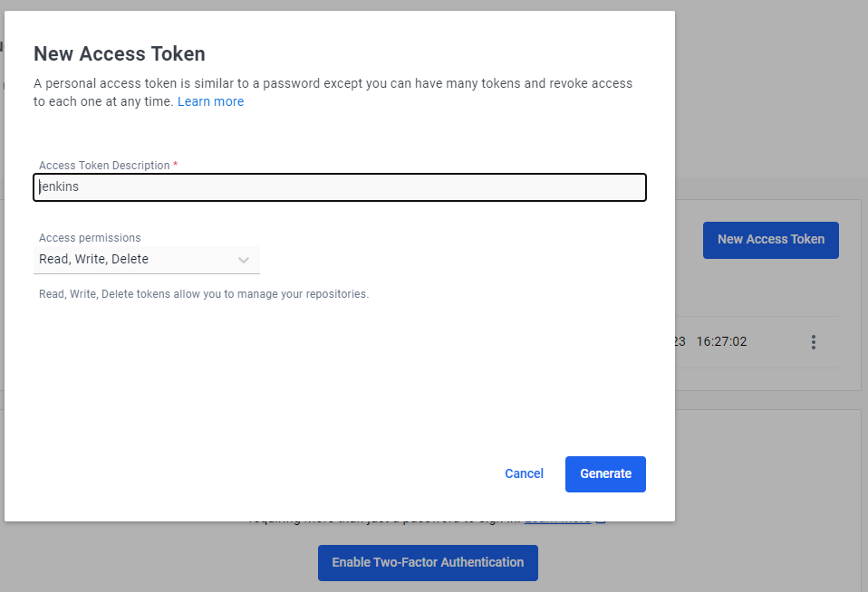<br/>

Jenkins 관리 > Credentials > Add Credentials <br/>
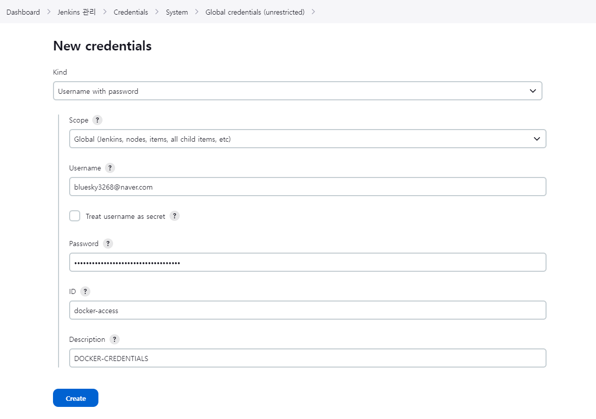<br/>
- username: Dockerhub ID
- password: 발급받은 토큰
- ID: 나중에 파이프 라인에 변수로 사용할 변수명(임의 작성)
  
 
<b>Github</b><br/>
> Settings > Developer Settings > Personal access tokens > Tokens(classic) > Generate new token
- 발급받은 토큰을 가지고 Docker Hub의 토큰을 등록한 것과 Jenkins에 동일하게 등록해준다.
<br/>