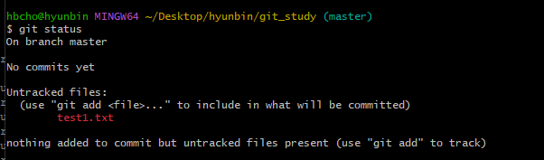
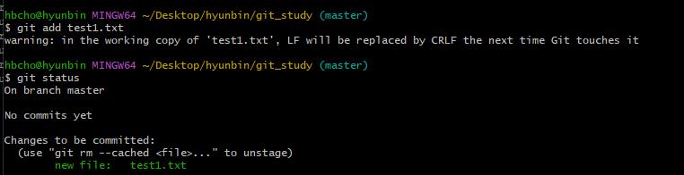
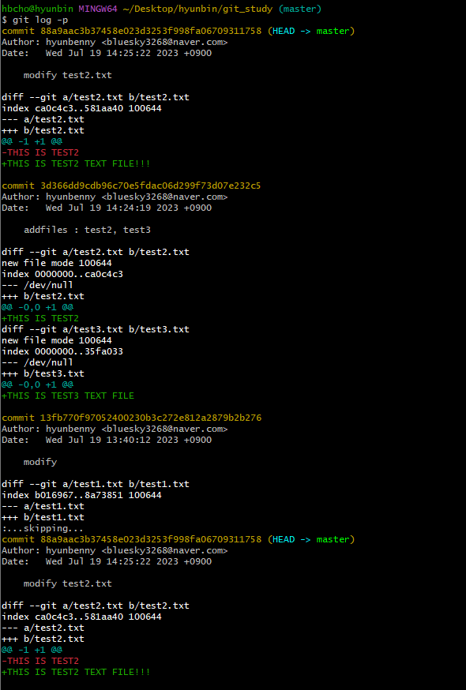

[지옥에서 온 Git](https://www.inflearn.com/course/lecture?courseSlug=%EC%A7%80%EC%98%A5%EC%97%90%EC%84%9C-%EC%98%A8-git&unitId=11599)을 듣고 정리한 내용입니다.

프로젝트 폴더로 이동하자.
mkdir -p /hyunbincho/Desktop/projects/git_study
cd /hyunbincho/Desktop/projects/git_study

# 1. Git 시작하기
## 1.1 설치
https://git-scm.com/downloads 로 에서 파일을 다운로드한 후 설치한다.<br/>
Mac OS의 경우 터미널을 사용하면 되고, Windows의 경우 검색창에서 `Git Bash`를 검색하여 실행하면 된다. 

## 1.2 init
> git을 시작하는 명령어
```bash
git init

ls -alrth
# `.git`폴더가 생성되었으면 성공
```
### ※ Git 명령어 관련된 정보를 보려면 `git` 명령어로 간단하게 확인할 수 있다. 
```bash
git
```

## 1.3 사용자 정보 세팅
```bash
git config --global user.name hyunbenny
git config --global user.email bluesky3268@naver.com
```
세팅한 정보를 조회해보자
```bash
git config user.name
git config user.email
```

# 2. add
> git이 파일을 관리할 수 있도록 추가하거나 이미 추가된 파일이 수정, 삭제되었을 때 `staged`상태로 만들때 사용하는 명령어 
```bash
vi test1.txt
# 내용
#THIS IS TEST1 TXT FILE
```
파일을 생성한 후 `git status`로 해보면 아래과 같이 `untracked files`로 되어 있는 것을 볼 수 있다.<br/>
현재 이 파일은 git이 관리하지 않고 있는 파일이라는 뜻이다.<br/>

<br/>
그럼 지금부터 git이 test1.txt파일을 관리하도록 만들어보자
```bash
git add test1.txt

git status
```
<br/>

이제 git이 test1.txt를 새로운 파일로 인식하고 관리하게 된다.<br/>
<br/>
테스트 등을 위해 임시로 만든 파일은 버전관리에 포함되면 안되는데 그럴 경우 테스트를 위한 임시 파일은 add 하지 않음으로써 버전관리에서 제외할 수 있다.<br/>
<br/>
자 그럼 이제 버전 관리를 해보자.
# 3. commit
```bash
git commit

# 커밋 메시지 입력
```

`git log` 명령어를 통해 커밋된 내역을 확인해보자.
```bash
git log
```
<br/>
test1.txt의 내용을 수정하고 `git status`명령어를 입력해보면 파일이 `빨간색`으로 `modified`상태로 되어 있는 것을 볼 수 있다.<br/>
이걸 `unstaged`상태라고 하는데 아래에서 다시 알아보자.
```bash
git status
```
<br/>
```bash
git add test1.txt
```
<br/>
`modified: test1.txt`라는 글씨가 `초록색`으로 바뀌면서 `staged`상태가 된 걸 알 수 있다.

이제 다시 커밋한 후 git log를 다시 보자.
```bash
git commit -m modify test1.txt
git log
```


# 3. Staging Area
> [Git 기초](https://git-scm.com/book/ko/v2/%EC%8B%9C%EC%9E%91%ED%95%98%EA%B8%B0-Git-%EA%B8%B0%EC%B4%88)에 따르면 Git은 파일을 3가지 상태로 관리한다.
> - Commited : 데이터가 로컬 데이터베이스에 안전하게 저장되었다는 의미
> - Modified : 수정한 파일을 아직 로컬 데이터베이스에 커밋하지 않은 상태
> - Staged : 현재 수정한 파일을 커밋할 예정이라고 표시한 상태

<br/>
<br/>
간단하게 설명하면 
우리가 파일을 추가하거나 수정, 삭제하면 `Working Directory`에 있다가<br/>
`add`명령어를 통해 `Staging Area`에 올려놓은 후 <br/>
`commit`을 하면 로컬 리포지토리에 저장되어 하나의 버전으로 관리된다.
<br/>

좀더 자세한 사항은 [수정하고 저장소에 저장하기](https://git-scm.com/book/ko/v2/Git%EC%9D%98-%EA%B8%B0%EC%B4%88-%EC%88%98%EC%A0%95%ED%95%98%EA%B3%A0-%EC%A0%80%EC%9E%A5%EC%86%8C%EC%97%90-%EC%A0%80%EC%9E%A5%ED%95%98%EA%B8%B0)를 참고해서 보자.

#### 그럼 Staging Area가 있는 이유, 우리가 Staged 상태를 거치는 이유는 무엇일까?
> 프로젝트를 진행하다보면 여러 부븐을 수정하고 추가하게 되는데 이를 세부적으로 분리하여 관리하기 위함이다.

<br/>
예를 들어 오늘 3개의 파일을 수정 했는데 
A파일은 버그를 수정하기 위해서 수정하였고<br/>
B파일은 새롭게 개발하는 기능을 추가하기 위해서, 
그리고 마지막 C파일은 불필요한 기능을 제거하기 위해서 수정했다고 하자.<br/>

`Staging Area`가 없다면 3개로 분리된 작업을 하나의 커밋으로 저장하고 버전관리를 해야 한다.<br/>
이럴 경우, 필요한 파일만 `staged`상태로 만든 후 `commit`하여 3개로 나눠서 각각 분리된 작업으로 관리할 수 있다.
```bash
git add filA
git commit -m fixed blah blah bug

git add fileB
git commit -m add new func blah blah

git add fileC
git commit -m remove unused method
```

# 4. log와 diff
> Git에서는 `log`와 `diff`로 변경사항들을 확인할 수 있다.
## 4.1 log
```bash
git log -p # 커밋 사이에 소스 차이를 확인할 수 있다
```
<br/>

## 4.2 diff
```bash
git log 
git diff 88a9aac3b37458e023d3253f998fa0670931175..3d366dd9cdb96c70e5fdac06d299f73d07e232c5
```
<br/>
- 두 커밋 해시 사이에 `..`을 넣으면 두 커밋 사이에 차이점을 보여준다.
- `git diff b4c0716057fca89c87eb6f0b7f302bf50a9c8e0c`와 같이 커밋 해시를 하나만 적으면 현재 HEAD와 비교하여 차이를 보여준다. 
- 파일을 수정하고 아직 `unstaged`상태에서 아무 옵션 없이 `git diff` 명령어를 사용하면 현재 HEAD와 비교하여 차이를 보여준다.


# 5 reset
> 커밋을 취소하는 명령어
 

위의 커밋 로그에서 마지막 2개(ce55e853fee600bc93050dd1119cf9366e3bc434, b5ab62f0a7b0a59557c28d42a2e77e2952bff478)를 지우고 88a9aac3b37458e023d3253f998fa06709311758 커밋을 최신 상태로 만들고 싶다.

```bash
git reset 88a9aac3b37458e023d3253f998fa06709311758 --hard 
```

* 협업을 할 때, reset은 내 로컬 PC에만 있는 버전에 대해서만 사용해야 한다.
* 원격저장소에 공유(push)하고 나서는 절대 reset하면 안된다. (혼자만 사용하는 브랜치인 경우는 가능...)

- soft : commit된 파일들을 staging area로 돌려놓음. (commit 하기 전 상태로)
- mixed(default) : commit된 파일들을 working directory로 돌려놓음. (add 하기 전 상태로)
- hard : commit된 파일들 중 tracked 파일들을 working directory에서 삭제한다. (Untracked 파일은 여전히 Untracked로 남는다.) git reset --hard HEAD^ 를 혼자 할땐 제일 많이 쓰게되더라..
- HEAD~취소할커밋수 : 현재로부터 원하는 만큼의 커밋이 취소된다.
- HEAD^ : 가장 최근의 커밋이 취소된다. (기본옵션 mixed)


## 5.2 revert
> 커밋을 취소하면서 새로운 버전을 생성하는 방법

다시 test2와 test3을 수정, 커밋한 후 revert를 해보자.
