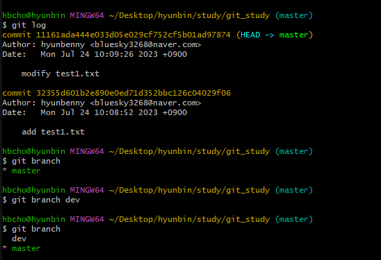
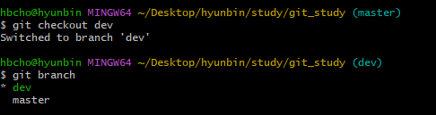
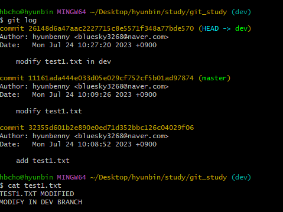
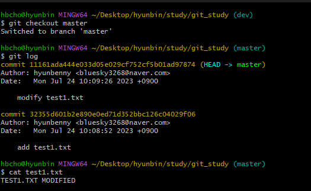
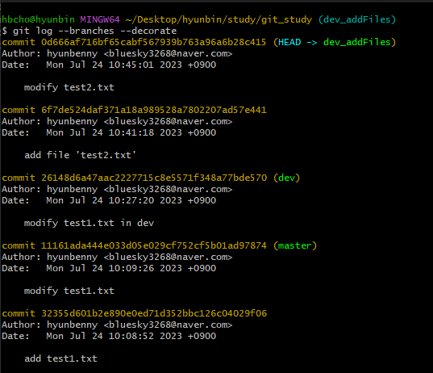
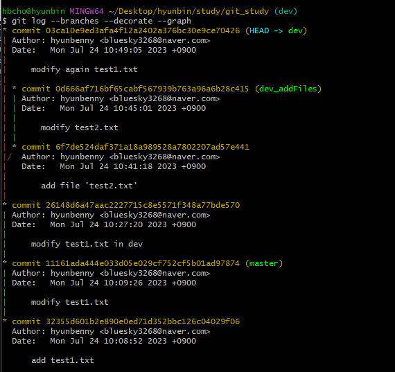
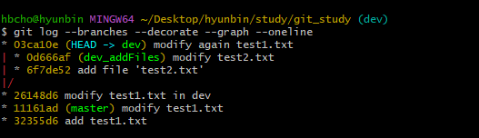
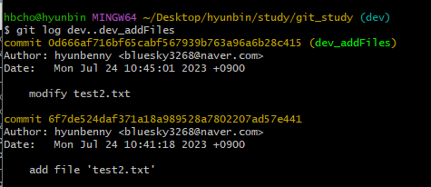
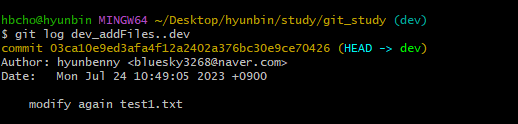
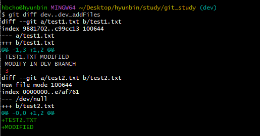

[지옥에서 온 Git](https://www.inflearn.com/course/lecture?courseSlug=%EC%A7%80%EC%98%A5%EC%97%90%EC%84%9C-%EC%98%A8-git&unitId=11599)을 듣고 정리한 내용입니다.


# 1. 브랜치(Branch)란
> 코드를 복사하여 원본과 상관없이 독립적으로 개발할 수 있도록 하는 것<br/>
> 각 브랜치들은 서로 영향을 주고 받지 않기 때문에 동시에 여러 작업을 진행할 수 있다.<br/>
[브랜치란 무엇인가](https://git-scm.com/book/ko/v2/Git-%EB%B8%8C%EB%9E%9C%EC%B9%98-%EB%B8%8C%EB%9E%9C%EC%B9%98%EB%9E%80-%EB%AC%B4%EC%97%87%EC%9D%B8%EA%B0%80)

# 2. 브랜치 사용하기
## 2.1 브랜치 생성
> Git의 기본 브랜치는 `master`이다.<br/>
> 브랜치가 생성될 떄 속해있는 브랜치의 상태를 그대로 복사한다.

아래의 명령어를 통해 새로운 브랜치를 생성해보자.
```bash
git branch dev
```
잘 생성되었는지 확인해보자
```bash
git branch
```
<br/>
master브랜치에 `*`이 붙어 있는 것을 볼 수 있는데 현재 위치하고 있는(사용 중인) 브랜치라는 뜻이다.

## 2.2 브랜치 이동
```bash
git checkout dev

git branch
```
<br/>
`*`를 통해 현재 브랜치가 `dev`로 변경된 것을 알 수 있다.<br/>
git branch 명령어를 통하지 않더라도 경로 뒤에 나타나는 브랜치 명을 통해 현재 브랜치를 알 수 있다.


## 2.3 생성한 브랜치에서 파일 수정
생성한 `dev` 브랜치로 `checkout` 한 다음 파일을 수정한 후 커밋해보자.<br/>
<br/>

그렇다면 `master`브랜치의 파일은 어떤 상태일까?
<br/>
우리가 `dev`브랜치에서 수정했던 내용이 전혀 반영되어있지 않은 점을 확인할 수 있다.<br/>
위에서 말했던 `코드를 복사하여 원본과 상관없이 독립적으로 개발할 수 있다`는 뜻이다.


# 3. 브랜치 정보 확인하기
## 3.1 브랜치 간 차이점 확인
로그에 현재 브랜치들의 가장 최신 커밋 위치를 알려준다.
```bash
git log --branches --decorate
```
<br/>
```bash
git log --branches --decorate --graph
```
<br/>
```bash
git log --branches --decorate --graph --oneline
```
<br/>

## 3.2 브랜치 사이에 차이점 확인
```bash
git log dev..dev_addFiles
git log -p dev..dev_addFiles
```
<br/>
`dev`에는 없고 `dev_addFiles`에는 있는 커밋 로그를 보여준다.
<br/>
```bash
git log dev_addFiles..dev
```

`dev_addFiles`에는 없고 `dev`에는 있는 커밋 로그를 보여준다.

## 3.3 각 브랜치들의 현재 상태 비교(git diff)
```bash
git diff dev..dev_addFiles
```


# 4. 브랜치 삭제
새로운 브랜치를 하나 만든 다음 삭제해보자.
```bash
git branch test
git branch

git branch -d test
git branch
```