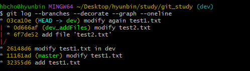
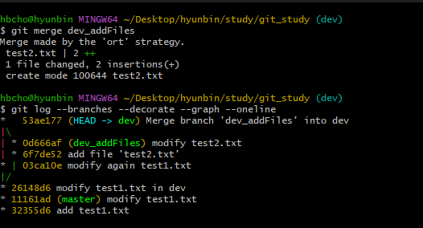
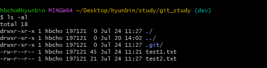
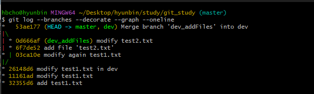

[지옥에서 온 Git](https://www.inflearn.com/course/lecture?courseSlug=%EC%A7%80%EC%98%A5%EC%97%90%EC%84%9C-%EC%98%A8-git&unitId=11599)을 듣고 정리한 내용입니다.

앞에서 `브랜치`를 생성하여 독립적으로 작업할 수 있는 것을 확인했다.<br/>
그렇게 독립적으로 작업한 파일들을 합쳐보자.

파일을 병합하는 방법에는 `merge`와 `rebase`가 있다.
<br/>
두 방법은 브랜치를 병합한다는 점은 동일하지만, 커밋 로그가 다르게 남기 때문에 목적에 맞게 사용해야 한다.

# 1. merge
<br/>
위와 같은 브랜치 상태에서 dev_addFiles와 dev를 `merge`해보자.
- 현재 dev 브랜치에는 `test2.txt`파일이 존재하지 않는다.
- dev_addFiles 에서 `dev`로 `merge`하기 위해서는 현재 브랜치가 `dev`이어야 한다.

```bash
git checkout dev
git merge dev_addFiles
git log --branches --decorate --graph --oneline
```
<br/>
dev 브랜치에서 뻗어져 나가 있던 dev_addFiles 브랜치가 다시 dev로 합쳐진 모습을 볼 수 있다.<br/><br/>
<br/>
다시 dev 브랜치에서 파일 목록을 조회해보면 이제 `test2.txt`가 보이는 것을 알 수 있다.<br/>

그렇다면 dev와 master를 머지하여 똑같은 상태로 만들어주자.<br/>
```bash
git checkout master
git merge dev
git log --branches --decorate --graph --oneline
```


# 2. rebase
