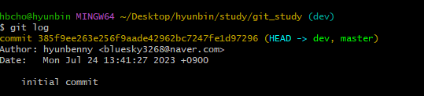
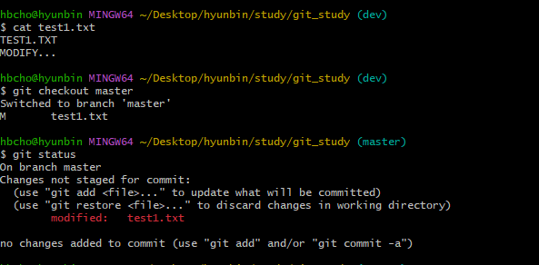
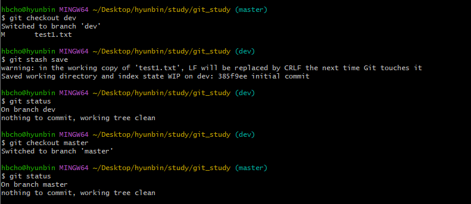
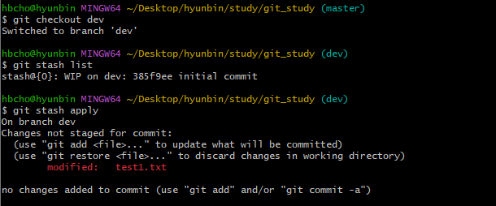
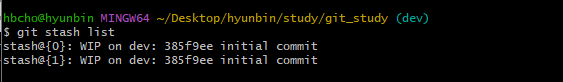
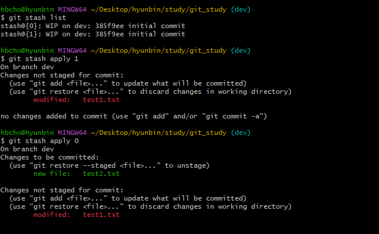
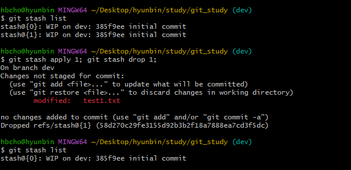
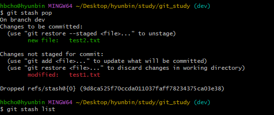

[지옥에서 온 Git](https://www.inflearn.com/course/lecture?courseSlug=%EC%A7%80%EC%98%A5%EC%97%90%EC%84%9C-%EC%98%A8-git&unitId=11599)을 듣고 정리한 내용입니다.


# 1. Stash
> 하던 작업을 임시로 저장해둘 때 사용
 
현재 브랜치의 상태를 깔끔하게 만들고 다른 브랜치로 checkout 할 수 있다.


# 2. stash 사용해보기
## 2.1 stash는 어떤 경우에 사용할까
기존에 사용하던 깃을 지우고 새로 만들어서 stash 기능을 사용해보자.
<br/>
<br/>
test1.txt 파일을 만든 후 dev브랜치를 생성했다.<br/>
dev브랜치에서 파일을 수정한 후 master브랜치로 checkout 하게 되면 master브랜치에 영향이 간다.<br/>
<br/>
근데 내가 원하는 건 이렇게 되는 것이 아니라 dev브랜치에서 수정하던 사항은 그대로 dev브랜치에 두고 master브랜치에서 새로운 작업을 하길 원하는 것이다.<br/>
이 때, `stash`를 사용한다.<br/>
<br/>
다시 dev 브랜치로 이동하여 `stash`를 사용해보자.<br/>

## 2.2 stash
```bash
git checkout dev

git stash 
git stash save

git status

git checkout master
```

## 2.2 stash한 내용 복구하기
```bash
git stash list

git stash apply
```
<br/>

`git stash apply`를 하게 되면 stash list의 가장 위에 있는(최신) 것으로 복구한다.<br/>
<br/>
<br/>
오래 된 것부터 복구하려고 하면 아래와 같이 apply하면 된다.
```bash
# 인덱스가 낮은 것이 최신 버전
git stash apply 1
git stash apply 0
```


## 2.3 stash 삭제하기
`apply`를 한다고 해서 list에서 사라지지 않는다. <br/> 
사용자가 직접 삭제해 줘야 하는데 아래와 같이 사용하면 된다.<br/>
```bash
git stash apply 1
git stash drop
```
<br/>

위의 `apply`, `drop` 명령어를 한 번에 해결할 수 있는 명령어가 있는데, `pop`이다.
```bash
git stash pop
```

