[지옥에서 온 Git](https://www.inflearn.com/course/lecture?courseSlug=%EC%A7%80%EC%98%A5%EC%97%90%EC%84%9C-%EC%98%A8-git&unitId=11599)을 듣고 정리한 내용입니다.

서로 다른 사용자가 같은 파일을 수정하면 `merge`할 때 충돌이 발생할 수 있다.

브랜치 충돌을 해결하기 전 기존에 연습했던 것들을 지우고 새롭게 시작해보자.
```bash
git init

vi common.txt

git add common.txt
git commit -m "add common.txt"

git branch feature
```
#### common.txt 내용
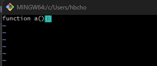

# 1. 충돌이 발생하지 않는 경우
> 같은 파일이라도 다른 부분을 수정하는 경우 충돌이 발생하지 않고 git이 자동으로 병합해준다.

#### main
```bash
vi common.txt

git add common.txt
git commit -m "common.txt modified by main"
```
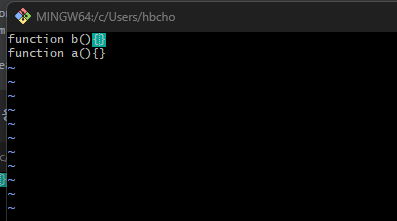

#### feature
```bash
git checkout feature

vi common.txt

git add common.txt
git commit -m "common.txt modified by feature"
```
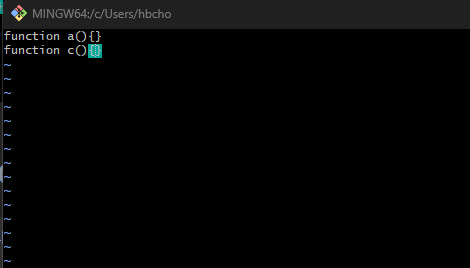

각 브랜치에서 동일한 파일을 수정했으면 다시 main으로 돌아와 `merge`를 해보자.

#### main
```bash
git checkout main

git merge feature
```
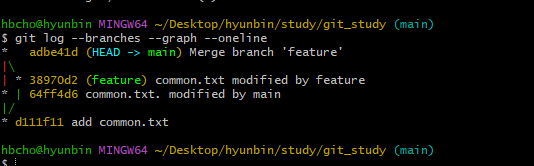<br/>
정상적으로 `merge`가 된 것을 볼 수 있다.<br/>
실제 파일에도 우리가 수정한 내용이 정상적으로 반영이 되었는지 확인해보자.
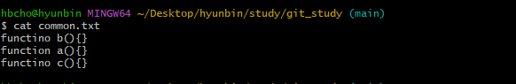

위에서 보는바와 같이 같은 파일이지만 서로 다른 부분을 수정한 경우 충돌없이 `git`이 자동으로 파일의 내용을 합쳐준다.
<br/>
#### 그렇다면 이제 충돌이 발생하는 경우에 대해 알아보자.

# 2. 충돌이 발생하는 경우
> 충돌이 발생하지 않는 경우와 반대로, 파일의 같은 부분을 수정하면 `merge`할 때 충돌이 발생한다.

충돌을 테스트하기 전, 현재 `feature`브랜치를 `main`과 같이 만들어주자.
```bash
git checkout feature
git merge main
```

수정을 통해 충돌을 발생시켜보자.<br/>
#### main
```bash
git checkout main

vi common.txt

git commit -am "conflict test by main"
```
common.txt 수정 내용<br/>
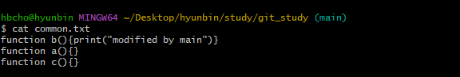

#### feature
```bash
git checkout feature

vi common.txt

git commit -am "conflict test by feature"
```
feature.txt 수정 내용<br/>
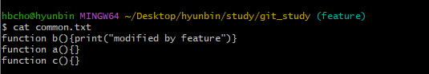

#### main
```bash
git checkout main

git merge feature
```
같은 부분을 수정하고 `merge`를 하게 되면 아래와 같이 충돌이 발생했다는 메시지와 `merge`에 실패했다는 것을 알 수 있다.

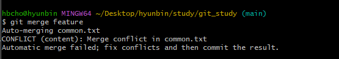<br/>
`git staus`를 통해 현재 상태를 확인해보면 `Unmerged paths`를 확인할 수 있다. 
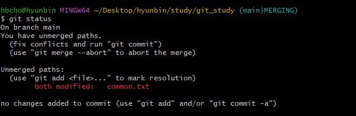<br/>


# 3. 충돌을 해결해보자
```bash
vi common.txt
```
`common.txt`파일을 열면 아래와 같이 충돌된 부분이 표시가 되어 있다.
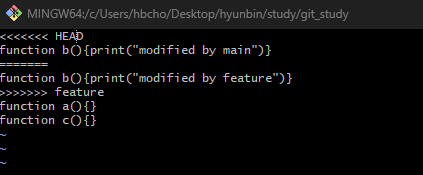<br/>
- `=======`: 구분자 
- `<<<<<<< HEAD`: 구분자를 기준으로 이 부분이 현재 내가 `checkout`한 브랜치의 수정사항(즉, `main`의 내용)
- `>>>>>>> feature`: 구분자를 기준으로 이 부분이 `feature`브랜치의 수정사항

#### `git`이 알려준 충돌부분을 직접 수정해준 뒤 다시 `merge`해주자.
➡️ `main`브랜치의 내용을 반영하는 것으로 합의로 보았다고 가정하고 수정해주자.
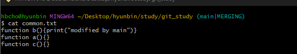<br/>

다시 `add`한 후 확인해보자.
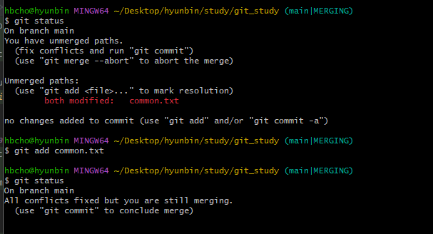<br/>

`commit`하여 `merge`를 마무리하자.
```bash
git commit
```
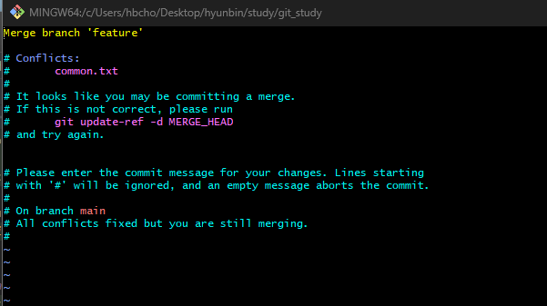<br/>
```bash
git log --branches --graph --oneline
cat commont.txt
```
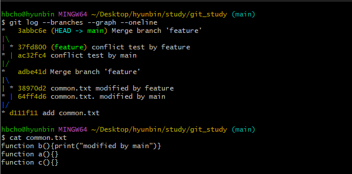<br/>
`log`와 `merge`된 common.txt의 내용을 보면 정상적으로 `merge`된 것을 확인할 수 있다.
