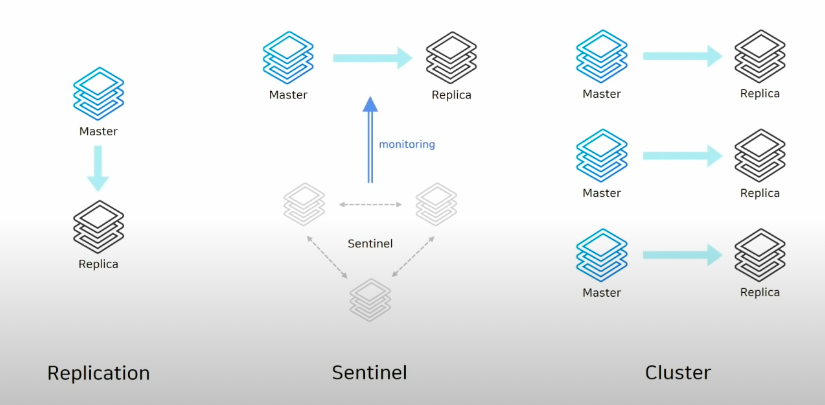

[[NHN FORWARD 2021] Redis 야무지게 사용하기
](https://www.youtube.com/watch?v=92NizoBL4uA)

# 1. Redis란
> Remote Dictionary Storage 
> 메모리 기반의 In Memory 데이터 저장소

## 1.1 특징
- Key-Value 구조를 가진 비관계형(NoSQL) 데이터베이스 관리 시스템이다.
- 데이터를 디스크가 아닌 메모리에 저장하기 때문에 휘발성이 특징이다.
- 싱글 쓰레드이며 초당 5 ~ 25만 건의 요청을 실행 가능하다.
- Single, Master-Slave, Sentinel, Cluster 등 다양한 아키텍처를 지원한다.

## 2. 단점
- 휘발성
  - AOF, RDB Snapshot을 통해 데이터의 휘발성 문제를 커버할 수 있다.
  - 데이터를 캐싱 이외의 용도로 사용하려면 적절한 데이터 백업 방안을 마련해둬야 한다.
- 사이즈가 큰 데이터에 적합하지 않다.
  - 휘발성 문제를 해결하기 위해 일정 간격으로 데이터를 디스크에 저장하는데 그 시간이 너무 오래 걸리면
  데이터 백업에 시간도 오래 걸리고 replication 싱크가 안맞는 경우가 생길 수도 있다. 
- 또한 디스크에 쓰는 동안 다른 요청에 지연이 발생할 수도 있다.

➡️ 따라서 일반적으로 `캐싱`, `리스트 형태의 데이터`, `Session store` 등에 사용된다.

❖ [캐싱이란](https:/aws.amazon.com/ko/caching) 

# 2. Redis에서 제공하는 데이터 영구저장 방법
## 2.1 AOF(Append Only File)
- 데이터를 변경하는 명령이 들어오면 `명령`을 그대로 모두 저장한다.(Redis 프로토콜 형식)
- 명령어를 모두 저장하기 때문에 RDB방식보다 데이터 크기가 크다. 
  - 따라서 주기적으로 데이터를 압축 및 재작성하는 과정을 거쳐야 한다.
- `redis.conf` 파일에서 `auto-aof-rewrite-percentage` 옵션을 통해 `크기 단위`로 자동 저장하도록 설정할 수 있다.
- `BGREWRITEAOF` 명령을 통해 수동으로 저장 가능하다.
## 2.2 RDB
- 저장 당시 메모리에 있는 데이터들을 `snapshot`으로 파일로 저장한다.(바이너리 형식)
- `redis.conf` 파일에서 `save`옵션을 통해 `시간 단위`로 자동 저장하도록 설정할 수 있다.
- `BGSAVE` 명령을 통해 수동으로 저장 가능하다.(save명령어는 절대 사용하면 안된다.)

## 2.3 AOF VS RDB
그렇다면 AOF와 RDB 중 무엇을 선택해서 사용해야 할까? 

#### Redis를 캐시로만 사용한다.
- 필요없음

#### 데이터의 백업이 필요하긴 하지만 어느 정도의 손실은 감수할 수 있는 경우
- RDB 단독 사용

#### 장애가 발생하기 직전까지의 모든 데이터가 보장되어야 하는 경우
- AOF 사용(`APPENDSYNC` 옵션이 `everysec`인 경우, 최대 1초 사이의 데이터 유실 가능)

#### 가장 강력한 내구성이 필요한 경우
- RDB와 AOF 모두 사용

# 3. Redis 아키텍처

## 3.1 Stand Alone
- master 노드 하나만 띄운 구조

## 3.2 Replication(Master-Slave)
- `relicaof`를 통해 복제가 연결되어 있는 구조로 비동기식 복제
- HA기능이 없기 때문에 장애 발생 시 수동으로 복구해야 한다.
  - master에서 장애 발생 시, 직접 접속하여 복제를 끊어야 하고 애플리케이션에서 연결 정보도 변경해야 한다.

## 3.3 Sentinel
- sentinel노드는 다른 노드를 감시하는 역할을 하는 자동 failover가 가능한 HA구성(High Availability)
- master에서 장애가 발생하면 자동으로 failover를 발생시키고 자동으로 replica노드가 master가 된다.
- sentinel이 변경된 master정보로 변경하여 연결해주기 때문에 애플리케이션에서는 sentinel노드에 대한 정보만 알고 있으면 되기 때문에 따로 연결 정보를 수정할 필요가 없다.
- 하지만 sentinel노드는 항상 3대 이상의 홀수로 구성해야 한다.
  - 과반수 이상의 sentinel노드가 동의해야 failover가 진행된다.

## 3.4 Cluster
- scale out과 HA구성
- `샤딩`기능을 제공한다.
  - 샤딩 기능 : 데이터가 여러 대의 master노드에 분할하여 저장(키를 여러 노드에 자동으로 분할하여 저장)
- 모든 노드가 서로를 감시하고 있다가 마스터가 비정상일 때 failover를 진행한다.
- 최소 3대 이상의 마스터 노드로 구성하고 마스터 노드는 replica 노드를 하나씩 가진다. 

## 구조별 비교
### 1. 가용성
Cluster >= Sentinel > Replication > SA
### 2. 성능
Cluster > Sentinel > Replication > SA
### 3. 효율성
SA > Replication >= Sentinel > Cluster