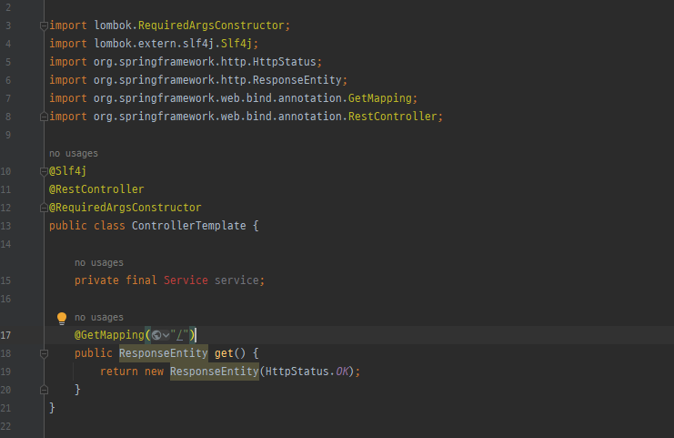
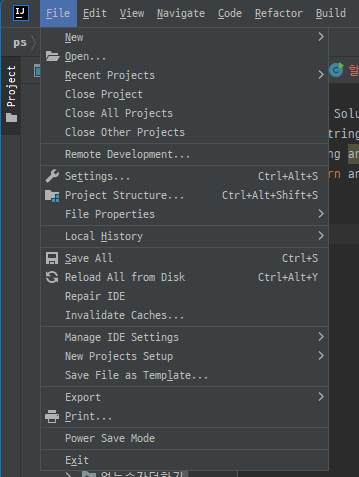
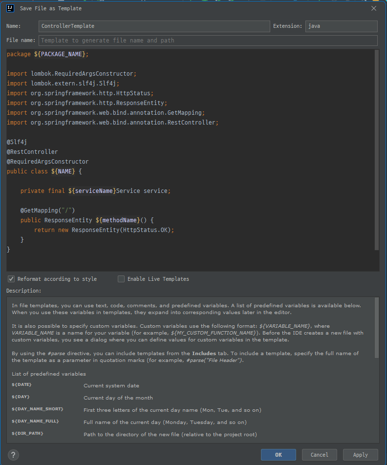
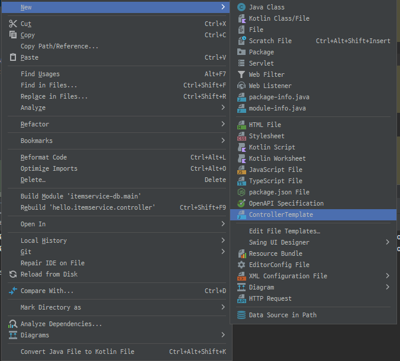
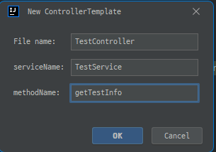
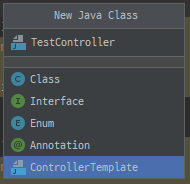
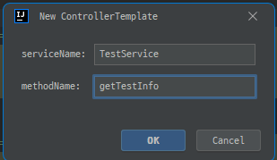
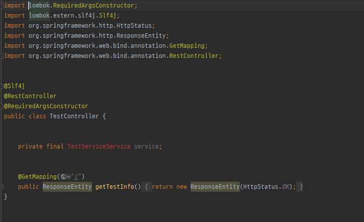

동일한 규격의 클래스 등을 반복해서 만들어야 하는 경우가 있는데 반복 노동을 줄이기 위한 템플릿을 생성해서 사용해보자. 

우리가 많이 사용하는 Controller를 가지고 템플릿을 한번 만들어보자. 

### 1. 먼저 템플릿으로 사용할 포맷의 클래스를 하나 만들어준다.
 

### 2. 윈도우의 경우 File -> Save File as Template을 눌러준다.
#### 맥의 경우 Tools ->  Save File as Template
 

### 3. 아래와 같은 화면이 나타나는데 우리가 변경할만한 내용들은 변수로 바꿔주자. 
 

### 4. 이제 템플릿을 사용해보자.
#### 방법 1
 
 
#### 방법 2
 
 

아래와 같이 우리가 설정한 변수명대로 생성이 된 것을 확인할 수 있다.
 

