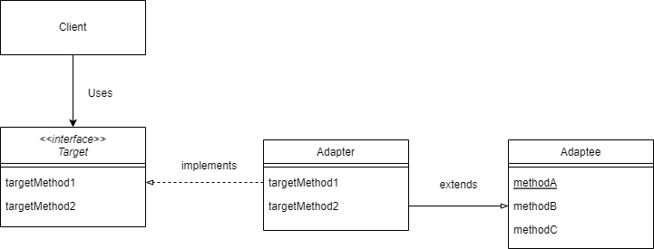
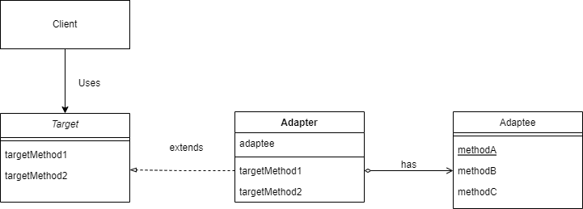

# 1. Adapter 패턴이란
> 우리가 `어댑터`하면 떠오르는 것은 110V 제품을 220V 콘센트에 사용하는 AC어댑터, 혹은 USB C타입과 A타입을 변환해주는 어댑터일 것이다.<br/>
> 이와 같이 서로 다른 것들 사이에서 필요한 형태로 변환하여 이용할 수 있도록 하는 것이 `Adapter 패턴`이다.

- Adapter 패턴은 무엇인가를 포장하여 다른 용도로 사용할 수 있도록 변환해주기 때문에 `Wrapper패턴`이라고 하기도 한다. 

# 2. Adapter 패턴의 종류
## 2.1 클래스에 의한 Adapter 패턴
> `상속`을 사용한 패턴

### 2.1.1 클래스 다이어그램
<br/>
- `Client`: `Target`의 메서드를 사용한다.(Main 클래스, Target: Interface220V 인터페이스)
- `Adaptee`: `적응 대상자`, 이미 준비된 메서드를 가지는 역할(SamsungTv110V 클래스)
- `Adapter`: `Adaptee`의 메서드를 사용해서 어떻게든 `Target`을 만족시키는 역할(Adapter 클래스)

### 2.1.2 코드로 알아보자.
미국에서 가져온 삼성TV가 110V이다. 그런데 한국은 220V 규격을 사용하는 국가이다..<br/>
어댑터를 이용하여 사온 TV를 사용해보자.
```java
public interface Interface110V {
    public void turnOn();
    public void turnOff();
}
```
```java
public class SamsungTv110V implements Interface110V{
    private String modelName;

    public SamsungTv110V(String modelName) {
        this.modelName = modelName;
    }

    @Override
    public void turnOn() {
        System.out.println("110V " + modelName + " turned on");
    }

    @Override
    public void turnOff() {
        System.out.println("110V " + modelName + " turned off");
    }

}
```
한국에서 제공하는 콘센트 규격은 220V
```java
public interface Interface220V {
    public void turnOn();
    public void turnOff();
}
```
TV코드에 어댑터를 꼽아보자.
```java
public class Adapter extends SamsungTv110V implements Interface220V {

    public Adapter(String modelName) {
        super(modelName);
    }

    @Override
    public void turnOn() {
        System.out.print("220V <<< [adapter] <<< ");
        super.turnOn();
    }

    @Override
    public void turnOff() {
        System.out.print("220V <<< [adapter] <<< ");
        super.turnOff();
    }
}
```
연결을 했으니 이제 TV를 켰다 꺼보자.
```java
public class Main {
    public static void main(String[] args) {
        Interface220V adapter = new Adapter("삼성TV01");
        adapter.turnOn();
        adapter.turnOff();
    }
}
// 220V <<< [adapter] <<< 110V 삼성TV01 turned on
// 220V <<< [adapter] <<< 110V 삼성TV01 turned off
```


## 2.2 인스턴스에 의한 Adapter 패턴
> `위임`을 사용한 패턴

### 2.2.1 클래스 다이어그램
<br/>
- `Client`: `Target`의 메서드를 사용한다.(Main클래스)
- `Adaptee`: `적응 대상자`, 이미 준비된 메서드를 가지는 역할
- `Adapter`: `Adaptee`의 메서드를 사용해서 어떻게든 `Target`을 만족시키는 역할 

### 2.2.2 코드로 알아보자.
클래스 다이어그램처럼 Interface110V, Interface220V를 추상클래스로 만들어서 상속받아 사용해야 하지만, 인터페이스를 구현하는 것으로 하자.<br/> 
<br/>
220V 코드를 가진 한국 내수용 LG TV와 110V를 코드를 가진 미국 수출용 LG TV가 있다.
```java
public class LgTvKoreanVer implements Interface220V {
    private String modelName;

    public LgTvKoreanVer(String modelName) {
        this.modelName = modelName;
    }

    @Override
    public void turnOn() {
        System.out.println("220V " + modelName + " turned on");
    }

    @Override
    public void turnOff() {
        System.out.println("220V " + modelName + " turned off");
    }

}

public class LgTvAmericanVer implements Interface110V {

    private String modelName;

    public LgTvAmericanVer(String modelName) {
        this.modelName = modelName;
    }

    @Override
    public void turnOn() {
        System.out.println("110V " + modelName + " turned on");
    }

    @Override
    public void turnOff() {
        System.out.println("110V " + modelName + " turned off");
    }
}
```
미국에서 한국TV를, 한국에서는 미국TV를 사용한다면 어댑터가 필요하다.<br/>
어댑터를 사용한 아래의 코드를 보자.<br/>
```java
// 110V TV에 220V 어댑터 적용
public class Adapter110to220 implements Interface220V {

    private LgTvAmericanVer lgTvAmericanVer;

    public Adapter110to220(LgTvAmericanVer lgTvAmericanVer) {
        this.lgTvAmericanVer = lgTvAmericanVer;
    }

    @Override
    public void turnOn() {
        System.out.print("220V <<< [adapter] <<< ");
        lgTvAmericanVer.turnOn();
    }

    @Override
    public void turnOff() {
        System.out.print("220V <<< [adapter] <<< ");
        lgTvAmericanVer.turnOff();
    }
}

// 220V TV에 110V 어댑터 적용
public class Adapter220to110 implements Interface110V {

    private LgTvKoreanVer lgTvKoreanVer;

    public Adapter220to110(LgTvKoreanVer lgTvKoreanVer) {
        this.lgTvKoreanVer = lgTvKoreanVer;
    }

    @Override
    public void turnOn() {
        System.out.print("110V <<< [adapter] <<< ");
        lgTvKoreanVer.turnOn();
    }

    @Override
    public void turnOff() {
        System.out.print("110V <<< [adapter] <<< ");
        lgTvKoreanVer.turnOff();
    }
}
```
사용해보자.
```java
public class Main {
    public static void main(String[] args) {
        Interface220V adapter1 = new Adapter110to220(new LgTvAmericanVer("LG TV AM001"));
        Interface110V adapter2 = new Adapter220to110(new LgTvKoreanVer("엘지 티비 001"));

        adapter1.turnOn();
        adapter1.turnOff();
        System.out.println("----------");
        adapter2.turnOn();
        adapter2.turnOff();
    }
}

// 220V <<< [adapter] <<< 110V LG TV AM001 turned on
// 220V <<< [adapter] <<< 110V LG TV AM001 turned off
// ----------
// 110V <<< [adapter] <<< 220V 엘지 티비 001 turned on
// 110V <<< [adapter] <<< 220V 엘지 티비 001 turned off
```
# 3. 장단점
## 3.1 장점
- 기존 코드의 변경없이 새로운 기능을 구현, 연동할 수 있기 때문에 `OCP원칙`을 지킬 수 있다.
- 기존 코드를 수정하지 않기 때문에 재사용성을 증가시킬 수 있다.
## 3.2 단점
- 클래스의 증가로 인해 복잡도가 증가할 수 있다.
- `클래스에 의한 Adapter 패턴`은 상속을 사용하기 때문에 유연하지 않다.
- `인스턴스에 의한 Adapter 패턴` 은 대부분의 코드를 다시 작성해야 하기 때문에 비효율적이다.