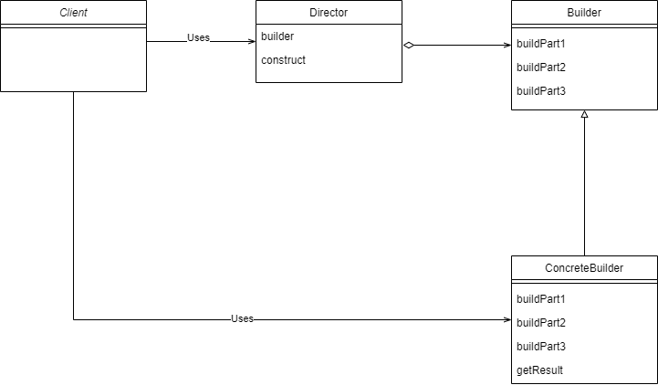

# 1. Builder패턴이란
>  복잡한 객체의 생성 과정과 표현 방법을 분리하여 다양한 구성의 인스턴스를 만드는 생성 패턴
- 생성자에 들어가는 매개변수를 하나하나 받아서 마지막에 `build()`를 통해 통합하여 객체를 생성한다. 

## 1.1 장단점
### 1.1.1 장점
- 생성과 표현에 필요한 코드를 분리할 수 있다.
- 객체를 생성하는 절차를 클라이언트에게 숨길 수 있고 좀 더 세밀하게 나눌 수 있다.


# 2. Builder 패턴 알아보기
## 2.1 클래스 다이어그램
<br/>
- Director: Builder의 인터페이스(API)를 이용하여 인스턴스를 생성
- Client: Builder패턴을 이용
- Builder: 인스턴스를 생성하기 위한 인터페이스(API)를 결정한다.
- ConcreteBuilder: Builder 인터페이스를 구현하는 클래스

## 2.2 코드로 알아보자.
```java
@Getter
@Setter
@ToString
public class MacBook {
    private String type;
    private int displaySize;
    private String color;
    private String cpu;
    private int memory;
    private String storage;
}
```
객체를 생성하는데 필요한 `Builder` 인터페이스를 만들자.
```java
public interface MacBookBuilder {
    void setDisplay(int displaySize);
    void setColor(String color);
    void setCpu(String cpu);
    void setMemory(int memory);
    void setStorage(String storage);

    MacBook getMacBook();
}
```
`ConcreteBuilder`를 만들어 인터페이스를 구현하자.
```java
public class ConcreteMacBookAirBuilder implements MacBookBuilder {

    private String type = "AIR";
    private int displaySize;
    private String color;
    private String cpu;
    private int memory;
    private String storage;

    @Override
    public void setDisplay(int displaySize) {
        this.displaySize = displaySize;
    }

    @Override
    public void setCpu(String cpuModelName) {
        this.cpu = cpuModelName;
    }

    @Override
    public void setColor(String color) {
        this.color = color;
    }

    @Override
    public void setMemory(int memory) {
        this.memory = memory;
    }

    @Override
    public void setStorage(String storage) {
        this.storage = storage;
    }

    @Override
    public MacBook getMacBook() {
        MacBook macBook = new MacBook();
        macBook.setType(this.type);
        macBook.setDisplaySize(this.displaySize == 0 ? 13 : this.displaySize);
        macBook.setCpu(this.cpu == null ? "M1" : this.cpu);
        macBook.setColor(this.color == null ? "Space Grey" : this.color);
        macBook.setMemory(this.memory == 0 ? 8 : this.memory);
        macBook.setStorage(this.storage == null ? "128GB" : this.storage);
        return macBook;
    }
}
```
```java
public class ConcreteMacBookProBuilder implements MacBookBuilder {

    private String type = "PRO";
    private int displaySize;
    private String color;
    private String cpu;
    private int memory;
    private String storage;

    @Override
    public void setDisplay(int displaySize) {
        this.displaySize = displaySize;
    }

    @Override
    public void setCpu(String cpuModelName) {
        this.cpu = cpuModelName;
    }

    @Override
    public void setColor(String color) {
        this.color = color;
    }

    @Override
    public void setMemory(int memory) {
        this.memory = memory;
    }

    @Override
    public void setStorage(String storage) {
        this.storage = storage;
    }

    @Override
    public MacBook getMacBook() {
        MacBook macBook = new MacBook();
        macBook.setType(this.type);
        macBook.setDisplaySize(this.displaySize == 0 ? 13 : this.displaySize);
        macBook.setCpu(this.cpu == null ? "M1" : this.cpu);
        macBook.setColor(this.color == null ? "Silver" : this.color);
        macBook.setMemory(this.memory == 0 ? 8 : this.memory);
        macBook.setStorage(this.storage == null ? "256GB" : this.storage);
        return macBook;
    }
}
```
`Builder`를 이용하여 객체를 생성할 `Director`를 만들자.
```java
public class Director {
    private final MacBookBuilder builder;

    public Director(MacBookBuilder builder) {
        this.builder = builder;
    }

    public MacBook getDefaultMacBook13() {
        return builder.getMacBook();
    }

    public MacBook getDefaultMacBook15() {
        builder.setDisplay(15);
        builder.setMemory(16);
        return builder.getMacBook();
    }
}
```
Director를 이용하여 맥북을 객체를 생성해보자.
```java
public class Main {
    public static void main(String[] args) {
        String orderMacBookType = "PRO";

        MacBookBuilder builder;
        if (orderMacBookType.equals("PRO")) {
            builder = new ConcreteMacBookProBuilder();
            Director director = new Director(builder);

            MacBook macbookPro13 = director.getDefaultMacBook13();
            MacBook macbookPro15 = director.getDefaultMacBook15();

            System.out.println(macbookPro13);
            System.out.println(macbookPro15);

        } else if (orderMacBookType.equals("AIR")) {
            builder = new ConcreteMacBookAirBuilder();
            Director director = new Director(builder);

            MacBook macbookAir13 = director.getDefaultMacBook13();
            MacBook macbookAir15 = director.getDefaultMacBook15();

            System.out.println(macbookAir13);
            System.out.println(macbookAir15);

        }

    }
}

```
#### 객체를 생성하는데 필요한 세부 내용들은 `Director`에 의해 숨겨지고 클라이언트는 단순히 메서드만 호출하면 된다.

내가 기존에 사용하던 `Builder패턴`과 달라 이해하는데 애를 먹었다.(내가 이해하고 짠 코드가 맞는 것인지도 잘 모르겠다..)<br/><br/>
※ 내가 흔히 쓰던 Builder패턴은 `effective 자바`에서 말하는 것이고 `GOF의 디자인 패턴`의 관점에서는 이 글과 같은 것 같다.