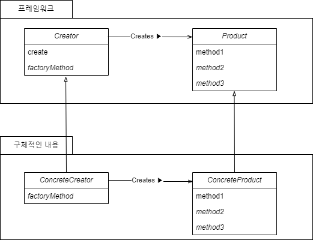
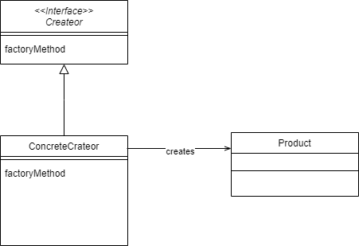

# 1. Factory Method 패턴이란
>  [Template Method 패턴](https://github.com/hyunbenny/study/blob/main/%EB%94%94%EC%9E%90%EC%9D%B8%ED%8C%A8%ED%84%B4/Template%20Method%20%ED%8C%A8%ED%84%B4.md)을 인스턴스를 생성할 때 적용한 패턴<br/> 
> 쉽게 말해 `인스턴스를 생성하는 공장`

- 인스턴스의 생성방법은 상위 클래스에서 결정하지만, 구체적인 클래스의 이름은 하위 클래스에서 결정한다.
- 생성할 객체의 타입을 예측할 수 없거나 객체 생성을 서브 클래스에 위임하고 서브 클래스에 대한 정보를 은닉하고자 할 때 사용한다.

## 1.1 장단점
### 1.1.1 장점
- 기존의 인스턴스를 생성하는 코드를 수정하지 않고 다른 방법으로 인스턴스를 생성할 수 있도록 확장 가능하다.
- 직접 객체를 생성하지 않고 서브 클래스에 위임함으로써 결합도를 낮출 수 있다.

### 1.1.2 단점
- 클래스가 많아진다.
- 클라이언트가 반드시 `Creator`를 상속해서 인스턴스를 생성해야 한다.

## 1.2 클래스 다이어그램
<br/>
- `Creator`: `Product`를 생성하는 추상 클래스
- `Product`: 생성되는 인스턴스가 가져야할 인터페이스를 결정하는 추상 클래스()
- `ConcreteCreator`: 
- `ConcreteProduct`: 

<br/>
 

# 2. 코드로 알아보자.
먼저 `User`라는 `Product`와 `UserCreator`라는 `Creator`를 만들어보자.
- `User`는 `Auth`에 따른 구분을 하기 위해 type이라는 필드와 userId라는 필드를 가지고, getUserInfo()라는 추상 메서드를 공통으로 사용하려고 한다.
- `UserCreator`는 create()를 통해 `User`를 생성한다.
```java
// Product
public abstract class User {
    public String type; // ENUM
    public String userId;

    public User(String type, String userId) {
        this.type = type;
        this.userId = userId;
    }

    public abstract String getUserInfo();
}

// Creator
public abstract class UserCreator {
    public final User create(String type, String userId) {
        return createUser(type, userId);
    }

    protected abstract User createUser(String type, String userId);
}
```
우리가 User를 상속받아 구현하는 것은 Kakao나 Naver를 통해 가입한 고객, 그리고 우리 서비스에 직접 가입한 고객으로 나눈다고 하자.
```java
public class KakaoUser extends User{

    public KakaoUser(String type, String userId) {
        super(type, userId);
    }

    @Override
    public String getUserInfo() {
        return "[KAKAO AUTH USER] " +
                "type=" + type +
                ", userId=" + userId
        ;
    }
}

public class NaverUser extends User{
    public NaverUser(String type, String userId) {
        super(type, userId);
    }

    @Override
    public String getUserInfo() {
        return "[NAVER AUTH USER] " +
                "type=" + type +
                ", userId=" + userId
                ;
    }
}

public class NormalUser extends User{
    public NormalUser(String type, String userId) {
        super(type, userId);
    }

    @Override
    public String getUserInfo() {
        return "[NORMAL AUTH USER] " +
                "type=" + type +
                ", userId=" + userId
                ;
    }
}
```
`User`를 리턴하는 `ConcreteCreator`를 만들어보자.
```java
public class UserCreatorFactory extends UserCreator {
    @Override
    protected User createUser(String type, String userId) {
        User user;
        switch (type) {
            case "KAKAO":
                user =  new KakaoUser(type, userId);
                break;
            case "NAVER":
                user = new NaverUser(type, userId);
                break;
            default:
                user = new NormalUser(type, userId);
        }

        return user;
    }
}
```

#### 그러면 이제 우리가 만든 Factory Method를 통해 인스턴스를 생성해보자.
```java
public class Main {
    public static void main(String[] args) {
        UserCreator creator = new UserCreatorFactory();
        User kakaoUser = creator.create("KAKAO", "helloKakao");
        User NaverUser = creator.create("NAVER", "helloNaver");
        User NormalUser = creator.create("", "helloWorld");

        System.out.println(kakaoUser.getUserInfo());
        System.out.println(NaverUser.getUserInfo());
        System.out.println(NormalUser.getUserInfo());
    }
}
// [KAKAO AUTH USER] type=KAKAO, userId=helloKakao
// [NAVER AUTH USER] type=NAVER, userId=helloNaver
// [NORMAL AUTH USER] type=, userId=helloWorld
```

위에서는 `UserCreatorFactory` 하나의 `ConcreteCreator`에서 분기처리하여 받은 `type`에 따라 인스턴스를 생성하였다.<br/>
하지만 `KakaoUserCreator`, `NaverUserCreator` 등을 따로 만들어 사용한다면 아래와 같이 생성할 수 있겠다.
```java
public class Main {
    public static void main(String[] args) {
        UserCreator kakaoCreator = new KakaoUserCreator();
        User kakaoUser = kakaoCreator.create("KAKAO", "helloKakao");

        UserCreator NaverCreator = new NaverUserCreator();
        User NaverUser = creator.create("NAVER", "helloNaver");

        System.out.println(kakaoUser.getUserInfo());
        System.out.println(NaverUser.getUserInfo());
    }
}
```

# 3. static Factory Method
> 인스턴스 생성을 위한 `static 메서드`를 `Factory Method`라고 부는 경우도 있다.
- 우리가 웹 개발을 하다보면 Entity -> DTO, DTO -> Entity 간 변환을 하는 경우, of(), from(), toEntity()와 같은 메서드들을 많이 사용하는데 이러한 경우 또한 `Factory Method`라고 한다.
```java
@Entity
public class UserAccount extends AuditingFields {


    @Id
    @Setter
    @Column(nullable = false, length = 50)
    private String userId;

    @Setter
    @Column(nullable = false)
    private String userPassword;

    @Setter
    @Column(length = 100)
    private String email;

    @Setter
    @Column(length = 100)
    private String nickname;

    public UserAccount() {
    }

    ...

    public static UserAccount of(String userId, String userPassword, String email, String nickname) {
        return new UserAccount(userId, userPassword, email, nickname);
    }
}
```
```java
public record UserAccountDto(
        String userId,
        String userPassword,
        String email,
        String nickname,
        String memo,
        String createdBy,
        LocalDateTime createdAt,
        String modifiedBy,
        LocalDateTime modifiedAt
) {

    public static UserAccountDto of(String userId, String userPassword, String email, String nickname, String createdBy, LocalDateTime createdAt, String modifiedBy, LocalDateTime modifiedAt) {
        return new UserAccountDto(userId, userPassword, email, nickname, createdBy, createdAt, modifiedBy, modifiedAt);
    }

    public static UserAccountDto from(UserAccount entity) {
        return new UserAccountDto(
                entity.getUserId(),
                entity.getUserPassword(),
                entity.getEmail(),
                entity.getNickname(),
                entity.getCreatedBy(),
                entity.getCreatedAt(),
                entity.getModifiedBy(),
                entity.getModifiedAt()
        );
    }

    public UserAccount toEntity() {
        return UserAccount.of(userId, userPassword, email, nickname);
    }
}
```
```java
String[] animals = {"lion", "tiger", "cat", "dog"};
List<String> animalList1 = Arrays.asList(animals);
List<String> animalList2 = List.of("lion", "tiger", "cat", "dog");
```