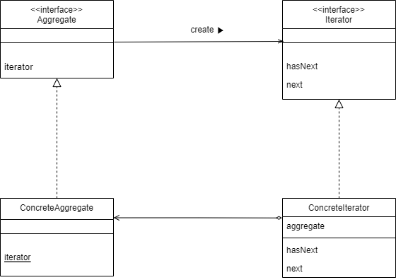
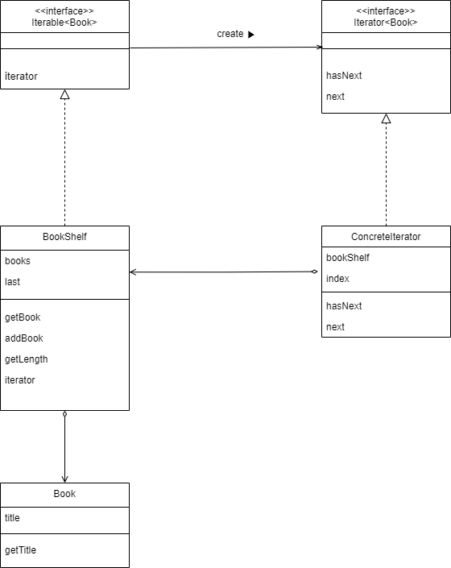
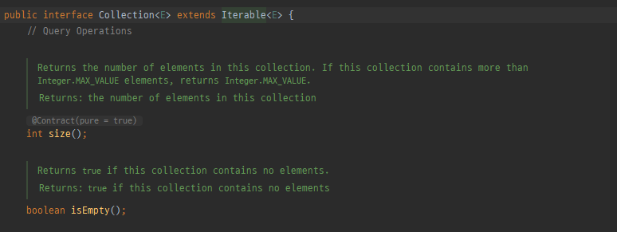

참고: <br/>
[반복자(Iterator) 패턴 - 완벽 마스터하기](https://inpa.tistory.com/entry/GOF-%F0%9F%92%A0-%EB%B0%98%EB%B3%B5%EC%9E%90Iterator-%ED%8C%A8%ED%84%B4-%EC%99%84%EB%B2%BD-%EB%A7%88%EC%8A%A4%ED%84%B0%ED%95%98%EA%B8%B0)<br/>
[Java 언어로 배우는 디자인 패턴 입문](https://www.yes24.com/Product/Goods/115576266)

# 1. Iterator패턴이란
> 여러 요소가 모여 있는 집합에서 순서대로 요소를 처리하는 패턴<br/>

여러 요소가 모여있는 집합에서 요소들을 순서대로 가리키며 전체를 검색하거나 특정 작업을 처리하는 것을 말한다.
쉽게 말해 우리가 사용하는 `for문`에서 `증감식`을 추상화하여 일반화한 것을 말한다.

## 1.1 사용시기
- 컬렉션에 상관없이 객체 접근 순회방식을 통일하고 싶을 때
- 컬렉션의 내부구조를 클라이언트로부터 숨기고 싶을 때
- 데이터를 담고 있는 컬렉션이 변경될 가능성이 있을 때

## 1.2 장점
- 컬렉션의 내부구조 및 반복 로직을 몰라도 된다.
- `Iterator`인터페이스를 통해 다양한 컬렉션에 일관된 반복 방법을 제공한다.
- 구현과 분리하여 반복할 수 있다.

## 1.3 단점
- 클래스가 늘어나고 복잡도가 증가한다.


# 2. Iterator패턴 알아보기
## 2.1 Iterator패턴의 클래스 다이어그램
<br/>
- `Iterator`: 요소들을 순서대로 검색하기 위한 인터페이스
- `Aggregate`: 여러 요소들로 구성되어 있는 `집합체`
- `ConcreteIterator`: `Iterator`인터페이스의 구현체
- `ConcreteAggregate`: `Aggregate` 인터페이스의 구현체

## 2.2 Iterator 패턴을 사용해보자.
<br/>
```java
@Data
@NoArgsConstructor
@AllArgsConstructor
public class Book {
    private String title;
}
```
```java
@Getter
public class BookShelf implements Iterable<Book> {

    private List<Book> books = new ArrayList<>();
    private int last;

    public BookShelf() {
        this.last = 0;
    }

    public BookShelf(List<Book> books) {
        this.books = books;
        this.last = 0;
    }

    public Book getBook(int index) {
        return books.get(index);
    }

    public void addBook(Book book) {
        this.books.add(last, book);
        this.last++;
    }

    public int getLength() {
        return this.last;
    }

    @Override
    public Iterator<Book> iterator() {
        return new BookShelfIterator(this);
    }
}
```
```java
public class BookShelfIterator implements Iterator<Book> {

    private BookShelf bookShelf;
    private int index;

    public BookShelfIterator(BookShelf bookShelf) {
        this.bookShelf = bookShelf;
        this.index = 0;
    }

    @Override
    public boolean hasNext() {
        if(index < bookShelf.getLength()) return true;
        else return false;
    }

    @Override
    public Book next() {
        if(!hasNext()) throw new NoSuchElementException();

        Book book = bookShelf.getBook(index);
        index++;
        return book;
    }
}
```
```java
public class Main {
    public static void main(String[] args) {
        BookShelf bookShelf = new BookShelf();
        bookShelf.addBook(new Book("hello"));
        bookShelf.addBook(new Book("world"));

        // 명시적으로 Iterator 만들어서 사용하기
        Iterator<Book> iter = bookShelf.iterator();
        while (iter.hasNext()) {
            Book book = iter.next();
            System.out.println(book.getTitle() + " : ");
        }

        System.out.println("===========================");

        // for-each문으로 사용하기
        for (Book book : bookShelf) {
            System.out.println(book.getTitle());
        }

    }
}
```

<br/>

※ 우리가 자바에서 사용하는 for-each문도 `Collection`이 `Iterable` 인터페이스를 상속하고 있기 때문에 가능한 것이다.
<br/>