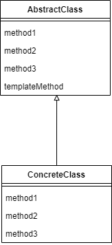

# 1. Template Method 패턴이란
`Template`이란, 어떤 제품을 만들기 위해 만든 `틀`을 뜻한다.<br/>

그렇다면 `Template Method 패턴`이란?
> `상위 클래스` 쪽에 `템플릿`이 될 `추상 메서드`가 정의되어 있고, `하위 클래스`에서 추상 메서드를 `구현`하는 방식으로,<br/>
> 상위 클래스에서 뼈대를 정하고 하위 클래스에서는 구체적인 내용을 결정하는 패턴을 말한다.

여러 다른 하위 클래스에서 다르게 구현하면, 당연히 처리도 다르게 이루어진다.<br/>
하지만 큰 흐름은 추상 메서드에서 정의한대로 흘러간다.<br/>

## 1.1 장단점
### 1.1.1 장점
- 전체적으로는 동일하게 동작하지만, 부분부분 다른 곳이 있는 경우 중복 코드를 최소화할 수 있다.
  - 동일한 기능을 상위클래스에서 정의하고 확장이나 변화가 필요한 부분만 하위 클래스에서 구현할 수 있도록 한다.
- 로직을 공통화 할 수 있고, 수정의 범위가 줄어든다.
  - 템플릿 메서드에 오류가 발생할 경우, 템플릿 메서드만 수정하면 된다.
- 하위 클래스의 역할을 줄여 핵심 로직의 관리가 용이하다.

### 1.1.2 단점
- 하위 클래스를 구현할 때, 상위 클래스에서 제공하는 템플릿 메서드의 로직을 알아야 한다.
- 클래스 관리가 복잡해진다.
- 클래스 간 관계나 코드가 꼬일 수 있다.

#### Template Method 패턴을 응용한 `Factory Method 패턴`이 있다.

# 2. Template Method 패턴 알아보기
## 2.1 클래스 다이어그램

- `AbstractClass`: 뼈대 역할(템플릿 메서드를 구현하고, 템플릿 메서드에서 사용할 추상 메서드를 선언한다.)
- `ConcreteClass`: 구현 클래스(AbstractClass에서 정의된 추상 메서드를 구현한다.)

## 2.2 코드로 알아보자
내가 원하는 흐름을 만들어보자.<br/>
AbstractDisplay를 상속하는 자식 클래스들은 open()이 호출되고 나면 print()를 5번 호출하고 close()를 호출하는 큰 틀을 따르게 하고 싶다. 
```java
public abstract class AbstractDisplay {
    public abstract void open();
    public abstract void print();
    public abstract void close();

    public final void display() {
        open();
        for (int i = 0; i < 5; i++) {
            print();
        }
        close();
    }
}
```
`AbstractDisplay`를 상속하여 구현하는 자식 클래스들을 만들어보자.
```java
public class CharDisplay extends AbstractDisplay{
    
    private char ch;

    public CharDisplay(char ch) {
        this.ch = ch;
    }

    @Override
    public void open() {
        System.out.print("<< ");
    }

    @Override
    public void print() {
        System.out.print(ch);
    }

    @Override
    public void close() {
        System.out.println(" >>");
    }
}

```
```java
public class StringDisplay extends AbstractDisplay{

    private String str;
    private int width;

    public StringDisplay(String str, int width) {
        this.str = str;
        this.width = width;
    }

    @Override
    public void open() {
        printLine();
    }

    @Override
    public void print() {
        System.out.println("| " + str + " |");
    }

    @Override
    public void close() {
        printLine();
    }

    private void printLine() {
        StringBuilder sb = new StringBuilder();
        sb.append("+");

        for (int i = 0; i < width; i++) {
            sb.append("-");
        }

        sb.append("+");
        System.out.println(sb);
    }
}

```
`CharDisplay`와 `StringDisplay`는 각각 다르게 동작하도록 구현하였다.<br/>
그럼 이제 어떻게 동작하는지 동작시켜보자.
```java
public class Main {
    public static void main(String[] args) {
        AbstractDisplay charDisplay = new CharDisplay('B');
        AbstractDisplay stringDisplay = new StringDisplay("hello world", 13);

        charDisplay.display();
        System.out.println();
        stringDisplay.display();

    }
}
// << BBBBB >>
// 
// +-------------+
// | hello world |
// | hello world |
// | hello world |
// | hello world |
// | hello world |
// +-------------+
```