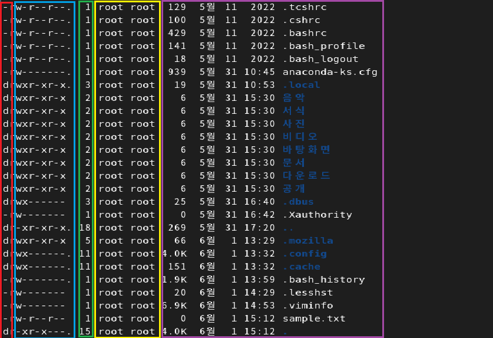
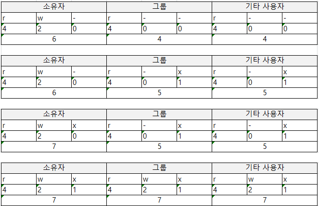

# 1. 빨간색 : `파일 유형`(파일의 종류)
```text
- d : 디렉토리
- - : 일반적인 파일
- b : 블록 디바이스(디바이스 장치 : 하드디스크, CD/DVD 등의 저장장치)
- c : 문자 디바이스(디바이스 장치 : 키보드, 마우스, 프린터 등의 입출력장치)
- l : 링크
```

# 2. 파란색 : `파일 허가권`(권한 정보)
> 파일을 읽고, 쓰고, 실행할 수 있는 권한을 나타낸다.
- 9개의 문자로 구성되어 있고 3개씩 끊어 읽는다.(문자는 3개로 구성된다 : r, w, x )
- 차례대로 `소유자의 권한`, `그룹의 권한`, `기타 사용자의 권한`을 나타낸다
    - 예) wxr——— : 소유한 사람만 읽고 쓰고 실행할 수 있는 권한을 가진다.
    - 각 권한 별 숫자가 있다(r : 4, w : 2, x : 1)
    
  

  | 8진수 | 2진수 | 문자 | 설명 |
  | --- | --- | --- | --- |
  | 0 | 000 | —- | 아무 권한 없음 |
  | 1 | 001 | -x- | 실행 권한만 있음 |
  | 2 | 010 | -w- | 쓰기 권한만 있음 |
  | 3 | 011 | -wx | 실행, 쓰기 권한만 있음 |
  | 4 | 100 | r— | 읽기 권한만 있음 |
  | 5 | 101 | r-x | 읽기, 실행 권한만 있음 |
  | 6 | 110 | rw- | 읽기, 쓰기 권한만 있음 |
  | 7 | 111 | rwx | 모든 권한 있음 |

## 2.1 파일 권한 변경 명령
### 2.1.1 chmod
```bash
chmod 604 test.txt    # test.txt에 대한 rw----r--부여
chmod 777 test.txt    # test.txt에 대한 rwxrwxrwx 부여
chmod 655 test.txt    # test.txt에 대한 rw-r-xr-x 부여
chmod 423 test.txt    # test.txt에 대한 r---w--wx 부여

# 번호가 아니라 좀 더 직관적으로 chmod를 사용할 수도 있다.
    # u : user, g : group, o : other
     
chmod u+w test.txt      # test.txt에 소유자에게 쓰기 권한 부여
chmod g+r test.txt      # test.txt에 그룹에게 읽기 권한 부여
chmod o-r test.txt      # test.txt에 기타 사용자에게 읽기 권한 제거
chmod u=rwx test.txt    # test.txt에 소유자에게 읽기, 쓰기, 실행 권한 부여
chmod go+rw test.txt    # test.txt에 그룹 및 기타 사용자에게 읽기, 쓰기 권한 부여
chmod u+w,g-w test.txt  # test.txt에 소유자에게 쓰기 권한 부여, 그룹에게 쓰기 권한 제거
```


# 3. 초록색 : `링크 수`
하드 링크(Hard Link) : <br/>
심볼릭 링크(Symbolic Link) :

# 4. 노란색 : `파일 소유자의 이름`과 `파일 소유 그룹명`
> 파일 소유권 : 파일을 소유한 사용자와 그룹을 뜻한다.

## 4.1 파일 소유권 변경 명령
### 4.1.1 chown
> chown `새로운 사용자 이름` `파일 이름`<br/>
chown `새로운 사용자 이름`.`새로운 그룹 이름` `파일 이름`
```bash


chown hbcho sample.txt : 파일의 소유자를 hbcho로 변경한다.
chown hbcho.hbcho sample.txt : 파일의 소유자와 소유 그룹을 hbcho로 변경한다.

chgrp hbcho sample.txt : 그룹만 hbcho그룹으로 변경한다.
```

# 5. 보라색 : 파일 크기(Byte), 마지막 변경 시간, 파일 명
