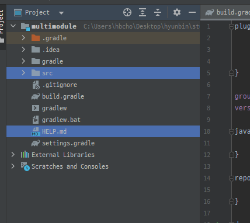
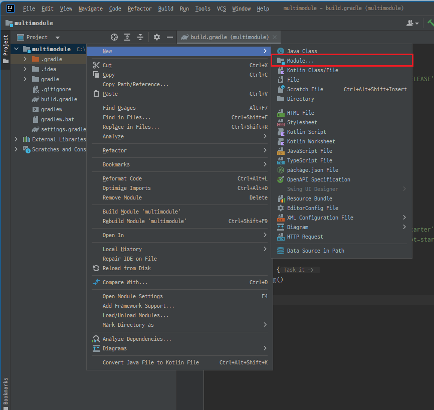

멀티모듈에서 Root가 되는 프로젝트는 특별한 dependency 및 소스 폴더가 필요없다.
따라서 아무런 의존성을 추가하지 않고 프로젝트를 생성 후, 아래와 같이 프로젝트 생성 후 소스 폴더를 지워주자.<br/>
<br/>

프로젝트 root에서 모듈을 생성한다.<br/>
<br/>

api, common 2개의 모듈을 만들어준다.<br/>
common 모듈에서는 애플리케이션을 띄울 일이 없기 때문에 `ModuleCommonApplication` 파일을 삭제해준다.<br/>
api 모듈에서는 프로젝트가 실행될 때 root에 있는 settings.gradle을 바라보고 우리는 하나의 세팅으로만 관리할 것이기 때문에 settings.gradle을 지워준다.(모듈 내 settings.gradle이 있으면 모듈 내 settings.gradle이 더 높은 우선순위를 가진다.)<br/>

root프로젝트에게 자신에게 속해있는 모듈을 알려준다.<br/>
```text
# root settings.gradle
rootProject.name = 'multimodule'

include 'module-api'
include 'module-common'
```
<br/>
<b> 이제 module-api와 module-common 간의 의존성 참조를 해보자.</b><br/>
module-api가 module-common을 참조하므로 module-api의 build.gradle에 추가해준다.<br/>

```text
implementation project(':module.common') //`()`안에 들어가는 모듈명은 프로젝트 root의 settings.gradle에 선언헀던 모듈명과 일치해야 한다. 
```

위와 같이 설정을 하고 gradle을 다시 로드했을 때
`org.gradle.execution.TaskSelectionException: Task 'prepareKotlinBuildScriptModel' not found in project ':module-api'.` 에러가 발생한다면
api모듈의 build.gradle에 아래를 추가해준다.
```text
tasks.register("prepareKotlinBuildScriptModel"){}
```

#### 다른 모듈의 빈 사용하기
자바코드는 모듈 간 특별한 설정없이 사용할 수 있지만, 스프링 빈은 컴포넌트 스캔으로 패키지(혹은 클래스)를 지정해주어야 한다.
```java
@SpringBootApplication(scanBasePackages = {
		"com.hyunbenny.moduleapi", "com.hyunbenny.modulecommon.service" }) 
public class ModuleApiApplication {

	public static void main(String[] args) {
		SpringApplication.run(ModuleApiApplication.class, args);
	}

}
```

#### DB연결
common모듈에서 DB연결을 관리한다고 하자.<br/>
common모듈에서 entity, repository, application.yml에 DB접속 정보를 작성한 후, api모듈에서 사용하려고 하면 `repository`를 찾을 수없다는 오류, 혹은 `entity`를 찾을 수 없다는 오류와 함께 빌드가 되지 않는 걸 볼 수 있다.
<br/>

이를 해결하기 위해서는 위해서 컴포넌트 스캔위치를 지정해준 것과 같이 엔티티와 리포지토리의 위치를 api모듈에게 알려주어야 한다.
```java
@SpringBootApplication(scanBasePackages = {
		"com.hyunbenny.moduleapi", "com.hyunbenny.modulecommon.service" })
@EntityScan("com.hyunbenny.modulecommon.domain")
@EnableJpaRepositories(basePackages = {"com.hyunbenny.modulecommon.repository"})
public class ModuleApiApplication {
    
	public static void main(String[] args) {
		SpringApplication.run(ModuleApiApplication.class, args);
	}
    
}
```


#### 빌드
jar로 빌드하기 위한 옵션 추가
- module-common : build.gradle
```text
tasks.bootJar{enabled = false} // common모듈은 다른 모듈에서 참조하기 위한 공통 모듈이기 때문에 실행가능한 jar는 생성할 필요가 없다.
tasks.jar{enabled = true} // 의존성이 포함되지 않은(소스의 클래스파일과 리소스파일만 가지고 있는 plain jar 생성)
```

- 빌드 명령어
```bash
./gradlew clean :module-api:buildNeeded --stacktrace --info --refresh-dependencies -x test 
```

실행하기<br/>
- jar파일 위치로 이동 후 실행
```bash
java -jar module-api-0.0.1-SNAPSHOT.jar
``` 