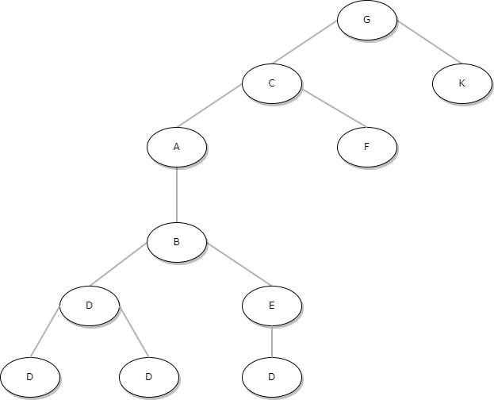

# 1. 너비 우선 탐색(BFS : Breadth First Search)이란
> 맹목적 탐색 방법 중의 하나로 시작 정점을 방문한 후, 한 노드와 같은 레벨에 있는 노드들을 먼저 탐색하는 방법으로 큐나 연결리스트를 활용한다.<br/>
-   인접한 모든 정점들을 우선 방문하는 방법으로 '큐'가 필요함

## 1.1 BFS의 흐름
-   배열(혹은 리스트): 각 노드에 방문 했는지 여부를 담는다.
-   큐(혹은 리스트): 해당 노드와 연결된 노드들을 담아둔다.
1.  시작 노드를 큐에 담으면서 시작 + 시작 노드를 방문처리한다.
2.  큐에서 노드를 하나 꺼낸다.
3.  꺼낸 노드와 연결된 노드 중 방문하지 않은 노드를 방문한다.(연결된 노드를 큐에 담고 방문 처리)
4.  큐에 노드가 없을 때까지 2~3을 반복한다.

<br/>
이미지출처: https://mine-it-record.tistory.com/525

#### 시작 노드가 A일 경우

1.  큐에 A를 담고 A를 방문처리한다.
2.  담은 A를 꺼낸다.
3.  A와 연결된 B, C를 큐에 담는다
4.  반복

1) 큐에서 노드를 하나 꺼내고 방문 처리한다. - B

2) B와 연결된 D, E를 큐에 담는다.

3) 큐에서 노드를 하나 꺼내고 방문 처리한다. - C

4) ..

# 2. BFS 구현해보기
```java
public class BFSEx {

    public static void main(String[] args) {
        HashMap<String, ArrayList<String>> graph = new HashMap<>();

        graph.put("A", new ArrayList<>(Arrays.asList("B", "C")));
        graph.put("B", new ArrayList<>(Arrays.asList("A", "D", "E")));
        graph.put("C", new ArrayList<>(Arrays.asList("A", "F", "G")));
        graph.put("D", new ArrayList<>(Arrays.asList("B", "H", "I")));
        graph.put("E", new ArrayList<>(Arrays.asList("B", "J")));
        graph.put("F", new ArrayList<>(Arrays.asList("C")));
        graph.put("G", new ArrayList<>(Arrays.asList("C", "K")));
        graph.put("H", new ArrayList<>(Arrays.asList("D")));
        graph.put("I", new ArrayList<>(Arrays.asList("D")));
        graph.put("J", new ArrayList<>(Arrays.asList("E")));
        graph.put("K", new ArrayList<>(Arrays.asList("G")));

        ArrayList<String> result = bfs(graph, "A");
        for (int i = 0; i < result.size(); i++) {
            if (i == result.size() - 1) {
                System.out.println(result.get(i));
            }else{
                System.out.print(result.get(i) + " -> ");
            }
        }
    }

    /**
     * 방문한 순서대로 리스트에 담아서 리턴
     * @param HashMap<String, ArrayList<String>> : 노드 그래프
     * @param String : 시작 노드
     * @return ArrayList<String> : 방문한 노드 리스트
     */
    public static ArrayList<String> bfs(HashMap<String, ArrayList<String>> graph, String startNode) {
        // 방문한 노드를 담을 리스트
        ArrayList<String> visited = new ArrayList<>();

        // 방문해야할 노드를 담을 리스트
        ArrayList<String> notVisitedYet = new ArrayList<>();

        // 주어진 시작 노드를 방문해야할 목록에 담고
        notVisitedYet.add(startNode);

        // 탐색 시작
        while (notVisitedYet.size() > 0) {

            // 방문했으니까 해당 노드는 방문해야할 노드 목록에서는 제거
            String node = notVisitedYet.remove(0);

            // 해당 노드가 방문한 노드 목록에 없는 경우에는 추가해주고
            // 방문하지 않은 목록에 해당 노드와 연결된 노드들을 추가해준다.
            if (!visited.contains(node)) {
                visited.add(node);
                notVisitedYet.addAll(graph.get(node));
            }
        }
        return visited;
    }

}
```
- 시작 노드를 A로 주면 `A -> B -> C -> D -> E -> F -> G -> H -> I -> J -> K`순으로 너비 우선 탐색을 한다.
- 만약 시작 노드를 G로 주면 G의 기준에서보면 아래와 같은 그림이 나올 것이다.
<br/>

- 따라서 `G -> C -> K -> A -> F -> B -> D -> E -> H -> I -> J`의 순으로 너비 우선 탐색을 한다.
- 그래프를 2차원 배열로 만들고 `큐`, `연결리스트`를 활용해서 구현해보기

```java
public class BFSEx {

    public static void main(String[] args) {
        int[][] graph = {
                  {}
                , {2, 3, 8}
                , {1, 6}
                , {1, 4}
                , {3, 5, 7}
                , {4}
                , {2}
                , {4}
                , {1, 9, 10}
                , {8}
                , {8}
        };

        String result = bfs(new boolean[graph.length], graph, 1);
        System.out.println(result);

    }

    /**
     * 방문한 순서대로 문자열로 리턴
     */
    public static String bfs(boolean[] visited, int[][] graph, int startIdx) {
        // 리턴값(방문한 순서대로 기록)
        StringBuilder sb = new StringBuilder();
        // 방문해야할 노드를 담을 리스트
        Queue<Integer> notVisitedYet = new LinkedList<>();

        // 주어진 시작 노드를 방문해야할 노드 큐에 넣고
        notVisitedYet.offer(startIdx);
        visited[startIdx] = true;

        // 탐색 시작
        while (!notVisitedYet.isEmpty()) {

            // 방문했으니까 해당 노드는 방문해야할 노드 큐에서는 제거하고 해당 노드를 StringBuilder에 추가
            Integer nodeIdx = notVisitedYet.poll();
            sb.append(nodeIdx + " | ");

            // 방문하지 않은 목록에 해당 노드와 연결된 노드들을 추가해준다.
            for (int i = 0; i < graph[nodeIdx].length; i++) {
                int tmp = graph[nodeIdx][i];

                if (!visited[tmp]) {
                    visited[tmp] = true;
                    notVisitedYet.offer(tmp);
                }
            }
        }
        return sb.toString();
    }

}
```

# 3. 시간복잡도 : O(V + E)
- V : 노드 수, E: 간선 수
- notVisitYet은 V + E번 만큼 반복하게 된다.
- 따라서 BFS의 시간복잡도는 O(V + E)