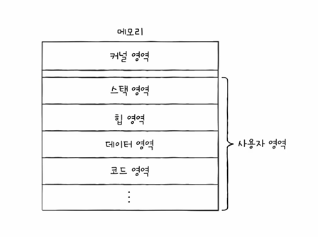

아래의 강의를 듣고 정리한 글입니다.<br/>
[혼자 공부하는 컴퓨터 구조 + 운영체제](https://www.inflearn.com/course/%ED%98%BC%EC%9E%90-%EA%B3%B5%EB%B6%80%ED%95%98%EB%8A%94-%EC%BB%B4%ED%93%A8%ED%84%B0%EA%B5%AC%EC%A1%B0-%EC%9A%B4%EC%98%81%EC%B2%B4%EC%A0%9C/dashboard)

[참고 : 프로세스](https://hyunbenny.tistory.com/9)

# 1. 프로세스
> `메모리에 적재`되어 실행되는 순간, 프로그램은 프로세스가 된다.  
> 이렇게 프로그램이 프로세스가 되는 과정을 우리는 `프로세스를 생성`한다고 한다.

## 1.1 포그라운드 프로세스(Foregroung Process)
> 사용자가 볼 수 있는, 즉 사용자와 `상호작용`하는 프로세스

## 1.2 백그라운드 프로세스(Background Process)
> 실행은 했지만 화면에 나타나지 않고 `화면 뒤에서 실행`되는 프로세스  
> 사용자와 상호작용없이 정해진 일만 수행한다.  
> `데몬(daemon)`, 서비스(service)라고도 부른다.

## 1.3 프로세스 제어 블록(PCB : Process Control Block)
> 한정된 CPU자원으로 모든 프로세스를 실행하기 위해서 운영체제는 프로세스의 `실행순서를 관리`하고 `CPU에 자원을 배분`한다.  
> 이러한 작업들을 위해 운영체제가 사용하는 프로세스와 관련된 정보를 저장하는 자료구조를 PCB라고 한다.


### 1.3.1 PCB에 저장되는 정보
- `PID(Process ID)` : 특정 프로레스를 식별하기 위한 고유 번호
- `레지스터 값` : CPU를 반납하고 나서 다시 획득한 후 기존 작업을 이어가기 위해서 프로그램 카운터 등의 레지스터값이 저장된다.
- `프로세스 상태` : 현재 프로세스틔 상태(CPU를 사용하기 위해 대기하고 있는 상태인지, 사용 중인지 등)
- `CPU 스케줄링 정보` : 언제 어떤 순서로 CPU를 할당받을 지에 대한 정보
- `메모리 정보` : 어느 메모리 주소에 저장되었는지에 대한 정보와 페이지 테이블 정보
- `사용한 파일`, `입출력 장치 정보` : 어떤 입출력장치가 할당되었는지, 어떤 파일들을 열었는지 등에 대한 정보

## 1.4 문맥 교환(Context Switching)
> 진행하고 있던 작업의 상태를 저장하고 다음 실행할 프로세스의 상태 값을 읽어 실행하는 과정

앞서 언급한 것과 같이 모든 프로세스는 실행하기 위해서 CPU를 얻어야 한다.<br/>

A라는 프로세스가 실행되다가 B라는 프로세스로 실행순서가 넘어가게 된다면 아래와 같은 흐름으로 CPU를 넘겨줄 것이다.
- A프로세스의 현재 상태를 백업한다.([프로그램 카운터](https://ko.wikipedia.org/wiki/%ED%94%84%EB%A1%9C%EA%B7%B8%EB%9E%A8_%EC%B9%B4%EC%9A%B4%ED%84%B0), 레지스터 값, 메모리 정보 등)
- B프로세스에게 CPU를 넘겨준다. 
- B프로세스도 CPU점유 시간이 끝나면 현재까지의 상태를 백업한 후 CPU를 반환한다.
  
  

#### PCB는 커널 영역에서 운영체제가 프로세스들을 제어하기 위해서 관련 정보들을 각 프로세스마다 저장하는 자료구조라고 했다.

#### 그렇다면 프로세스가 사용자 영역에서는 어떻게 저장되는지 알아보자.

## 1.5 프로세스의 메모리 영역

### 1.5.1 코드 영역(= 텍스트 영역)
> 실행할 수 있는 코드(기계어)로 이루어진 `명령어 저장되는 영역`<br/>
> CPU가 실행할 명령어가 담기기 때문에 쓰기가 금지되어 있는 영역이다.(데이터X)
 
### 1.5.2 데이터 영역
> 프로그램이 `실행되는 동안 유지할 데이터`를 저장하는 영역(전역 변수 등) <br/>
> `정적 할당 영역`이라고도 한다.

### 1.5.3 힙 영역
> 개발자가 직접 할당할 수 있는 공간으로 사용한 메모리는 반환해야 한다.<br/>
> GC(Garbage Collection)가 돌면서 불필요 메모리를 반환해가는 영역

### 1.5.4 스택 영역
> 데이터 영역과는 달리 데이터가 `잠깐` 저장되는 영역(매개변수, 지역변수 등)<br/>

* `힙`과 `스택` 영역은 프로그램이 실행되는 과정에서 크기가 `동적`으로 변할 수 있다.
* `힙`영역은 `낮은`주소에서 `높은`주소로 할당하고
* `스택`역영은 `높은`주소에서 `낮은`주소로 할당한다.


# 2. 프로세스 상태와 계층구조
## 2.1 프로세스 상태

### 2.2.1 생성 상태
> 메모리에 적재되어 PCB를 할당받은 상태<br/>
-  준비가 완료되면 준비상태로 넘어간다.

### 2.2.2 준비 상태
> CPU를 할당받아 실행할 수 있지만 차례를 기다리는 상태<br/>
- `준비상태`의 프로세스가 CPU를 할당받아 실행상태가 되는 것을 `디스패치(dispatch)`라고 한다.

### 2.2.3 실행 상태
> CPU를 할당받아 실행 중인 상태<br/>
- 할당된 시간을 모두 사용한 경우 `준비 상태`가 된다.<br/>
- 실행 중 입출력 장치를 사용하면 입출력 작업이 끝날 때까지 `대기 상태`가 된다.

### 2.2.4 대기 상태
> 프로세스가 작업 도중 입출력 장치를 사용하는 경우 <br/>
- 입출력 작업이 끝나면 `준비 상태`가 된다.

### 2.2.5 종료 상태
> 프로세스가 종료된 상태
- 프로세스가 점유하고 있던 메모리 영역을 정리하고 할당받은 PCB는 폐기해야 한다.

## 2.2 프로세스의 계층 구조
> 프로세스 실행 도중, `시스템 콜`을 통해 다른 프로세스(`자식 프로세스`)를 생성 가능하다. 


- 이와 같은 프로세스 계층 구조를 통하여 여러 프로세스가 동시에 실행되면서 컴퓨터가 동작한다.
- `pstree` 명령어를 통해 프로세스 계층 구조를 확인할 수 있다.

# 3. 프로세스 생성 기법
[참고 : 프로세스 관리](https://hyunbenny.tistory.com/14)<br/>
부모 프로세스는 자식 프로세스를 어떻게 생성할까? <br/>
자식 프로세스는 자신의 코드를 어떻게 실행할까? <br/>
## 3.1 `fork`와 `exec`
- `fork` 시스템 콜을 통해 자신의 복사본을 자식 프로세스로 생성한다.
  - PID, 메모리 주소는 다르다.
- 자식 프로세스는 `exec` 시스템 콜을 통해 자신의 메모리 공간을 다른 프로그램으로 교체한다.
### 3.1.1 fork()
```java
/* Parent */ 
int main(){ 
    int pid;
    printf("\n Hello World. \n"); 
    
    pid = fork(); // fork() 실행 후 자식 프로세스의 PID를 리턴 받는다.
    
    if(pid == 0)
        printf("\n THIS IS CHILD. \n"); 
    else if(pid > 0)
        printf("\n THIS IS PARENT. \n"); // pid가 양수가 될 테니까 이 부분이 실행됨 
}
```
```java
/* Child */
int main(){ 
    int pid;
    printf("\n Hello World. \n"); 
    
    pid = fork(); 
    
    if(pid == 0)
        printf("\n THIS IS CHILD. \n"); // pid가 0이니까 이 부분이 실행됨
    else if(pid > 0)
        printf("\n THIS IS PARENT. \n"); 
}
```
### 3.1.2 exec()
```java
int main(){
    int pid;
    pid = fork();
    
    if(pid == 0){
        printf("\n THIS IS CHILD. \n"); 
        execlp("/bin/date", "/bin/date", (char *)0); 
    }else if(pid > 0)
        printf("\n THIS IS PARENT. \n"); 
}
```
- exec() 이후에 나오는 코드는 코드는 실행될 수 없는 코드이다.

# 4. 쓰레드
> 프로세스를 구성하는 `실행 흐름의 단위`
- 하나의 프로세스는 하나 이상의 쓰레드를 가질 수 있다.

## 4.1 멀티 쓰레드 프로세스
> 실행 흐름이 여러 개인 프로세스 
- → 프로세스를 이루는 여러 명령어를 동시에 실행 가능


## 4.2 쓰레드의 구성요소

- 쓰레드마다 다른 프로그램 카운터, 스택을 가지고 있기 때문에 프로그램의 다른 부분들을 각각 실행할 수 있다.
- 쓰레드들은 실행에 필요한 최소한의 정보를 가지고 `프로세스의 자원을 공유`하여 실행된다.

## 4.3 멀티 프로세스와 멀티 쓰레드
단일 쓰레드로 여러 개의 프로세스를 실행하는 것과 하나의 프로세스를 여러 쓰레드로 실행하는 것의 차이는 무엇일까?<br/>


- 프로세스끼리는 자원을 공유하지 않지만, `쓰레드`끼리는 같은 프로세스의 `자원을 공유`한다.
  - 위의 그림에서처럼 하나의 프로세스를 `fork()`하여 동일한 프로세스를 2개 더 만들어서 실행한다고 했을 때
  - 메모리에 동일한 내용들이 중복해서 존재하게 되므로 메모리에 낭비가 발생한다.
    - 물론, `copy on write`기법을 통해 같은 프로세스를 메모리에 중복 저장하지 않으면서 자원을 공유하지 않는 방법도 있다.


- 그림과 같이 `멀티 쓰레드`는 프로세스의 `자원을 공유`하기 때문에 `협력`, `통신`에 유리하다.
- 반대로, 자원을 공유하기 때문에 하나의 쓰레드에 문제가 생기면 `다른 쓰레드에도 영향`을 미칠 수 있다.
  - `멀티 프로세스 환경`에서는 `독자적`이기 때문에 한 프로세스의 문제가 다른 프로세스에 영향을 미치지 않는다. 
  - 프로세스 간에도 자원을 주고 받을 수 있다.(IPC)