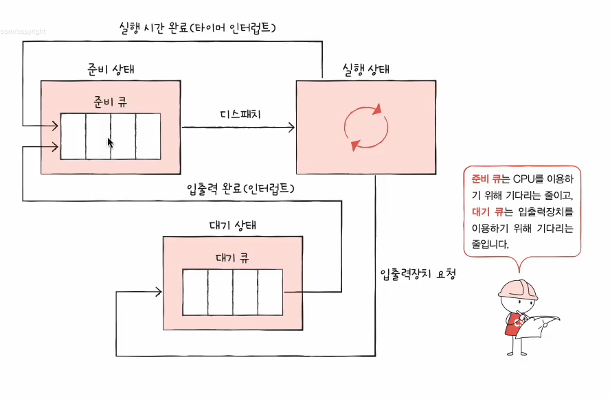
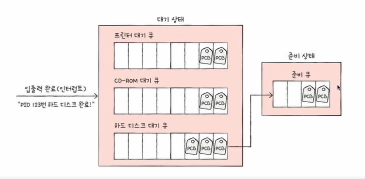
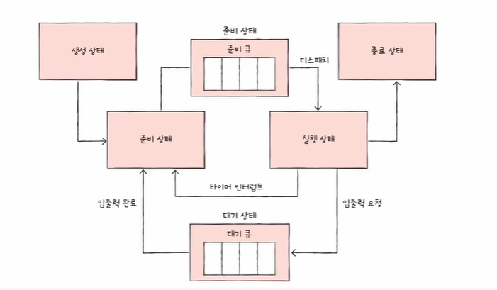
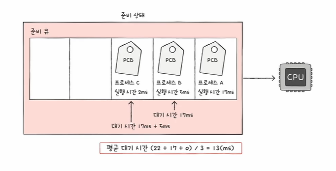
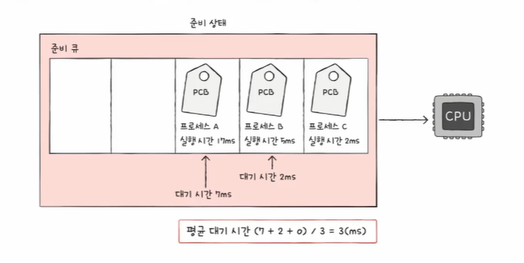
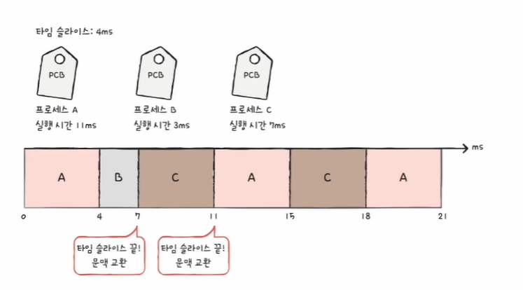
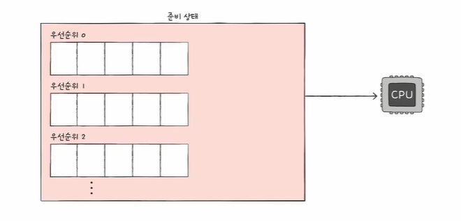

# 1.CPU 스케줄링이란
> 운영체제가 공정하고 합리적으로 CPU자원을 관리하는 것(프로세스들에게 배분)

- 모든 프로세스에게 공평하게 CPU를 배분하는 것보다 `우선순위`에 맞게 배분하는 것이 더 `효율적`이다.
- 입출력 작업이 많은 프로세스는 CPU작업이 많은 프로세스보다 우선순위가 높다.
- 우선 순위는 프로세스의 `PCB`에 저장된다.
  - 우선 순위가 높은 프로세스가 더 빨리, 더 자주 실행 될 수 있다.

운영체제가 매번 대기하고 있는 모든 프로세스의 PCB를 보고 우선 순위를 정하는 것은 비효율적이다.

그래서 운영체제는 `스케줄링 큐`를 사용한다. 
## 1.1 스케줄링 큐

 
`준비 큐`에 먼저 들어왔다고 해서 먼저 실행할 수 있는 게 아니라, 우선순위에 따라 더 늦게 실행할 수도 있다.  
 
`대기 큐`는 보통 입출력 장치 별로 있는 경우가 많다. → 같은 장치에 대한 요청은 같은 큐에서 대기한다. 
- 입출력 장치의 작업이 완료되었다는 인터럽트를 받으면, 해당 입출력 장치 대기 큐에서 제거하고 준비 큐에 새로 추가 시켜준다.
- 같은 대기 큐에서도 `우선순위 별`로 처리된다.

### 큐를 포함한 프로세스 상태 다이어그램

## 1.2 선점형과 비선점형 스케줄링
### 1.2.1 선점형과 비선점형 스케줄링이란?
> - 선점형(preemptive) : 프로세스가 자원을 사용하고 있더라도 운영체제가 프로세스로부터 자원을 빼앗아 다른 프로세스에게 할당할 수 있는 스케줄링 방식 
> - 비선점형(non-preemptive) : 프로세스가 자원을 사용하고 있으면 해당 프로세스가 종료되거나 대기 상태가 될 때까지 다른 프로세스가 끼어들 수 없는 스케줄링 방식 

### 1.2.1 선점형과 비선점형 스케줄링의 장단점
#### 선점형 스케줄링
- 장점 : 더 급한 작업을 가진 프로세스가 언제든지 끼어들어 사용할 수 있기 때문에 CPU의 독점을 막고 프로세스에 `자원을 골고루 분배`할 수 있다. 
- 단점 : `컨텍스트 스위칭`에서 `오버헤드`가 발생할 수 있다. 

#### 비선점형 스케줄링
- 장점 : 컨텍스트 스위칭의 횟수가 선점형보다 적기 때문에 오버헤드가 선점형보다 적다. 
- 단점 : 하나의 프로세스가 자원을 사용 중인 경우, 무작정 기다리는 수 밖에 없기 때문에 모든 프로세스가 골고루 자원을 사용할 수 없다. 

 

#### 그럼 이제 운영체제가 프로세스들을 스케줄링할 때 사용하는 알고리즘에 대해서 알아보자.

# 2. CPU 스케줄링 알고리즘
## 2.1 FCFS(First Come First Served) 스케줄링
> - 비선점형 스케줄링  
> - 선입 선처리 스케줄링으로 준비 큐에 삽입된 순서대로 처리하는 스케줄링 
> → 먼저 CPU를 요청한 프로세스부터 CPU를 할당해 준다.
- `호위효과`가 발생할 수 있다.
  - 호위효과 : 프로세스들이 기다리는 시간이 매우 길어질 수 있음

## 2.2 SJF(Shortest Job First) 스케줄링 
> - 비선점형 스케줄링(하지만 선점형, 비선점형 모두 구현 가능) 
> - 최단 작업 우선 스케줄링으로 CPU 사용시간이 가장 짧은 프로세스부터 처리하는 스케줄링 방식 
> - FCFS스케줄링에서 발생하는 호위효과를 방지 

## 2.3 RR(Round Robin) 스케줄링
> - 선점형 스케줄링 
> - 정해진 타임 슬라이스만큼의 시간동안 돌아가며 CPU를 이용하는 스케줄링 
> - FCFS스케줄링 + 타임 슬라이스 
>   - 타임 슬라이스 : 프로세스가 CPU를 사용할 수 있도록 정해진 시간
>   - 정해진 시간을 다 사용하고도 작업을 완료하지 못했다면 다시 큐의 맨 뒤에 삽입

- 타임슬라이스의 크기가 중요하다.
  - 타임슬라이스의 크기가 너무 크면 FCFS스케줄링과 똑같음

## 2.4 SRT(Shortest Remaining Time) 스케줄링
> - 최소 잔여 시간 우선 스케줄링
> - SJF스케줄링 + 라운드 로빈 스케줄링
> - 정해진 시간만큼 CPU를 이용하지만, 다음 차례의 프로세스는 남은 작업 시간이 가장 적은 프로세스

## 2.5 Priority 스케줄링
> - 우선순위 스케줄링
> - 프로세스들에 우선순위를 부여하고, 우선순위가 높은 프로세스부터 실행한다.
> - 우선 순위가 같은 프로세스가 있는 경우, FCFS스케줄링
> - SJF, SRT ⊂ 우선순위 스케줄링

- `기아현상`이라는 근본적인 문제가 존재한다.
  - 기아현상(Starvation) : 우선순위가 높은 프로세스만 계속하여 실행되고 우선순위가 낮은 프로세스는 먼저 큐에 삽입 되었음에도 불구하고 계속해서 뒤로 밀리는 현상

이를 해결하기 위한 기법으로 `aging`이 있다. 
#### `aging`이란 무엇인가?
> 오래 대기한 프로세스의 우선순위를 점차 높여주는 방식
- 최초에는 우선순위가 낮았어도 점점 우선순위가 높아져 감에 따라 언젠가는 실행이 된다.

## 2.6 MLQ(MultiLevel Queue) 스케줄링
> - 다단계 큐 스케줄링
> - Priority 스케줄링의 발전된 형태로 우선순위별로 준비 큐를 여러개 사용하는 방식

- 우선 순위가 가장 높은 큐에 있는 프로세스를 먼저 처리하고 우선순위가 가장 높은 큐가 비면 다음 우선순위 큐에 있는 프로세스를 처리
- 큐별로 알고리즘을 다르게 정함으로써 프로세스를 유형별로 처리하기가 쉬워진다.
  - 우선순위 0에는 FCFS 스케줄링을 적용하고, 우선순위 1에는 RR 스케줄링을 적용하고, 우선순위 2에도 RR 스케줄링을 적용하지만 타임슬라이스를 더 길게 주는 등
 
  
#### 단점 
- 큐 간 이동을 할 수 없다. → 또 `기아현상`이 발생할 수 있다.
  - 우선 순위가 낮은 프로세스는 계속 우선순위가 낮은 큐에 들어가서 앞의 큐들이 빌 때까지 기다린 후 실행되어야 한다.

## 2.7 MFQ(MultiLevel Feedback Queue) 스케줄링 
> - 다단계 피드백 큐 스케줄링
> - MLQ 스케줄링의 발전된 형태로 큐 간 이동이 가능하다.
> - `aging`기법을 적용할 수 있다.
> - 가장 일반적인 형태의 CPU 스케줄링 방식으로 알려져 있다.

- 새롭게 준비 큐에 추가되면 가장 높은 우선순위 큐에 넣어 작업을 진행한다.
  - 보통 가장 높은 우선순위의 큐에는 타임 슬라이스를 아주 짧게 설정하고 Round Robin을 사용한다.
  - 하위 큐로 갈수록 타임 슬라이스를 점점 길게 주고, 마지막 큐는 FCFS를 사용한다.
- 타임 슬라이스 내 작업을 완료하지 못하면 우선순위를 한단계 낮춰 큐에 넣는다.
- 작업이 완료될 때까지 우선순위를 점점 낮춰가며 반복한다.
  - 우선순위 0 큐 → 우선순위 1 큐 → 우선순위 2 큐 ...

→ CPU 사용시간이 긴 프로세스는 점점 밑으로 쫓겨나고 CPU 사용시간이 짧은 프로세스는 빠르게 CPU를 사용하고 빠져나간다. 
