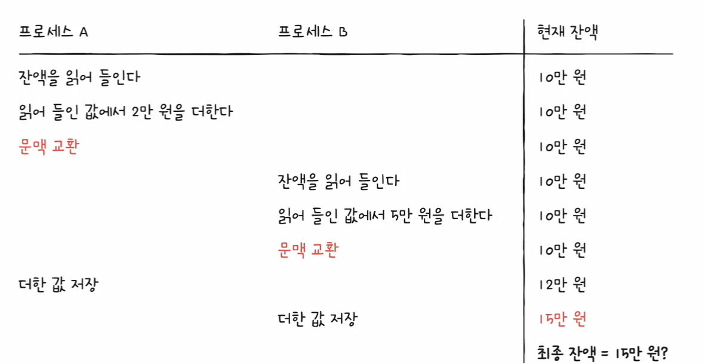
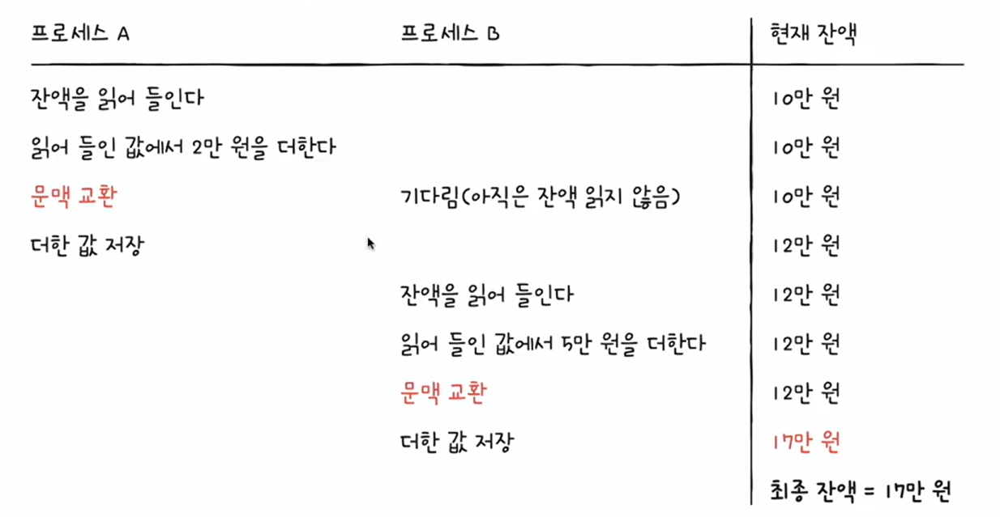
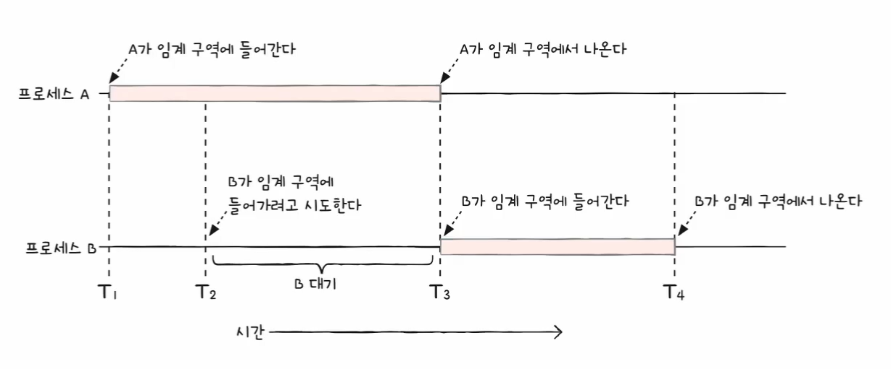
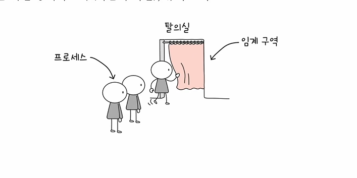
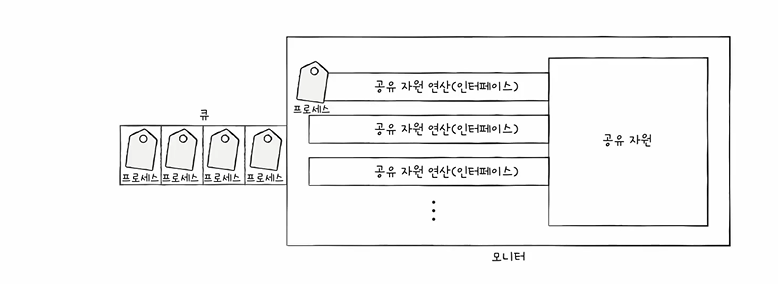
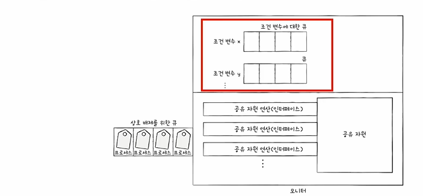

#### 프로세스와 쓰레드는 동시다발적으로 수행되며, 서로 협력하며 영향을 주고 받는다.
➡️ 자원의 일관성을 보장할 수 있어야 한다.

# 1. 프로세스의 동기화란
> `실행 순서 제어를 위한 동기화`: 프로세스들을 올바른 순서대로 실행하는 것<br/>
> `상호 배제를 위한 동기화`: 동시에 접근해서는 안되는 자원에 하나의 프로세스만 접근하도록 하는 것<br/>
> ➡️ 프로세스들의 수행 시기를 맞추는 것이다.
- 공통의 목적을 위해 동시에 실행되는 프로세스들은 `동기화`되어야 한다.

# 2. 동기화에 대해 자세히 알아보자.
## 2.1 실행 순서 제어를 위한 동기화
### Reader Writer Problem
`Writer`: 파일에 데이터를 쓰는 프로세스<br/>
`Reader`: 파일에 저장되어 있는 데이터를 읽어오는 프로세스<br/>
`Reader`는 읽어오려는 파일 안에 데이터가 있어야 한다는 `조건이 만족`되어야만 실행이 가능하기 때문에 두 프로세스가 순서없이 아무렇게나 실행되어서는 안된다. 

## 2.2 상호 배제를 위한 동기화
> 공유가 불가능한 자원의 동시 사용을 피하기 위한 동기화

### 2.2.1 예시
#### bank account Problem
현재 잔액은 10만원<br/>
`A`: 현재 잔액에서 2만원을 입금하려고 한다.<br/>
`B`: 현재 잔액에서 5만원을 입금하려고 한다.<br/>

이 상황에서 동시에 실행 된다면 어떻게 될까?<br/>
<br/>
두 프로세스가 동시에 `잔액`에 접근했기 떄문에 우리가 기대했던 17만원이라는 값을 얻지 못헀다.(물론 얻을 때도 있겠지)<br/><br/>
아래와 같이 한 프로세스의 작업이 끝날 때까지 기다렸다가 잔액에 접근하여 작업을 한다면 정상적으로 우리가 원하는 값을 얻을 수 있다.


#### Producer & Consumer Problem
`producer`: 물건을 계속해서 생산한다.<br/>
`consumer`: 물건을 계속해서 소비한다.<br/>
`총합`이라는 변수를 공유한다.<br/>

producer가 10,000개를 생산하고 consumer가 10,000개를 소비한다고 하자.<br/>
우리가 예상하는 결과는 당연히 `0`일 것이다.<br/>
하지만 실제 `동기화를 고려하지 않은 코드`를 실행해보면 -1418개, 혹은 1911개 등 우리가 예상했던 결과와 전혀 다른 값을 얻게 된다.<br/>

#### 그렇다면 우리가 `동기화`를 고려해야 하는 자원 즉, 동시에 여러 프로세스가 접근하면 안되는 자원은 무엇일까?
#### 공유자원
> 여러 프로세스 또는 쓰레드가 공유하는 자원<br/>
> 예) 전역 변수, 파일, 입출력 장치 등..

#### 임계구역
> 동시에 접근하면 문제가 발생하는 자원에 접근하는 코드 영역<br/>
> 예) 잔액 변수 등..
- 임계구역에 진입할 때, 이미 진입한 프로세스가 있다면 대기해야 한다.
<br/>

임계구역에 동시에 접근하여 자원의 일관성이 깨지는 상황을 `race condition`이라고 한다.<br/>
이 문제를 해결하기 위한 방법을 알아보자.

### 2.2.2 상호배제 동기화를 위한 3가지 원칙
- 상호 배제: 한 프로세스가 임계구역에 진입했다면 다른 프로세스는 진입할 수 없다.
- 진행: 임계구역에 어떤 프로세스도 진입하지 않은 경우 진입하고자 하는 프로세스가 있다면 진입할 수 있어야 한다.
- 유한 대기: 한 프로세스가 임계구역에 진입하기 위해서 대기하고 있다면 언젠가는 진입할 수 있어야 한다.(무한정 대기해서는 안된다.)

# 3. 동기화 기법
## 3.1 뮤텍스 락
> 전역변수 1개, 함수 2개로 구성되어 프로세스가 임계구역에 진입하기 전 잠그고, 작업을 마친 뒤 나오면서 잠금을 해제한다.

<br/>

### 3.1.1 뮤텍스 락의 형태
- 자물쇠 역할: 프로세스들이 공유하는 `전역변수`를 `lock`
- 임계구역을 잠그는 역할: `acquire`함수
- 임계구역 잠금을 해제하는 역할: `release`함수

### 3.1.2 간단한 코드로 알아보자.
```c
// 임계구역 진입 전 호출하는 메서드
acquire(){                  // busy waiting -> 좋은 방법은 아니다.
    while(lock == true)     // 임계구역이 잠겨 있으면 
        ;                   // 임계구역이 잠금 해제되었는지를 반복 확인
    lock = true;            // 임계 구역이 잠겨있지 않다면 임계구역 잠금
}


// 임계구역에서 작업을 완료 후 호출하는 메서드        
release(){
    lock = false;           // 임계구역 작업 종료 -> 잠금 해제
}
```
```c
acquire(); // 잠금

// 임계구역에서의 작업 진행

release(); // 잠금해제 
```

## 3.2 세마포어
> 뮤텍스 락과 비슷하지만 좀 더 일반화 된 동기화 도구<br/>
> 전역변수 1개, 함수 2개로 구성되어 임계구역 앞에서 신호를 받고 대기하다가 진입 가능하다는 신호를 받으면 그 때 임계 구역에 진입한다.
- 공유 자원이 여러 개 있는 경우에도 적용이 가능하다.
- 이진, 카운팅 세마포가 있다.
- 상호 배제 뿐만 아니라 실행 순서를 동기화 할 수도 있다.

<br/>

### 3.2.1 세마포어의 형태
- 임계구역에 진입할 수 있는 프로세스의 개수: `전역 변수 S`
- 임계구역에 진입해도 되는지, 기다려야 하는지를 알려주는 함수: `wait`함수
- 임계구역에 진입하기 위해 대기하고 있는 프로세스에게 진입하라고 알려주는 함수: `signal`함수

### 3.2.2 코드로 알아보기
```c
wait(){                 // busy waiting -> 좋은 방법은 아니다.
    while( S <= 0)      // 임계구역에 진입할 수 있는 프로세스 개수가 0이하인 경우
    ;                   // 사용할 수 있는 자원이 있는지 반복 확인
    S--;                // 임계구역에 진입할 수 있는 프로세스 개수가 하나 이상인 경우 S--하고 임계구역 진입
}

signal(){
    S++;
}
```
```c
wait();

// 임계구역에서의 작업 진행

signal();
```

### 3.2.3 busy waiting 해결방법
사용할 수 있는 자원이 없는 경우 `대기 상태`로 만든다.(-> 해당 프로세스의 PCB를 `대기 큐`에 넣는다)<br/>
사용할 수 있는 자원이 생긴 경우, 대기 큐의 프로세스를 `준비 상태`로 만든다(해당 프로세스의 PCB를 대기 큐에서 꺼내 `준비 큐`에 넣는다)<br/>
```c
wait(){
    S--;
    if(S < 0) {
        addToQueue();       // 대기 큐에 삽입
        sleep();            // 프로세스를 대기 상태로 만든다
    }
}

signal(){
    S++;
    if( S <= 0 ){
        Process p = removeFromQueue();      // 대기 큐에 있던 프로세스를 제거한다.
        wakeup(p);                          // 프로세스를 대기 상태에서 준비 상태로 만든다.
    }
}
```
## 3.3 모니터
> 임계구역 앞뒤로 함수를 호출해줘야 하는 불편함과 누락, 중복 호출 등을 해결하기 위해 등장한 동기화 도구<br/>
> 개발자가 다루기 편리한 동기화 도구이다.

- 모니터 안에는 하나의 프로세스만 있을 수 있다.

### 3.3.1 상호 배제를 위한 동기화
- 인터페이스를 위한 큐
  - 공유 자원에 접근하고자 하는 프로세스를 큐에 넣고 큐에 삽입된 순서대로 한 번에 하나의 프로세스만 공유 자원을 이용한다.
  
<br/>

### 3.3.2 실행 순서 제어를 위한 동기화
- 조건 변수를 이욯
  - `조건 변수`: 프로세스나 쓰레드의 실행순서를 제어하기 위해 사용하는 특별한 변수
  - 조건변수.wait(): 대기상태로 변경하고 조건 변수에 대한 큐에 삽입
  - 조건변수.signal(): wait()로 인해 대기 상태로 있는 조건 변수를 실행 상태로 변경

<br/>
- 상호 배제를 위한 큐와 실행 순서 제어를 위한 큐는 다른 큐