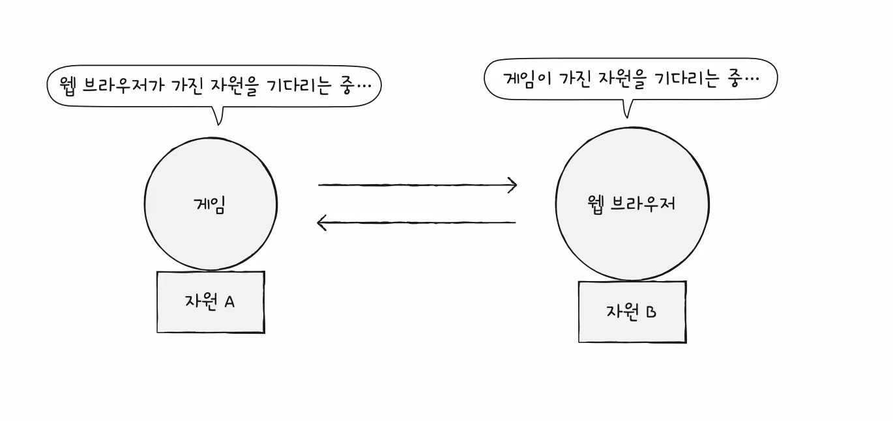
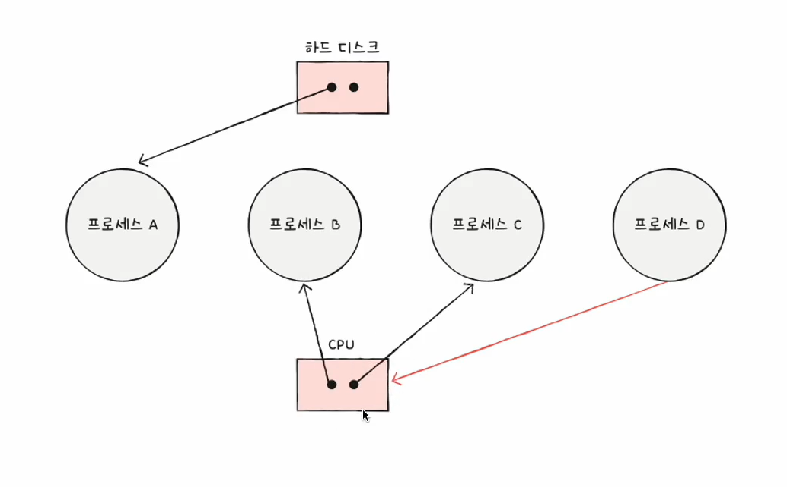
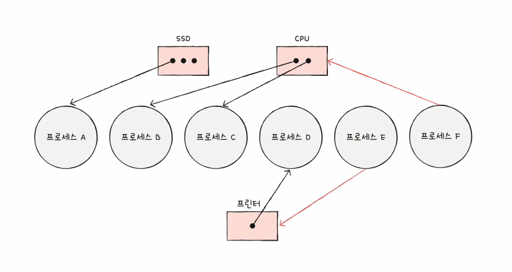
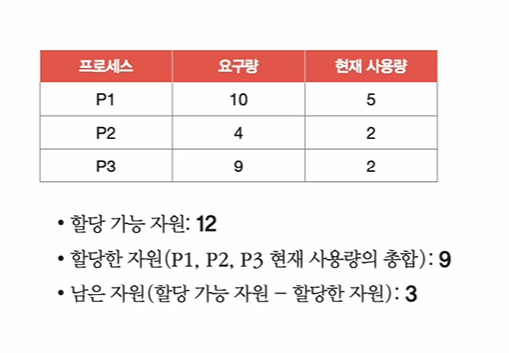

# 1. [교착상태(Deadlock)](https://ko.wikipedia.org/wiki/%EA%B5%90%EC%B0%A9_%EC%83%81%ED%83%9C)란
> 두 개 이상의 작업이 서로 상대방의 작업이 끝나기 만을 기다리고 있기 때문에 결과적으로 아무것도 완료되지 못하는 상태
 

# 2. 자원할당 그래프
> `자원할당 그래프`를 통해 교착상태의 `발생 조건`을 파악할 수 있다.
- 어떤 프로세스가 어떤 자원을 할당받아 사용 중인지 확인
- 어떤 프로세스가 어떤 자원을 기다리고 있는 지 확인
## 2.1 자원할당 그래프의 요소들
- 원: 프로세스 
- 사각형: 자원의 종류
- 사각형 내 점: 사용할 수 있는 자원의 개수
- 화살표(자원 -> 프로세스): 프로세스가 어떤 자원을 할당받아 사용 중 
- 화살표(프로세스 -> 자원): 프로세스가 어떤 자원을 사용하기 위해 대기 중

 
#### 예
 

## 2.2 교착상태가 발생한 자원할당 그래프의 특징
- `원`의 형태를 보인다.
 
# 3. 교착상태 발생 조건
- 상호배제: 한 프로세스가 사용하고 있는 자원은 다른 프로세스가 사용할 수 없는 상태
- 점유와 대기: 자원을 할당받은 상태에서 다른 자원을 기다리고 있는 상태
- [비선점](https://github.com/hyunbenny/study/blob/main/%EC%BB%B4%ED%93%A8%ED%84%B0%20%EA%B5%AC%EC%A1%B0%EC%99%80%20%EC%9A%B4%EC%98%81%EC%B2%B4%EC%A0%9C/%EC%9A%B4%EC%98%81%EC%B2%B4%EC%A0%9C/4.CPU%EC%8A%A4%EC%BC%80%EC%A4%84%EB%A7%81.md#%EB%B9%84%EC%84%A0%EC%A0%90%ED%98%95-%EC%8A%A4%EC%BC%80%EC%A4%84%EB%A7%81): 어떤 프로세스도 다른 프로세스의 자원을 강제로 빼앗지 못하는 상태
- 원형대기: 프로세스들이 원의 형태로 자원을 대기하는 상태

위 4가지 조건 중 하나라도 만족하지 않으면 교착상태가 `발생하지 않음` 
위 4가지 조건 중 `모두 만족`하면 교착상태가 `발생할 수 있음` 

# 4. 교착상태 해결방법
## 4.1 예방
> 애초에 교착상태가 발생하지 않도록 `교착상태 발생 조건` 중 하나를 없앤다.
- 상호배제를 없앤다: 모든 자원을 공유할 수 있도록 만든다.
  - 이론적으로는 가능하지만 현실적으로는 불가능
- 점유와 대기를 없앤다: 특정 프로세스에 자원을 모두 할당하거나, 아예 할당하지 않는 방식으로 배분한다.
  - 현실적으로는 자원의 활용률을 너무 떨어뜨리는 방식
- 비선점을 없앤다: 선점이 가능한 CPU와 같은 자원에 대해서는 효과적이다.
  - 하지만 모든 자원이 선점 가능한 것이 아니다.
- 원형대기를 없앤다: 모든 자원에 번호를 부여하고 번호의 오름차순으로 자원을 할당한다.
  - 모든 자원에 번호를 붙이는 것은 어려운 작업이다. 
  - 어떤 자원에 어떤 번호를 붙이느냐에 따라 자원의 활용률이 달라진다.

#### ➡️ 교착상태가 절대 발생하지 않도록 만들 수는 있지만 각 방법에 따라 부작용이 따른다. 

## 4.2 회피 
> 한정된 자원을 `무분별하게 사용`하려고 해서 발생한 문제라고 인식하고 
> 배분할 수 있는 자원의 양을 고려하여 교착상태가 발생하지 않을 만큼만 할당한다.
- 안전 순서열: 교착상태 없이 안전하게 프로세스들에게 자원을 할당할 수 있는 순서
- 안전 상태: 교착상태 없이 모든 프로세스가 자원을 할당받고 종료될 수 있는 상태(안전 순서열이 있는 상태)
- 불안전 상태: 교착상태가 발생할 수도 있는 상태(안전 순서열이 없는 상태)

 
P1, P2, P3가 각각 5개, 2개, 7개의 자원을 추가로 요구했을 경우.. 
1. P2 -> P1 -> P3 순으로 자원을 할당한다.(할당한 자원은 11, 남은 자원은 1이 된다.) 
2. 필요한 자원을 모두 할당받은 P2는 작업을 완료하고 자원을 반환한다(할당한 자원: 7, 남은 자원: 5)
3. P1에 남은 자원 5를 할당한다.(할당한 자원 12, 남은 자원 0)
4. P1이 작업을 완료하고 자원을 반환하면 P3에 필요한 자원을 할당
5. P3의 작업 완료
- 위와 같이 안전 순서열대로 할당하면 모든 프로세스가 실행 가능하다.

#### ※ 똑같이 그림과 같은 상황에서 위와 같이 처리하지 않고 P3에게 남은 자원 중 하나를 먼저 줬다면 어떻게 되는지 생각해보자. 
- 불안정 상태가 되면서 교착상태가 발생할 수도 있다.

#### 안전 상태에서 안전 상태로 움직이는 경우에만 자원을 할당하여, 항상 안전 상태를 유지하도록 자원을 할당하는 방식이다. 

## 4.3 검출 후 회복
> 교착상태가 발생한 후, 사후에 조치하는 방식으로  
> 프로세스가 자원을 요구하면 일단 주고, 이후 교착상태가 발생하면 선점 또는 프로세스의 강제종료를 통해 회복한다. 

### 4.3.1 선점을 통한 회복
- 교착상태가 해결될 때까지 한 프로세스씩 자원을 몰아주는 방식
- 확실하게 교착상태를 해결할 수는 있으나, 작업 내역을 잃을 수 있다.

### 4.3.2 프로세스 강제 종료를 통한 회복
- 교착상태에 놓인 프로세스를 모두 강제 종료한다.(-> 작업 내역을 잃을 수 있다.)
- 교착상태가 해결될 때까지 한 프로세스씩 강제종료한다.(-> 오버헤드가 발생할 수 있다.)