# 1. 연속 메모리 할당
> 프로세스에 연속적인 메모리 공간을 할당한다.

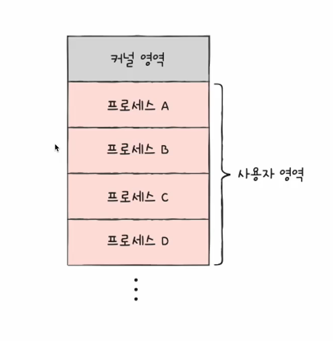<br/>

## 1.1 운영체제의 메모리 관리 기법
### 1.1.1 스와핑
> 현재 사용되지 않는 프로세스들을 보조기억장치의 영역으로 쫓아내고 생긴 빈 공간에 새 프로세스를 적재

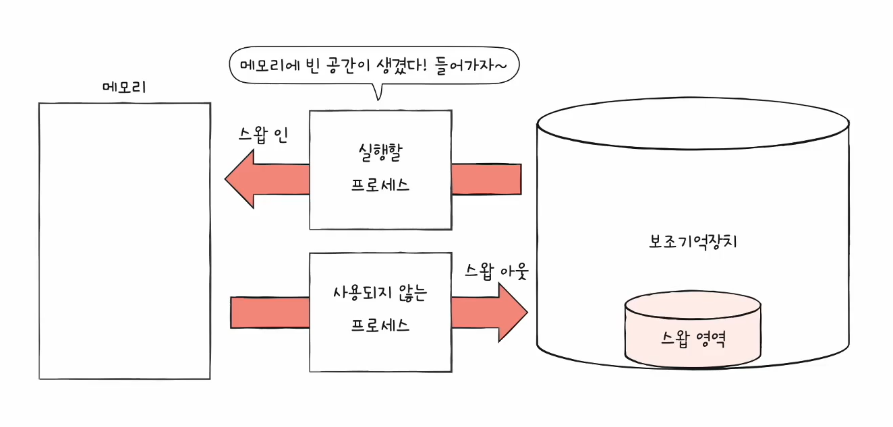<br/>
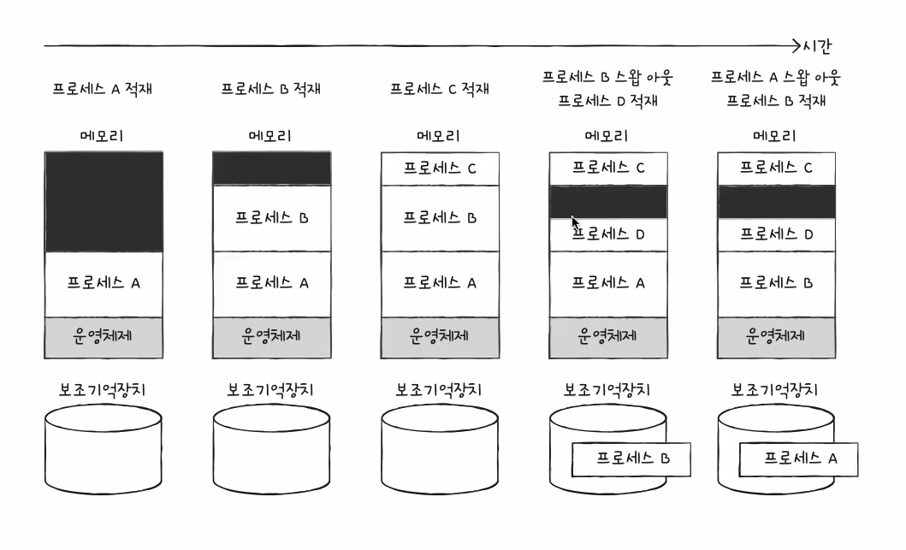<br/>
#### 스왑 영역의 크기 확인하기: free, top
free<br/>
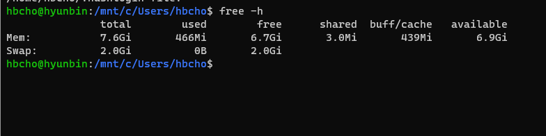<br/>
top<br/>
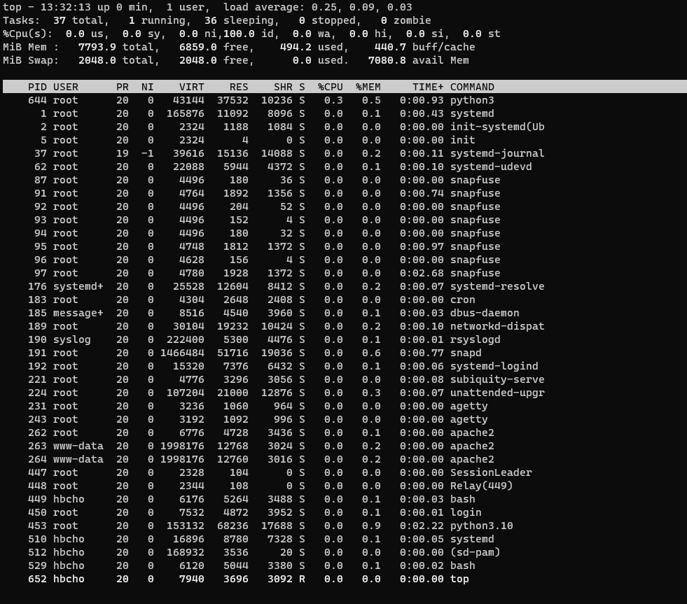<br/>

## 1.2 메모리의 연속 할당
> 프로세스는 메모리의 빈 공간에 할당되어야 한다.<br/>
> 근데 빈 공간이 군데 군데 여러 개 있다면?

### 1.2.1 최초 적합(first-fit)
> 운영체제가 빈 공간을 순서대로 찾다가 적재할 수 있는 공간을 발견하면 그 공간에 프로세스를 적재하는 방식
- 검색을 최소화하고 빠른 할당

### 1.2.2 최적 적합(best-fit)
> 운영체제가 모든 빈 공간을 검색한 뒤, 적재가 가능한 가장 작은 공간에 적재하는 방식

### 1.2.3 최악 적합(worst-fit)
> 운영체제가 모든 빈 공간을 검색한뒤, 적재가 가능한 가장 큰 공간에 적재하는 방식

#### 이와 같이 프로세스를 연속적으로 메모리에 할당하는 방식은 메모리를 효율적으로 사용할 수 없다.

## 왜?
> `외부 단편화`이라는 문제가 발생하기 때문

<br/>
그렇다면 이제부터 외부단편화와 그 해결방안에 대해서 알아보자.<br/>

# 2. 외부 단편화(external fragmentation)
> 프로세스들이 실행과 종료를 반복하면서 메모리 사이사이에 빈 메모리 공간이 생기는데<br/>
> 프로세스를 할당하기 어려울만큼 작은 메모리 공간들로 인해 메모리가 낭비되는 현상을 말한다.

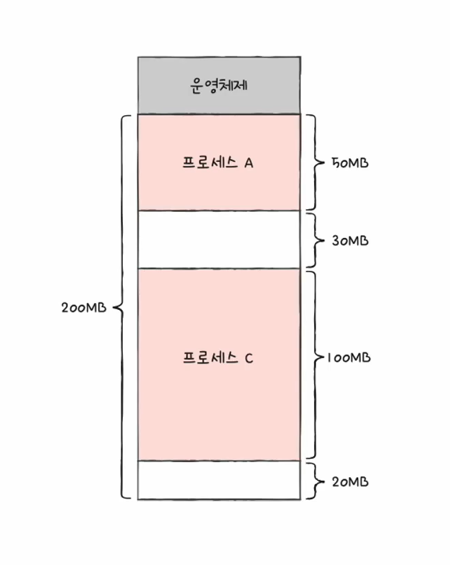<br/>
위와 같은 상황에서 한 프로세스가 필요한 메모리가 50MB인 경우, 프로세스는 메모리에 적재될 수 없다.


## 2.1 외부 단편화의 해결 방법
### 2.1.1 메모리 압축(compaction)
> 여기 저기 흩어져 있는 비어있는 메모리들을 하나로 모으는 방식(메모리 조각 모음)

<br/>
메모리 압축 방식은 아래와 같은 단점이 존재한다.<br/>
- 메모리를 재배치하는 과정에서 오버헤드가 발생하고 프로세스들이 할 일을 제대로 못한다.
- 메모리를 재배치하는 방법을 특정, 정립하기가 어렵다.

### 2.1.2 가상 메모리
> 실행하고자 하는 프로그램의 `일부만 메모리에 적재`하여 실제 물리 메모리보다 더 큰 메모리를 요구하는 프로세스도 실행할 수 있게 하는 기술

#### 가상메모리 관리 기법
#### 1) 페이징(paging) 
> 프로세스의 논리 주소 공간을 `페이지(page)`라는 일정 단위로 자르고<br/>
> 메모리의 물리 주소 공간을 `프레임(frame)`이라는 페이지와 동일한 일정 단위로 자른 뒤<br/>
> 페이지에 프레임을 할당하는 가상 메모리 관리 기법 

▶ 페이징에서의 스와핑<br/>
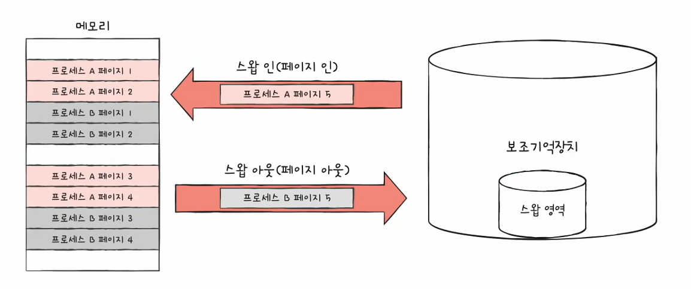 <br/>
- 프로세스 단위가 아니라 페이지 단위로 스와핑을 진행한다.
- 메모리에 적재될 필요가 없는 페이지들은 보조기억장치로 스왑 아웃하고 필요한 페이지들은 스왑 인

<br/>
프로세스가 연속적으로 적재되어 있는 것이 아니라 여러군데 흩어져 적재 되어 있다면 CPU는 프로세스가 이루는 페이지가 어느 프레임에 적재되어 있는지 알기 어렵다.<br/>
또한 불연속적으로 적재되어 있기 때문에 순차적으로 실행하기도 어렵다.(CPU가 다음 명령어를 찾기가 어렵다.)<br/>
<br/>

▶ 페이지 테이블<br/>
실제 물리 주소에 불연속적으로 적재하더라도 CPU가 바라보는 논리주소에는 연속적으로 배치되도록 하는 방법<br/>
- 프로세스마다 페이지테이블이 존재한다.

▶ 내부 단편화<br/>
페이징을 통해 `외부 단편화`를 해결했지만 `내부 단편화`라는 문제가 또 발생할 수 있다.<br/>
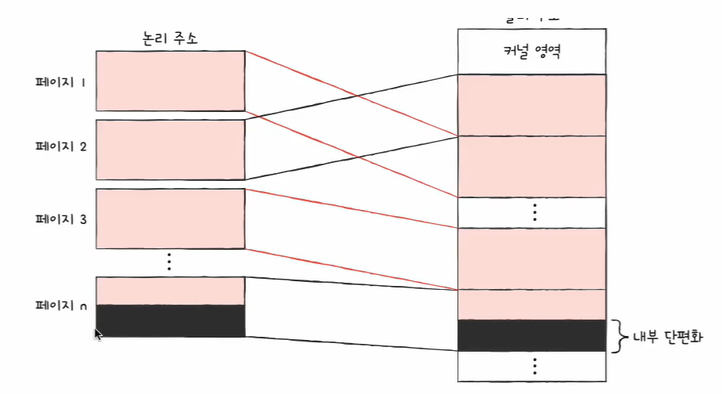<br/>
페이지 크기가 10KB인데 프로세스의 크기가 108KB라면 2KB라는 내부 단편화가 발생한다.<br/>
(내부 단편화의 크기는 외부 단편화의 크기보다 작은 경우가 많다.)<br/>

▶ 페이지 크기 확인하기<br/>
```bash
getconf PAGESIZE
```
<br/>

▶ PTBR(Process Table Base Register)<br/>
프로세스마다 페이지 테이블이 존재하고, CPU 내의 PTBR이 각 페이지 테이블을 가리킨다.<br/>
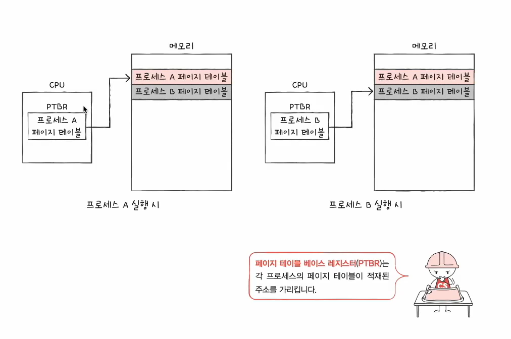<br/>
<br/>
근데 메모리에 페이지 테이블이 있으면 메모리에 2번 접근하기 때문에 접근 시간이 2배로 걸린다.

<br/>

이를 해결하기 위해 사용하는 방식이 `TLB`<br/>
TLB: 페이지 테이블의 일부를 가져와 저장하는 `캐시 메모리`
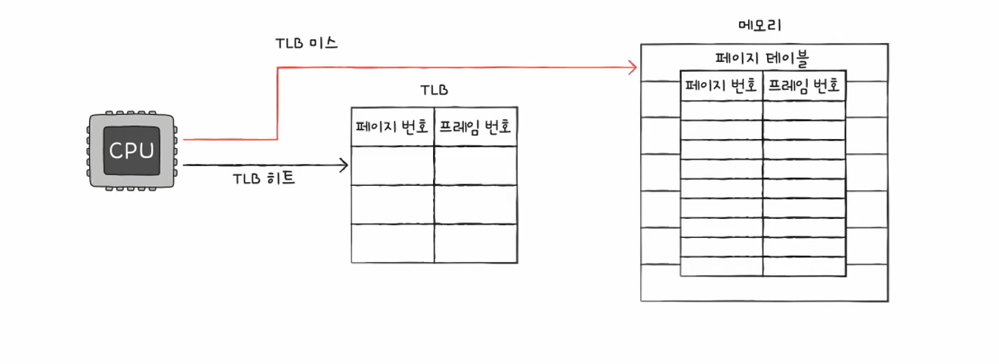
- 페이지 테이블 엔트리(PTE): 페이지 테이블의 각각의 행
  - 페이지 번호
  - 프레임 번호 
  - 유효 비트: 현대 해당 페이지에 접근 가능한지 여부
    - 유효 비트가 0(메모리에 적재되어 있지 않음)인 페이지에 접근하려고 한다면
      - `page fault` 인터럽트 발생
      - → CPU는 기존 작업 내역 백업
      - → 페이지 폴트 처리 루틴 실행
      - → 원하는 페이지를 메모리로 가져온 뒤 유효 비트를 1로 변경
      - → 페이지 폴트 처리를 했다면 CPU가 해당 페이지에 접근 가능
  - 보호 비트: 페이지 보호를 위해 존재하는 비트
  - 참조 비트: CPU가 해당 페이지에 접근한 적이 있는지 여부를 나타내는 비트
  - 수정 비트: CPU가 해당 페이지에 데이터를 쓴 적이 있는지 여부를 나타내는 비트(=dirty bit)

▶ 페이징에서의 주소 변환<br/>
어떻게 논리 주소에서 물리 주소로 변환될까?<br/>
- 페이징 시스템에서의 논리 주소
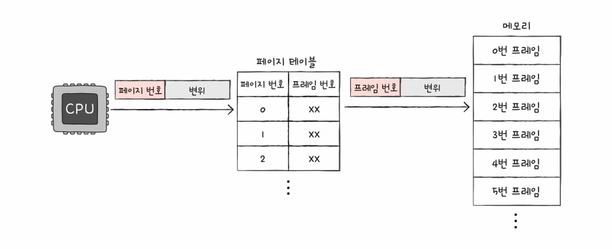
  - 페이지 번호: 접근하고자 하는 페이지의 번호
  - 변위(offset): 내가 접근하고자 하는 주소는 페이지에서 얼만큼 떨어져 있는가
  - 논리주소는 `페이지 테이블`을 통해 프레임 번호, 변위로 변환되며 이를 통해 물리 주소에 접근한다.

  ※ 논리 주소에서의 변위와 페이지 테이블을 통해 변환된 변위는 `같다`. <br/> ➡️ 페이지의 크기와 프레임의 크기는 같기 때문


# 3. 페이징 교체와 프레임 할당
위에서 페이징에 대해서 알아봤다. 지금부터는 페이지를 교체하는 기법에 대해서 알아보자.<br/>

## 3.1 페이지 교체
### 3.1.1 요구 페이지
> 처음부터 모든 페이지를 적재하지 않고 필요한 페이지만 메모리에 적재하는 기법
- 요구 페이징 시스템이 안정적으로 동작하기 위해서는 `페이지 교체`와 `프레임 할당`이라는 작업이 필요하다.
  - 페이지 교체: 기존에 적재된 불필요한 페이지를 선별하여 보조 기억장치로 내보내는 작업<br/>
  - 프레임 할당: 프로세스들에게 적절한 수의 프레임을 할당하는 작업<br/>

### 3.1.2 페이지 교체 알고리즘
> 요구 페이징 기법으로 계속해서 필요한 페이지를 적재하다보면 메모리가 가득 차게 된다.<br/>
> 이럴 때, 어떤 페이지를 내보낼지를 결정하는 방법(알고리즘)
- 무엇이 좋은 알고리즘일까? ➡️ 페이지 폴트가 적은 알고리즘이 좋은 알고리즘!! 
  - 페이지 폴드가 많다? ➡️ 내보내면 안되는 페이지를 내보냈다..(좋지 않은 알고리즘)

#### 페이지 폴트 횟수
페이지 폴드의 횟수는 어떻게 알 수 있을까?<br/>
- 페이지 참조열(page reference string): CPU가 참조하는 페이지들 중 연속된 페이지를 생략한 페이지열
  - 22221333555555576 → 213576 (연속된 경우 페이지 폴트는 발생하지 않기 때문)

####  FIFO(First In First Out) 페이지 교체 알고리즘
> 가장 단순한 방식<br/>
> 메모리에 가장 먼저 올라온 페이지를 가장 먼저 내보내는 방식

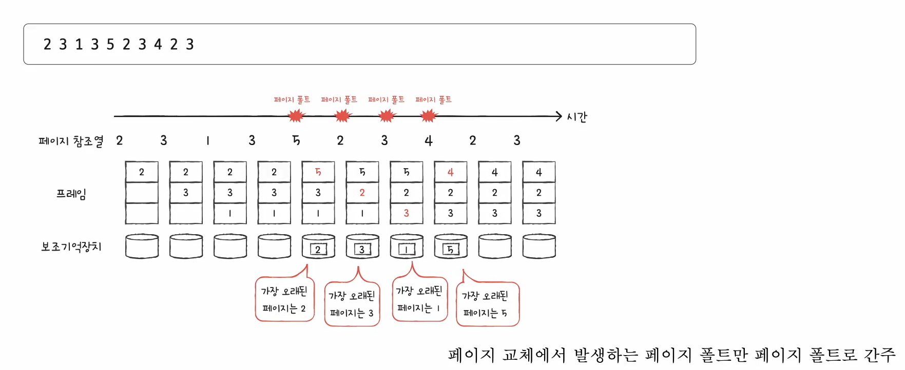<br/>
- 프로그램 실행 내내 사용되어야 할 페이지인데 오래되었다고 내보내서는 안된다.

#### 2차 기회(Second-chance) 페이지 교체 알고리즘
> FIFO 알고리즘의 단점을 보완하기 위해서 나온 알고리즘<br/>
> FIFO와 같이 가장 오래된 페이지를 내보내지만, 참조비트가 1인 경우 적재시간을 현재시간을 초기화 후 맨 끝으로 보낸다.
- 참조 비트 0: CPU가 참조한 적 없는 페이지
- 참조 비트 1: CPU가 한 번 참조한 적 있는 페이지

#### 최적 페이지 교체 알고리즘
> 앞으로 사용빈도가 가장 낮을 것으로 판단되는 페이지를 내보내는 알고리즘으로 가장 낮은 페이지 폴트율을 보장한다.

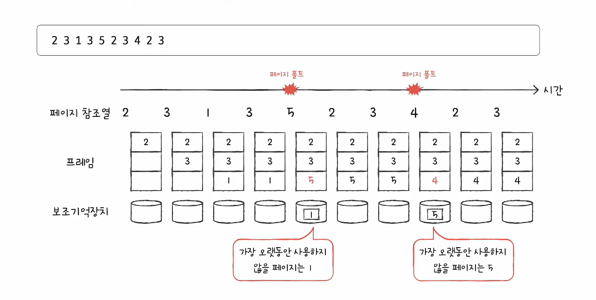<br/>
- 가장 낮은 페이지 폴트율을 보장하지만 예측할 수 없기 때문에 실제 구현이 어렵다.
- 따라서 다른 페이지 교체 알고리즘의 성능을 평가하기 위한 수단으로 간주한다.

#### LRU(Least-Recently-Used) 페이지 교체 알고리즘 
> 가장 오래 사용되지 `않은` 페이지를 내보내는 알고리즘<br/>
> CPU에 의해 참조되는 횟수를 고려하여 페이지를 내보내는 알고리즘<br/> 

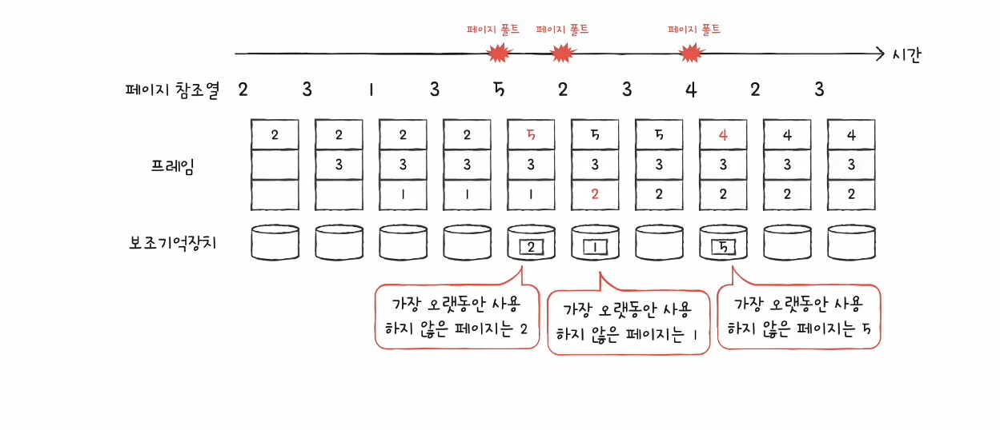<br/>


## 3.2 프레임 할당
#### 페이지 폴트가 자주 발생하는 이유가 무엇일까?
> 페이지 교체 알고리즘이 좋지 않거나 프로세스가 사용할 수 있는 프레임 자체가 작기 때문

### 3.2.1 스래싱
> 프로세스가 실행되는 시간보다 페이징에 더 많은 시간을 소요하여 성능 즉, CPU이용률이 저하되는 문제

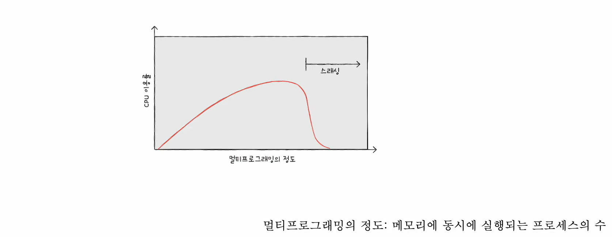<br/>
- 하지만 동시에 실행되는 프로세스의 수를 늘린다고 해서 CPU이 이용률이 높아지는 것은 아니다.

#### 스레싱은 왜 발생할까?
- 각 프로세스가 필요로 하는 최소한의 프레임 수가 보장되지 않았기 때문

### 3.2.2 프레임 할당 방법
#### 균등할당
> 모든 프로세스들에게 균등하게 프레임을 할당하는 방식으로 가장 단순한 방식(정적 할당 방식)

#### 비례할당
> 프로세스의 크기에 비례하여 프레임을 할당하는 방식(정적 할당 방식)
- 프로세스가 필요로 하는 프레임 수는 실행해봐야 정확히 알 수 있기 때문에 완벽한 방법이 아니다.

#### 작업 집합 모델
> 프로세스가 실행되는 과정에서 배분할 프레임을 결정하는 방식(동적 할당 방식)<br/>
> 스래싱의 원인이 빈번한 페이지 교체 때문이므로 CPU가 특정시간 동안 주로 참고한 페이지 개수만큼 프레임을 할당해준다.
- → 작업 집합을 기억하여 빈번한 페이지 교체를 방지한다.
- 참조지역성의 원리

- `작업 직합`: 실행 중인 프로세스가 일정 시간동안 참조한 페이지의 집합
  - 프로세스가 `참조한 페이지`와 `시간 간격`을 통해 작업 집합을 구할 수 있다.
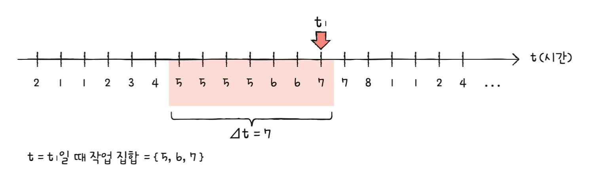<br/>
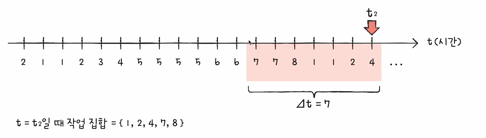<br/>

#### 페이지 폴트 빈도 기반 할당
> 프로세스가 실행되는 과정에서 배분할 프레임을 결정하는 방식(동적 할당 방식)<br/>
> 페이지 폴트율에 상한선과 하한선을 정하고 그 범위 안에서만 프레임을 할당하는 방식 
- 아래와 같은 가정으로 인해 생겨났다.
 - 페이지 폴트율이 너무 높으면 그 프로세스는 너무 적은 프레임을 가지고 있다.
 - 페이지 폴트율이 너무 낮은면 그 프로세스는 너무 많은 프레임을 가지고 있다.

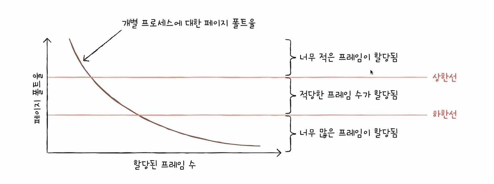<br/>